SharePoint Server 2010 beta2をSingle Server構成でインストールする手順です。
**Single Server構成とは**
Single Server構成とは、1台のサーバーにSharePoint ServerもDatabaseもすべてインストールして稼動させる構成になります。
この構成は拡張性がないため、本番環境での使用はお勧めできません。
開発環境や検証環境に限って使用することをお勧めします。
Single Server構成に関することは、msdnオンラインの以下のドキュメントに載っています。
<http://technet.microsoft.com/ja-jp/library/cc263202(office.14).aspx>
**インストール手順**
**０．準備**
インストールを始める前に、以下のドキュメントを見ておいてください。
<http://technet.microsoft.com/ja-jp/library/cc262485(office.14).aspx>
これを読んで、必要なことをあらかじめやっておかないとインストールではまります。
特にメモ欄に書いてあることは要注意です。
山崎さんのブログにその辺のことがまとめて書いてありますので、ご一読を。
<http://shanqiai.weblogs.jp/sharepoint_technical_note/2009/11/sharepoint-server-2010-%E3%81%AE%E3%82%A4%E3%83%B3%E3%82%B9%E3%83%88%E3%83%BC%E3%83%AB%E6%A6%82%E8%A6%81.html>
**１．インストールファイル実行**
msdn subscriptionのサイトからダウンロードしたファイル[ja\_sharepoint\_server\_2010\_beta\_x64\_x16-19252]を実行します。
すると、ファイルが展開されてスプラッシュウィンドウが表示されます。
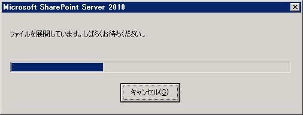
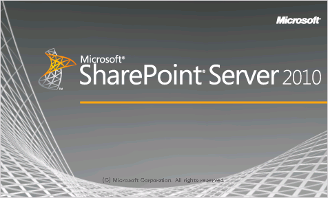

**２．インストール前の確認**
スプラッシュウィンドウが表示されてすぐに、以下のインストールメニューが表示されます。
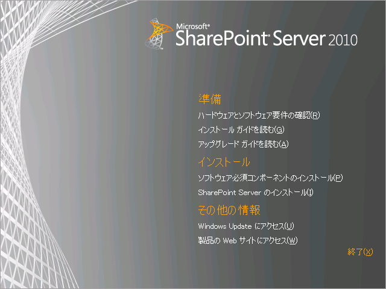
このウィンドウから各種ドキュメントを開くことができます。
今はまだ英語のドキュメントですが、結構しっかりと書いてあります。
ただし、[ハードウェアとソフトウェア要件の確認]のリンクをクリックして開かれるページにあるリンクは、正しいページにリンクされていません。
おそらく本当は以下のページが表示されるべきなのでしょう。
<http://technet.microsoft.com/ja-jp/library/cc262485(office.14).aspx>
必要なドキュメントを確認したら、次の手順に進みます。
**３．必須コンポーネントのインストール**
インストールメニューで[ソフトウェア必須コンポーネントのインストール]をクリックすると、Microsoft SharePoint 製品とテクノロジ 2010 準備ツールが起動します。
このツールは、SharePoint Server 2010をインストールするのに最低限必要となるコンポーネントが、サーバーにインストールされているかどうかをチェックし、インストールされていないものがあればインストールしてくれます。
ちなみに、必須コンポーネントのインストールにより、以下のコンポーネントがインストールされます。
• アプリケーション サーバーの役割、Web サーバー (IIS) の役割
• Microsoft SQL Server 2008 Native Client
• Microsoft "Geneva" Framework Runtime
• Microsoft Sync Framework Runtime v1.0 (x64)
• Microsoft Chart Controls for Microsoft .NET Framework 3.5
• Microsoft Filter Pack 2.0
• Microsoft SQL Server 2008 Analysis Services ADOMD.NET
操作は、[次へ]をクリックしていくだけなので非常に簡単です。
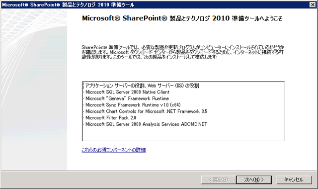
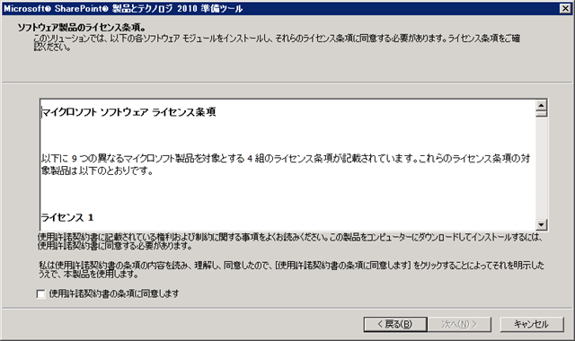
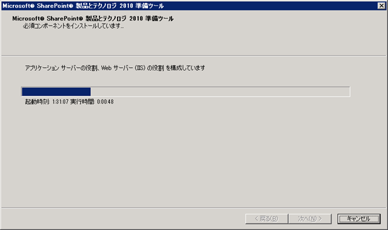
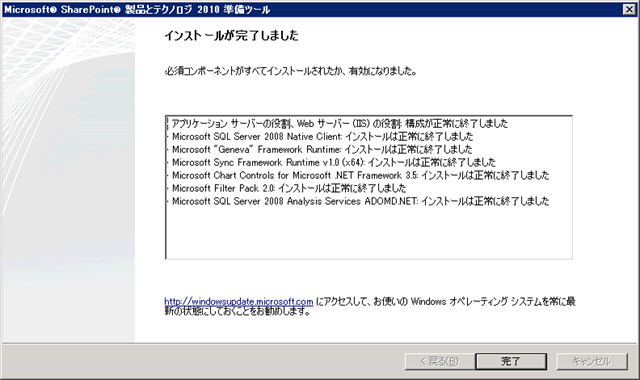
これで、必要なコンポーネントがすべてインストールされました。
**４．SharePoint Server 2010 のインストール**
必須コンポーネントのインストールが終わると、インストールメニューに戻ります。
ここで、[SharePoint Serverのインストール]をクリックします。

すると、以下の画面が表示され、少しすると次の画面が表示されます。
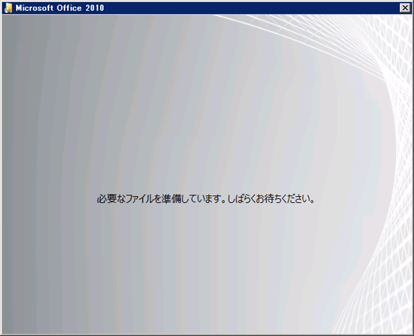
**５．プロダクトキーの入力**
msdn subscriptionから取得したプロダクトキーをここで入力します。
入力するとその場でキーの検証が行われ、問題なければ[続行]がクリックできるようになるので、これをクリックします。
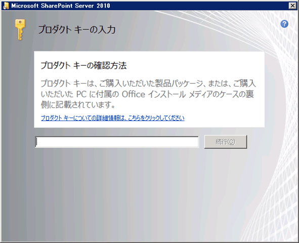
**６．ライセンス条項への同意**
問題なければ同意して、[続行]をクリックします。
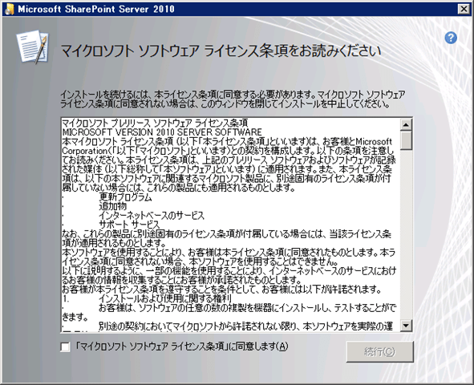
**７．インストール方法選択**
SharePoint Server をインストールするにあたり、どのような構成でインストールするかを選択します。
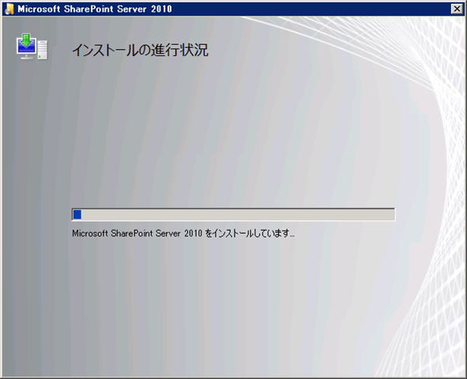
タイトルにもあるとおり、今回はSingle Server構成ということで、[スタンドアロン]を選択します。
**８．インストール開始**
以上で、インストールの設定は完了です。
あとはインストールが完了するのを、じっと待ちます。。。

**９．インストール完了**
インストールが完了すると以下の画面が表示されます。
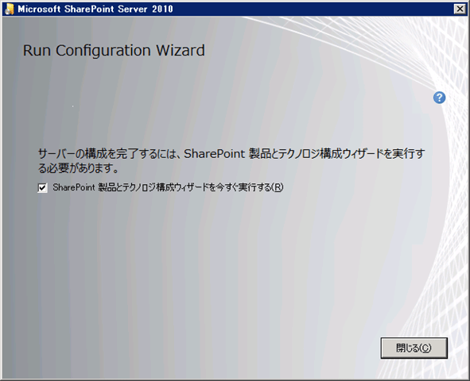
SharePoint Serverはインストールしただけでは動きません。
このあと、動かすための設定を色々とやっていきます。
それについては、別記事でまとめたいと思います。
