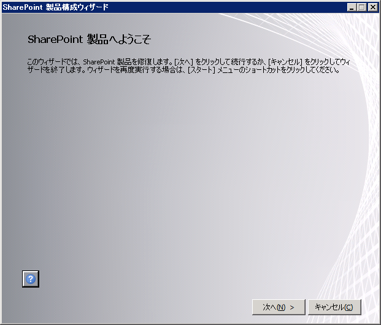
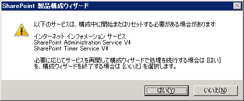
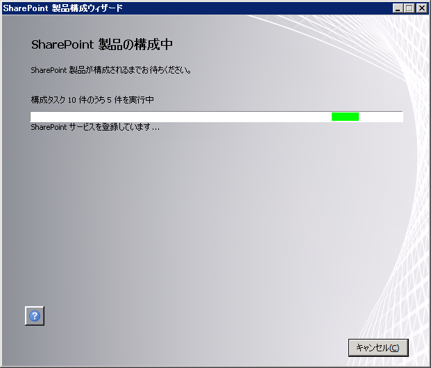
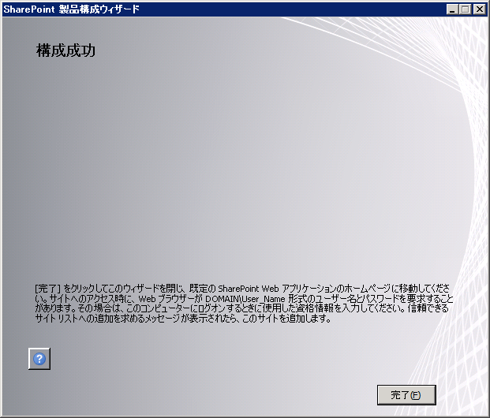
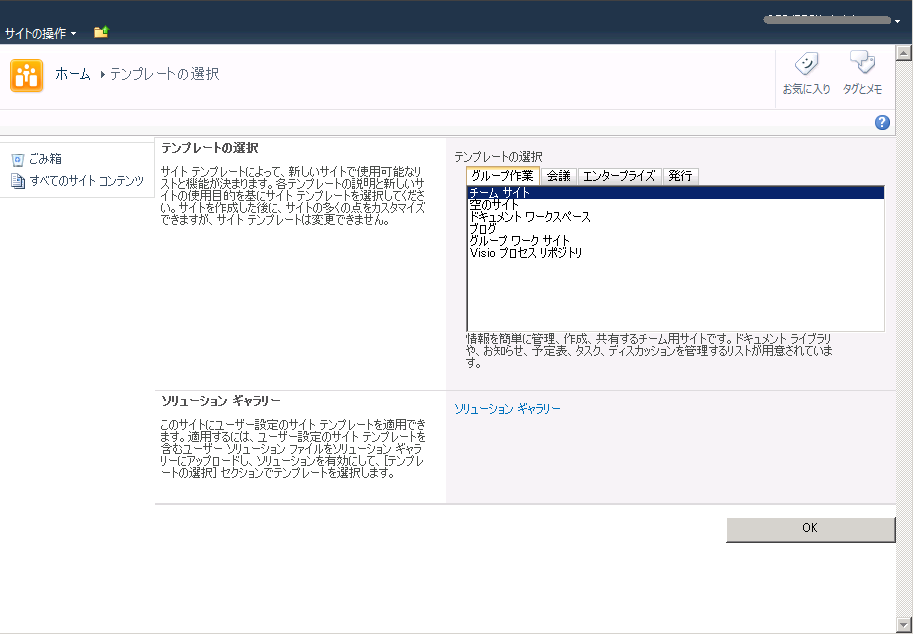
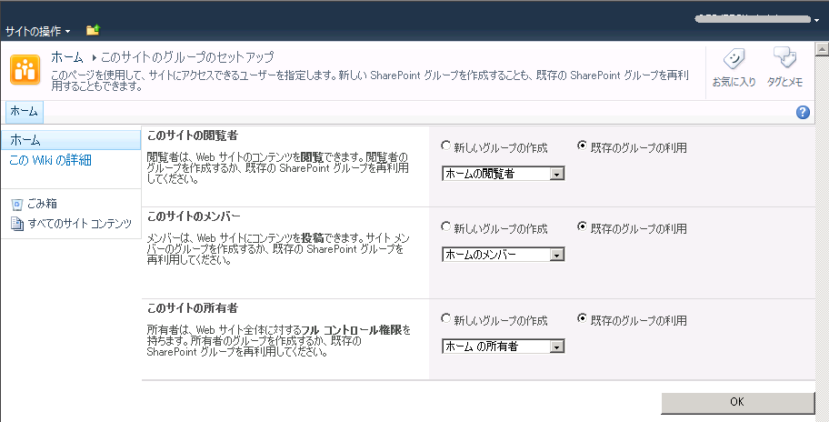
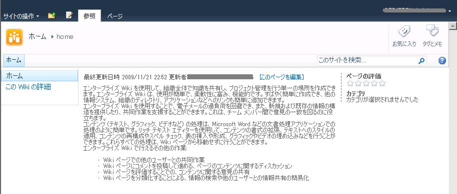
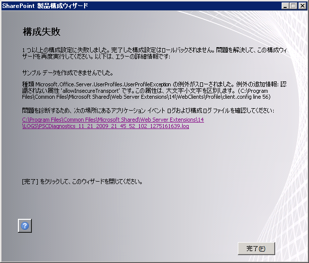

SharePoint Server 2010 beta2 をSingle Server 構成でインストールした後に起動する構成ウィザードの実行から、トップページ作成までの手順です。
**１．構成ウィザード起動**
インストールが完了すると、構成ウィザードが起動します。
インストール完了後、構成ウィザードが起動しない場合は、スタートボタンから、[すべてのプログラム]-[Microsoft SharePoint Products]-[SharePoint 2010 製品構成ウィザード]を起動してください。
すると、以下の画面が表示されます。

[次へ]をクリックします。
**２．サービス停止**
構成ウィザードを実行するにあたり、関連するサービスが停止されます。
[はい]をクリックして先に進めます。

**３．構成開始**
ウィザードというからには、色々入力をしながら進めていくのかと思いきや、ここからは全自動です。

**４．構成完了**
しばらく待つと、構成完了となります。

簡単に構成できました。
[完了]をクリックして、トップページの作成へ進みます。
もし、構成ウィザードの途中でエラーが出ると、構成失敗の画面が表示されます。
そんな場合は、ログを見たりBingったりしてエラーを解決しましょう。
ちなみに私は途中でエラーが出て、構成失敗しました。
この記事の最後に、そのときの解決策を書いておきました。
**５．トップページテンプレート選択**
ここでトップページのサイトテンプレートを選択します。
サイトテンプレートとは、サイトの役割に応じたコンテンツが最初から組み込まれているサイトの雛形のようなものです。
今回は、[エンタープライズ]タブの中にある、[Wiki]を選択してみました。

サイトテンプレートを選んだら、[OK]をクリックします。
すると、以下の処理中画面が表示され、トップサイトが作成されます。

**６．権限設定**
トップサイトの作成が終わると、次に権限設定のページに移ります。
ここでは初期状態のまま[OK]をクリックします。

**７．出来上がり**
トップサイトが出来上がりました。

**構成ウィザード実行時のエラーについて**
私の環境では、構成ウィザードを実行している途中で以下のエラーが発生、構成ウィザードが中断してしまいました。
サンプルデータを作成できませんでした。
例外の追加情報：認識されない属性'allowInsecureTransport'です。この属性は、大文字小文字を区別します。

このエラーが出た場合、以下のフォーラムの情報が参考になります。
<http://social.msdn.microsoft.com/Forums/en-US/sharepoint2010general/thread/041ddc78-8d18-4753-b7be-8d8113e26e62>
私はこのフォーラムに書いてあった、以下のファイルをインストールしたら上記のエラーが出なくなりました。
<http://connect.microsoft.com/VisualStudio/Downloads/DownloadDetails.aspx?DownloadID=23806>
実はこの辺の情報は、TechNetに記載されているようですね。
インストール前にじっくり読んでからはじめれば、はまることはないようですね。
<http://technet.microsoft.com/ja-jp/library/cc262485(office.14).aspx>
