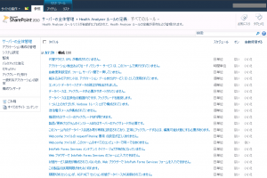
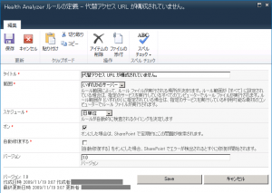
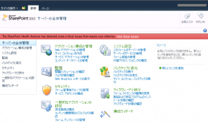
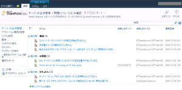
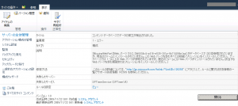

SharePoint Server 2010 beta2 には、Health AnalyzerというSharePointの設定などでおきている問題点を検出・修正する機能が付いています。
Health Analyzerにより検出される問題点は、beta2時点では58項目あります。（下図は１ページ目だけを表示しています）

各項目ごとに、検出を行うかどうか、自動修復を行うかどうかなどを設定することができます。

問題が見つかると、全体管理サイトを表示したときに、下図のように赤い帯が表示されます。

帯にあるリンクをクリックすると、検出された問題の一覧ページに遷移します。

問題点のひとつをクリックすると、その問題を解決する方法などが表示されます。

この機能により、SharePointの状態確認が容易になり、運用がしやすくなるかと思います。
