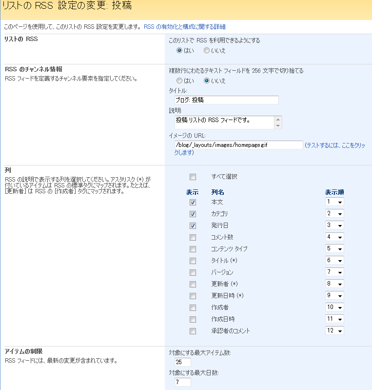

SharePointのリストやブログは、標準でRSSフィードを配信する機能を持っています。
ただし、RSSフィードを使用する設定をしただけの状態では、RSSフィードの中身（タイトルや表示項目）は、ややいけてない状態になっています。
たとえば、ブログサイトのRSSフィードのタイトルの初期値は、「ブログ：投稿」です。
このタイトル、なんのこっちゃよくわからないので変更したくなりますよね。
そんな時は、以下のように設定を変更してください。
**１．RSS設定ページへ移動**設定変更をしたいリストの設定ページにある「RSS設定」をクリックし、RSS設定ページへ移動します。
**２．設定変更**RSS設定ページで、必要項目を変更します。
ちなみにブログのRSSフィードの初期設定は以下のようになっています。

画像を見ると分かりますが、タイトルが「ブログ：投稿」になってますよね。
ここを変えれば、RSSフィードのタイトルが変わります。
