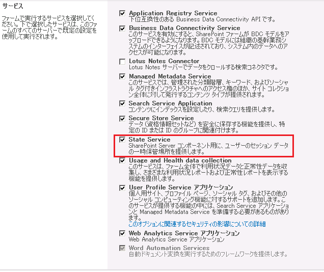

State Serviceサービスアプリケーション（以降、State Service）は、他のサービスアプリケーションのように全体管理サイトから手動で追加することができません。
State Serviceを追加する場合は全体管理サイトのファーム構成ウィザードかPower Shellで構成する必要があります。
**ファーム構成ウィザードでState Serviceを追加する**
**１．ファーム構成ウィザード開始**サーバーの全体管理サイトからファーム構成ウィザードをクリックし、ウィザードを実行します。
**２．State Serviceを選択しウィザード実行**
ファーム構成ウィザードのサービスセクションにて、下図の通りState Serviceにチェックをつけて[次へ]ボタンをクリック。
サイトコレクション作成のページはスキップしても進めても構いません。

