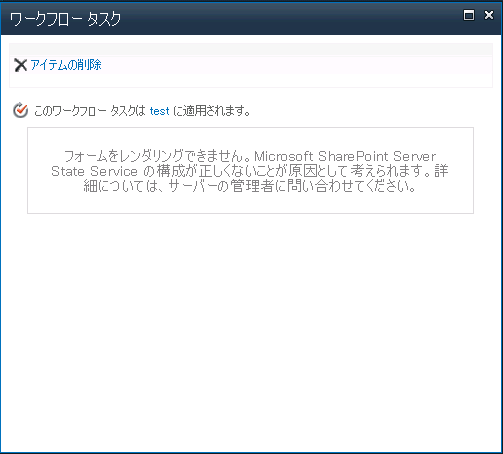

**現象：**
ワークフローを実行中に下図の通り「フォームをレンダリングできません・・・」というエラーが発生し、アイテムを開くことができない。

**原因：**
メッセージの通り、State Serviceが構成されていないことが原因。
**対処法：**以下のリンクの通り、State Serviceを構成することで、ワークフローが動くようになる。
[State Service アプリケーションを構成する](http://sharepoint.orivers.jp/reference/SitePages/State Serviceサービスアプリケーションを構成する.aspx)
