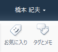
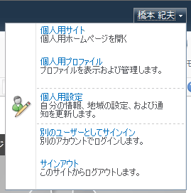
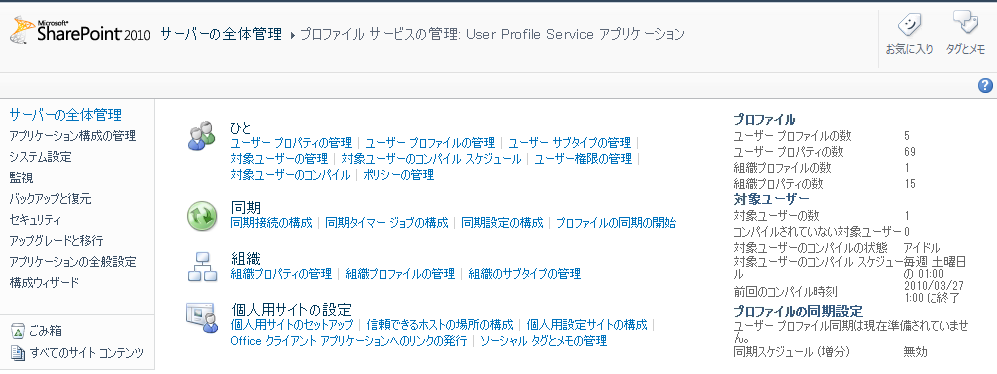
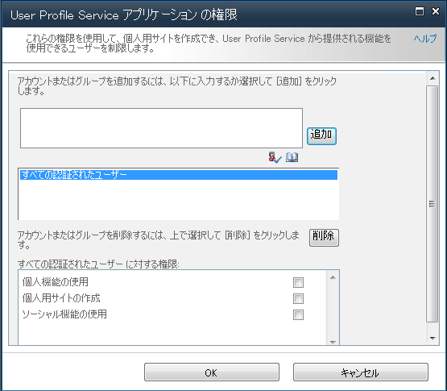
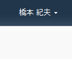
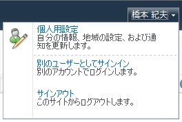

SharePoint2010のページ右上には、デフォルトで個人用サイトへアクセスするためのリンクと、お気に入り及びタグのアイコンが表示されています。
お気に入りとタグのアイコン

個人用サイトを作成＆参照するためのリンク

これらのリンクとアイコンを削除する方法は以下の通りとなります。
**１．プロファイルサービスの管理ページへ移動**サーバーの全体管理サイトへアクセスし、[サービスアプリケーションの管理]→[User Profile Service アプリケーション]をクリック。
[プロファイルサービスの管理]ページを開きます。

**２．User Profile Service アプリケーションの権限ページを開く**[プロファイルサービスの管理]ページにて、[ひと]セクションの[ユーザー権限の管理]をクリック。
[User Profile Service アプリケーションの権限]ページを開きます。
**３．権限を編集**[User Profile Service アプリケーションの権限]ページ中段のリストボックスから、リンクとアイコンを消したいユーザーを選択します。
デフォルトでは、ActiveDirectoryで認証されたユーザーすべてを指す「すべての認証されたユーザー」がリストアップされています。
リストアップされたユーザーを一つ選択し、下段の権限一覧のチェックをオン/オフすることで機能をオン/オフすることができます。
個人用サイトのリンクを消すには、[個人用サイトの作成]のチェックを外します。
お気に入りとタグのアイコンを消すには、[ソーシャル機能の使用]のチェックを外します。
以下のページは、「すべての認証されたユーザー」に対して、権限を外した場合のイメージになります。

**４．結果**ここまでの操作の結果、個人用サイトのリンクとお気に入り、タグのアイコンが表示されなくなります。
お気に入りとタグのアイコンが消えています。

個人用サイトのリンクが消えています。

一つ注意点です。
権限を外すことで、個人用サイトのリンクやお気に入り、タグのアイコンが表示されなくなりますが、同時に機能そのものも利用できなくなってしまいます。
ページ右上からリンクを消したいだけとかであれば、マスターページを編集するなどして、リンクだけ消すようにしてください。
