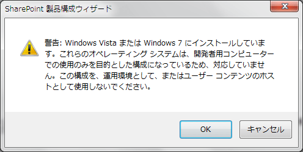

SharePoint 2010 は開発用途に限って、クライアント OS 上にインストールすることができるようになりました。
この記事では、Windows 7 を開発環境として、SharePoint Server 2010 をインストールするための手順を記載します。
手順は msdn ライブラリにも記載されているので、最低限必要なことだけ記載ます。
詳細な手順を確認したい場合は、msdn ライブラリの以下の記事を参考にしてください。
[http://msdn.microsoft.com/ja-jp/library/ee554869%28office.14%29.aspx](http://msdn.microsoft.com/ja-jp/library/ee554869(office.14).aspx)
なお、以下の手順は管理者アカウントで実施してください。
**１．更新プログラムのインストール**SharePoint Server 2010 のインストールを開始する前に、以下の２つの更新プログラムをインストールします。
WCF修正プログラム
<http://go.microsoft.com/fwlink/?linkid=166231&clcid=0x411>
.NET Framework 3.5 SP1のADO.NETデータサービスの更新プログラム
<http://go.microsoft.com/fwlink/?linkid=163524&clcid=0x411>
**２．セットアップファイルのコピー**SharePoint Server 2010 のセットアップファイルをクライアント PC にコピーします。
msdn サブスクリプションから ja\_sharepoint\_server\_2010\_x64\_dvd\_518705.iso ファイルをダウンロードした場合は、そのファイルを仮想ドライブソフトで開くか DVD に焼いて開くかして、全ファイルをクライアント PC にコピーします。
ここでは、C:SharePointFiles フォルダにコピーします。
**３．setup.configファイルを編集する**C:SharePointFilesFilesSetupSetup.config ファイルをメモ帳などテキストエディタで開きます。
以下の１行を、Setup.config ファイルの最終行にある </Configuration> の１行上の行に追記します。
<Setting Id="AllowWindowsClientInstall" Value="True"/>
**４．追加コンポーネントのインストール**以下のコンポーネントを順にインストールします。
Microsoft FilterPack 2.0 (SharePoint Server 2010 のインストールフォルダに入ってます)
C:SharePointFilesPrerequisiteInstallerFilesFilterPackFilterPack.msi
Microsoft Sync Framework Runtime 1.0
<http://go.microsoft.com/fwlink/?linkid=141237&clcid=0x411>
SQL Server 2008 Native Client
<http://go.microsoft.com/fwlink/?linkid=123718&clcid=0x411>
Windows Identity Foundation (Windows6.1-KB974405-x64.msi)
<http://www.microsoft.com/downloads/details.aspx?FamilyID=eb9c345f-e830-40b8-a5fe-ae7a864c4d76&displayLang=ja>
Microsoft Chart Controls for Microsoft .NET Framework 3.5 ソフトウェア更新プログラム
<http://go.microsoft.com/fwlink/?linkid=122517&clcid=0x411>
Microsoft SQL Server 2008 Analysis Services ADOMD.NET
<http://download.microsoft.com/download/A/D/0/AD021EF1-9CBC-4D11-AB51-6A65019D4706/SQLSERVER2008_ASADOMD10.msi>
**５．機能の有効化**以下のコマンドをコマンドプロンプトで実行して、Windows 7 の各機能を有効化します。
なお、以下のコマンドを実行すると、クライアントスペックにもよると思いますが、数分間応答が返ってきません。
start /w pkgmgr /iu:IIS-WebServerRole;IIS-WebServer;IIS-CommonHttpFeatures;IIS-StaticContent;IIS-DefaultDocument;IIS-DirectoryBrowsing;IIS-HttpErrors;IIS-ApplicationDevelopment;IIS-ASPNET;IIS-NetFxExtensibility;IIS-ISAPIExtensions;IIS-ISAPIFilter;IIS-HealthAndDiagnostics;IIS-HttpLogging;IIS-LoggingLibraries;IIS-RequestMonitor;IIS-HttpTracing;IIS-CustomLogging;IIS-ManagementScriptingTools;IIS-Security;IIS-BasicAuthentication;IIS-WindowsAuthentication;IIS-DigestAuthentication;IIS-RequestFiltering;IIS-Performance;IIS-HttpCompressionStatic;IIS-HttpCompressionDynamic;IIS-WebServerManagementTools;IIS-ManagementConsole;IIS-IIS6ManagementCompatibility;IIS-Metabase;IIS-WMICompatibility;WAS-WindowsActivationService;WAS-ProcessModel;WAS-NetFxEnvironment;WAS-ConfigurationAPI;WCF-HTTP-Activation;WCF-NonHTTP-Activation
**６．再起動**ここまでの作業が終わったら、クライアント PC を再起動します。
**７．SharePoint Server 2010 のインストール**クライアント PC にコピーしたセットアップファイルの setup.exe を実行します。
インストールを開始すると、以下のダイアログが表示されるので、[OK] をクリックしてください。

インストールが完了した後、そのまま続けて構成ウィザードを実行します。
これで、Windows 7 上で SharePoint Server 2010 を実行することができるようになります。
