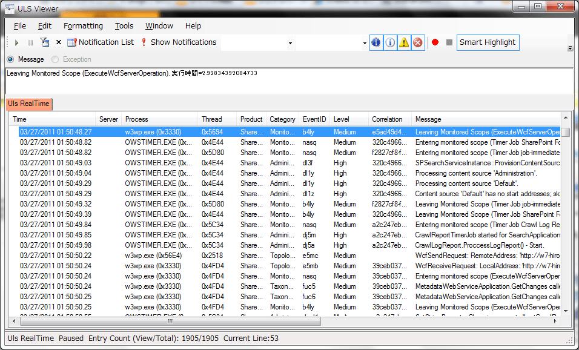

**概要**
SharePointの診断ログ用ビューアです。
ログのレベル（Hight, Middleなど）や任意項目による絞込み、検索、ログのリアルタイム表示などの機能があります。
テキストファイルのまま見るよりも、ずいぶんと見やすいかと思います。

**製造元・販売元**マイクロソフト
**製造・販売年月日**2009/10/09
**ダウンロード**<http://archive.msdn.microsoft.com/ULSViewer>
