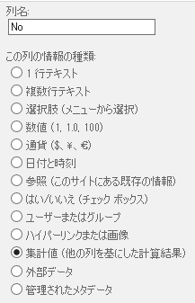
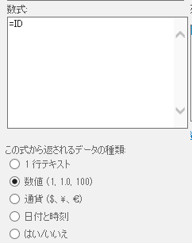
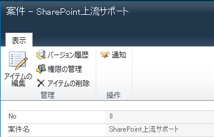

**注意！**
**本件、すでに登録されているアイテムを参照する分には問題ないですが、新規登録されたアイテムには対応できないようです。**
**新規登録されたアイテムは、集計列が計算式を実行するタイミングではIDがまだ確定していなくてゼロになっているようで、集計列にもゼロが表示されてしまいます。**
**以下、上記現象を解説しているブログになります。（中村さん、ご指摘いただき、ありがとうございました。）**
[**http://fahadzia.com/blog/2011/05/sharepoint-list-id-column-in-a-calculated-column-does-not-update/**](http://fahadzia.com/blog/2011/05/sharepoint-list-id-column-in-a-calculated-column-does-not-update/ "http://fahadzia.com/blog/2011/05/sharepoint-list-id-column-in-a-calculated-column-does-not-update/")
 
**それでも記事は一応残しておきます。**
**参照だけで使いたいというニーズがあるかもしれないので・・・**
 
アイテムの ID は、リスト内で必ず一意になる数字で、ビューで一覧で見た時にわかりやすいのため、アイテムの識別番号として使うことは多いと思います。
そして、ビューには簡単に ID 列を表示できるので、参照ページでも普通に表示できるだろうと考え、参照ページで ID 列を表示しようと試みます。
しかし、いざ設定しようとすると、アイテムの参照ページには ID 列が表示できないことに気づきます。
 
そんな時・・・
以下の手順で、参照ページに簡単に ID 列を表示することができます。
 
**１．リストに集計値列を追加する。**
リストの設定ページにて、[列の作成]をクリックし、集計値列を追加します。
ここで列名を ID にしようとしても、内部的に ID という列名は使われているので、指定することができません。
No など、ID 以外の列名にしてください。

 
**２．数式として「=ID」と入力し、データの種類を数値にする。**
数式欄に「=ID」と入力します。
この数式により、集計値列に ID 列の値を表示することを指定しています。
また、[この式から返されるデータの種類]は、必ず数値にしてください。
ここで違う種類を選択すると、数式で ID を指定していても、値が表示されません。
データの種類は、表示する列の種類に合わせて、正しく指定する必要があります。

設定は以上です。
これで参照ページに ID 列を表示できるようになります。
あとは、列の並び順を整えれば完成です。

 
なお、今回追加した列は集計値列なので、新規や更新ページでは表示されません。
