SharePoint 2013 のインストールから初期構成までの流れを、画面ショット付きでまとめました。
 
TechNet には、日本語で詳細な手順が公開されているので、詳細はそちらで追っていただくとして、ここでは流れをつかんでいただければと思います。
 
なお、今回は SharePoint の最低限の検証環境を構築する際に良く作る構成(SharePoint x 1 + SQL x 1)を例にしています。
TechNet でいうところの「[SQL Server を使用する単一サーバーに SharePoint 2013 をインストールする](http://technet.microsoft.com/ja-jp/library/cc262243(v=office.15).aspx)」とほぼ同じ内容になっています。
2010 をインストールした経験のある方であれば、それとほぼ同じなので全く問題ないかと思います。
 
 
**前提条件：**
SQL Server は事前にインストールしておいてください。
 
インストールを開始する前に、以下のドキュメントを確認し、ハードウェア、ソフトウェアが要件を満たしていることを確認してください。
[http://technet.microsoft.com/ja-jp/library/cc262485(v=office.15).aspx](http://technet.microsoft.com/ja-jp/library/cc262485(v=office.15).aspx "http://technet.microsoft.com/ja-jp/library/cc262485(v=office.15).aspx")
 
ちなみに私の検証環境は貧弱でして以下の通りとなっています。
まだバリバリ検証しているわけではないので、今のところこれで足りています。
＜SharePoint＞
CPU：2 仮想プロセッサ
メモリ：8GB
 
＜SQL Server＞
CPU：2 仮想プロセッサ
メモリ：4GB
 
 
**インストール手順：**
**１．必須コンポーネントのインストール**
SharePoint 2013 を動かす上で必要となるコンポーネントを、自動的に Web からダウンロードしつつ、インストールを行います。
自動的に Web に繋ぎに行くので、Web に繋がる状態で以下の手順を進めてください。
本番環境など、Web が繋がらない環境でインストールする方法は、また別の機会にご紹介します。
 
インストーラーを起動し、[ソフトウェア必須コンポーネントのインストール]をクリック。
[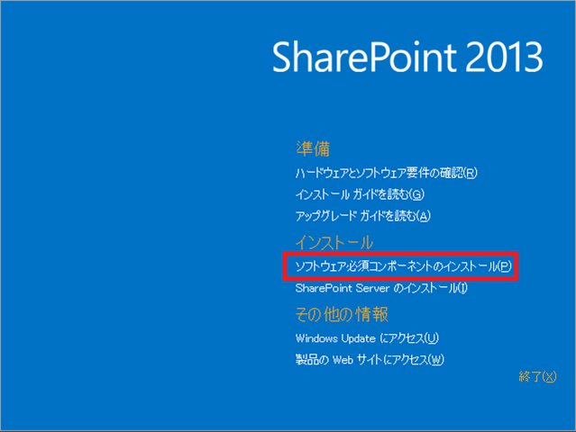](http://sharepoint.orivers.jp/wp-content/uploads/2014/12/image_thumb_3D9E5E32.png)
製品準備ツールが起動するので、[次へ]をクリック。
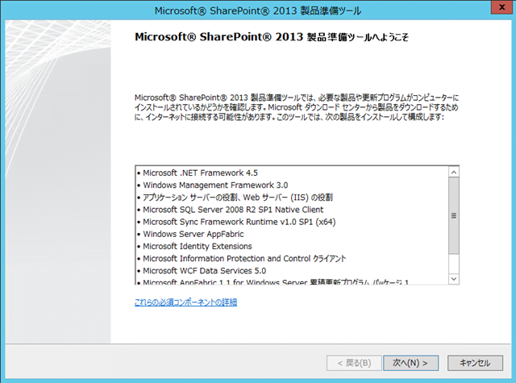
ライセンス条項。
[使用許諾契約書の条項に同意します]をチェックして、[次へ]をクリック。
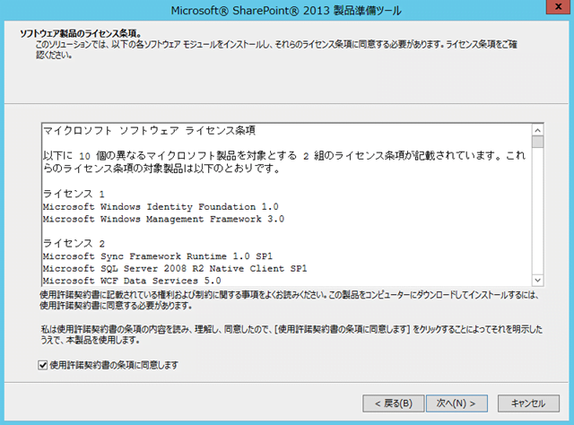
必須コンポーネントが順次インストールされるので、終わるまで待ちます。
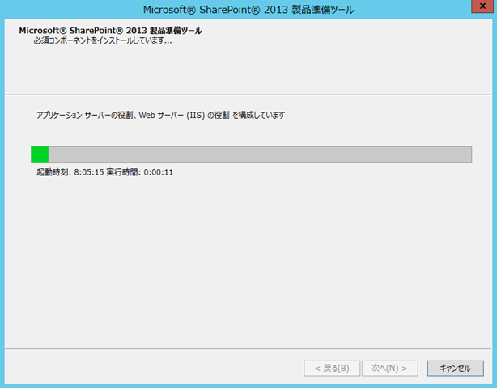
終了しました！
これで必須コンポーネントのインストールは完了です。
[完了]をクリックして、元の画面に戻ります。
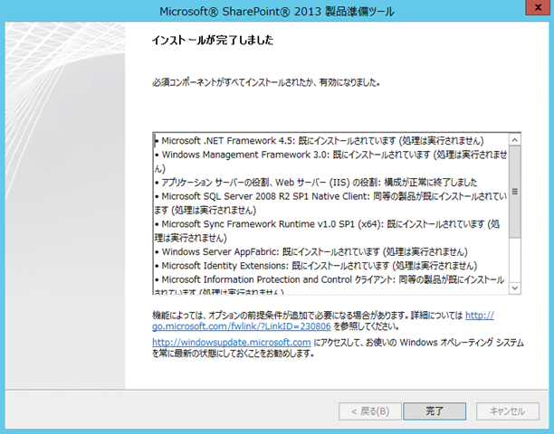
**２．SharePoint 本体のインストール**
いよいよ、SharePoint本体のインストールです。といっても、ここまでは何も難しいことはありません。
[SharePoint Server のインストール]をクリックして、SharePoint 本体のインストールを開始します。
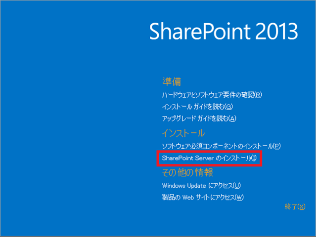
プロダクトキーを入力して、[続行]をクリック。
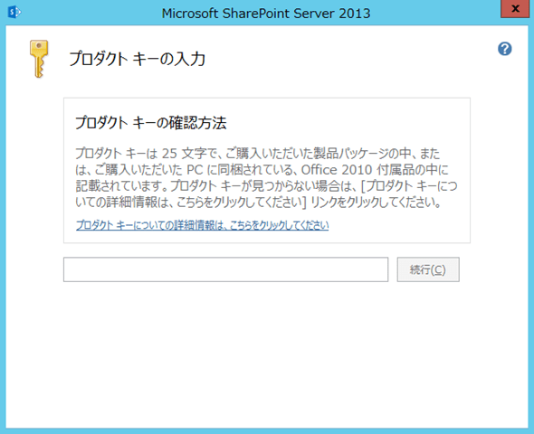
[「マイクロソフト ソフトウェア ライセンス条項」に同意します]にチェックを入れ、[続行]をクリック。
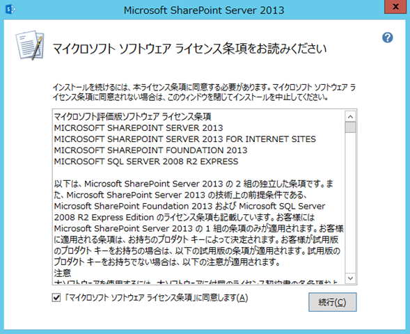
サーバーの種類は[完全]のまま、[今すぐインストール]をクリック。
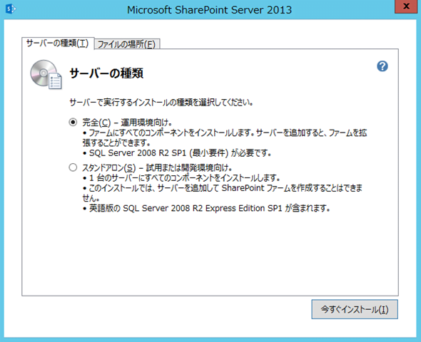
ちなみに、必要に応じて製品の各種ファイルの格納先と、検索インデックスの格納先を指定できます。
検証環境として作る分には、特に変える必要はないと思います。
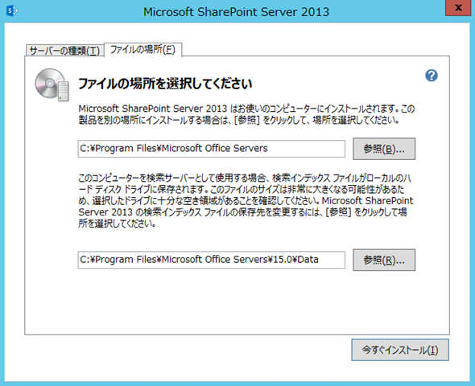
インストールが始まります。
あとは勝手に進行しますので、インストールが終わるまでしばし待ちます。。。
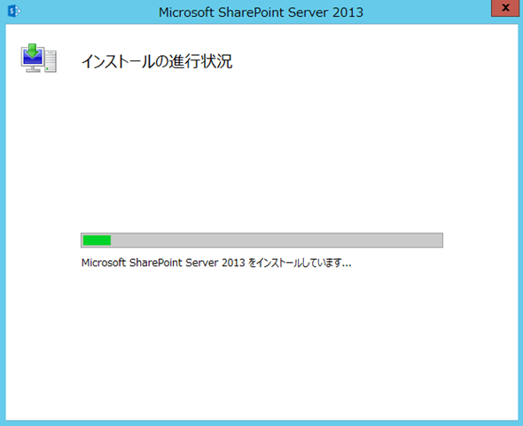
インストールが完了しました！！
[SharePoint 製品構成ウィザードを今すぐ実行する]にチェックを入れたまま、[閉じる]をクリックして、製品構成ウィザードの実行に進みます。
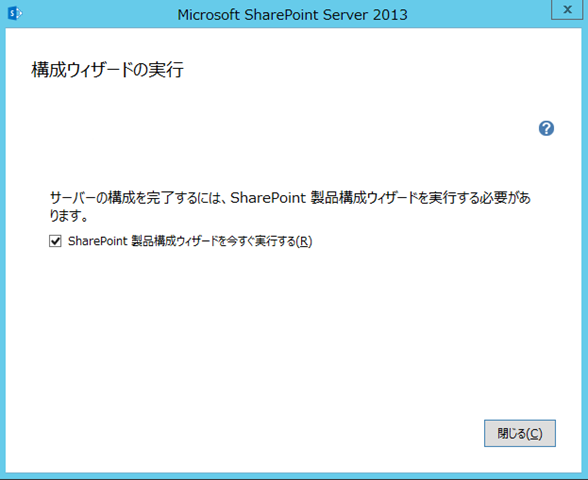
 
**3. 更新プログラムのインストール**
パブリック更新プログラムと、必要に応じて最新の累積的更新プログラムをインストールしてください。
パブリック更新プログラムは、すべての環境でインストールすることが推奨されている更新プログラムとなります。
以下よりダウンロードして、ウィザードの手順に従いインストールしてください。
[http://support.microsoft.com/kb/2767999](http://support.microsoft.com/kb/2767999 "http://support.microsoft.com/kb/2767999")
累積的更新プログラムは、以下のサイトからダウンロード可能です。
必要に応じてダウンロード、インストールしてください。
なお、累積的更新プログラムをインストールするためには、上記パブリック更新プログラムを事前にインストールしておく必要があります。
[http://technet.microsoft.com/en-us/sharepoint/jj891062](http://technet.microsoft.com/en-us/sharepoint/jj891062 "http://technet.microsoft.com/en-us/sharepoint/jj891062")
 
**4．製品構成ウィザードの実行**
製品構成ウィザードでは、SharePoint ファームを構成するために、SQL Server との接続設定をして、各種 サービスのインストールやファイル、レジストリ、ローカルアカウントの設定などなど、色々な処理が実行されます。
 
[次へ]をクリックして、製品構成ウィザードを始めます。
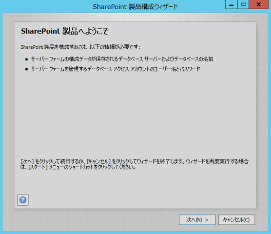
製品構成ウィザード実行中に、IIS が停止するとのこと。
検証環境構築中なので特に問題はないかと思います。[はい]をクリック。
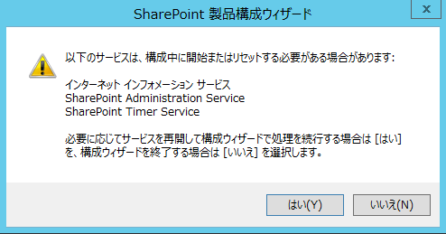
新しく環境を構築するので[新しいサーバーファームの作成]を選択し、[次へ]をクリック。
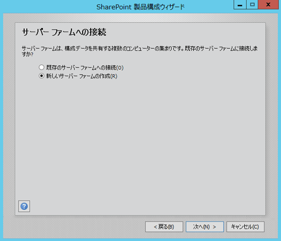
SQL Server への接続設定を行います。
[データベースサーバー]には、SharePoint の設定情報やデータを保存する先となる SQL Server のコンピュータ名を入力します。
[データベース名]は、デフォルトで"SharePoint\_Config"になっており、特に変える必要はないかと思いますが、もし SQL Server に既に別の SharePoint ファームが構築されている場合や、その予定がある場合は、データベース名に環境名がわかるように文字を追加するのが良いかと思います。
なお、データベースには、SharePoint のファームに関する各種設定情報が保存されます。
[ユーザー名]には、SharePoint から SQL Server に接続するときに使用する、ドメインアカウントを指定します。
ここで指定するユーザーがいわゆるシステム管理者のような位置づけになります。
TechNetにも詳しく書いてあるので、よく読んでアカウントを決めてください。
[パスワード]には、[ユーザー名]で指定したユーザーのパスワードを入力します。
すべて入力したら、[次へ]をクリック。
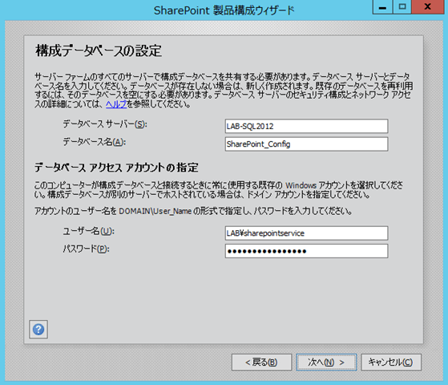
 
ファームにサーバーを追加する時に必要となるパスフレーズを設定します。
[パスフレーズ]と[パスフレーズの確認]を入力し、[次へ]をクリック。
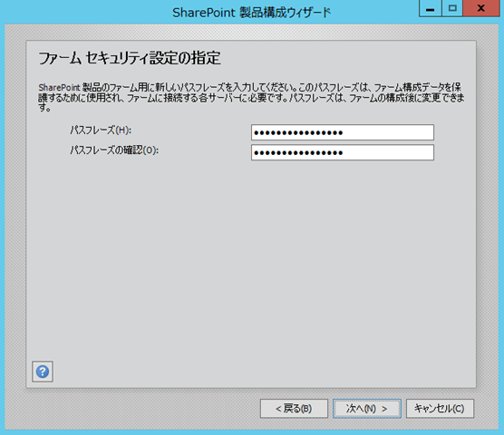
 
SharePoint のファームレベルの管理画面となる、全体管理サイトの設定をします。
ポート番号と認証プロバイダーを指定して、[次へ]をクリック。
ちなみに私はいつも、下の画面ショットにあるような設定にしています。
ポート番号はわかりやすい方が管理がしやすいですし、認証プロバイダーはNTLMがわかりやすいので。
全体管理サイトは特にネゴシエートでなければならない理由もないのではないかと思いますので・・・
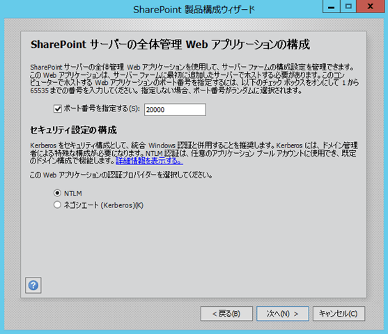
確認画面になります。
これまでに指定した内容が表示されるので、間違いがないか確認して、[次へ]をクリック。
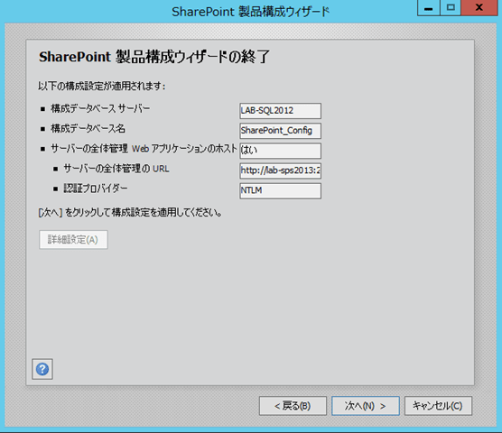
ここから構成が始まるので、完了するまでしばし休憩。。。
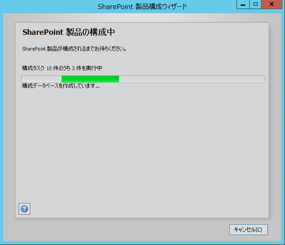
 
これで構成完了です。
この時点でファームは完成し、全体管理サイトが起動している状態になります。
でも、まだ検証で使うサイトが作られておらず、各種サービスアプリケーションも作られていないため、何もできません。
ということで、[完了]をクリックすると自動的にブラウザが起動し、次のウィザードが立ち上がります。
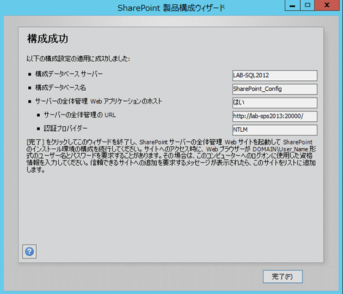
 
**5．ファーム構成ウィザードの実行**
ここまでで、SharePoint ファームの初期状態が出来上がり、全体管理サイトも起動しました。
次に、ファーム構成ウィザードを使って各種サービスアプリケーションの構成と初期サイトコレクションを作成します。
 
ブラウザが起動すると、まず品質向上にご協力くださいということで、以下のページが開きます。
検証環境なので、私はいつも迷わず[参加する]にチェックし、[OK]をクリック。
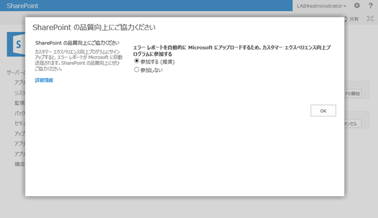
ファームの構成をウィザードで行うか、手動で行うかを選択するページが表示されます。
今回はウィザードを使うので、[ウィザードの開始]をクリックします。
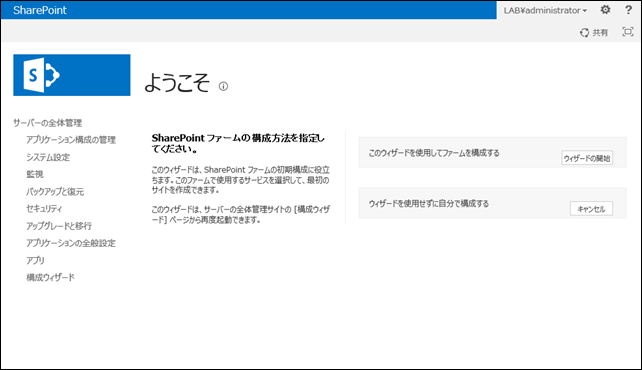
このファームで動かすサービスアプリケーションのアカウントを指定します。
私の場合はいつも事前にアカウントを作っているので、[既存の管理アカウントを使用する]を指定していますが、もちろんここで[新しい管理アカウントを作成する]を指定して、新規作成しても問題ありません。
サービスは、検証環境で起動させたいサービスのチェックを付けた状態にしておきます。
検証する内容にもよりますが、色々機能を確認したいということであれば、ひとまずデフォルト設定のままでよいかと思います。
設定を確認したら、[次へ]をクリック。
※画面ショットは４つに分かれていますが、これで１つのページです。
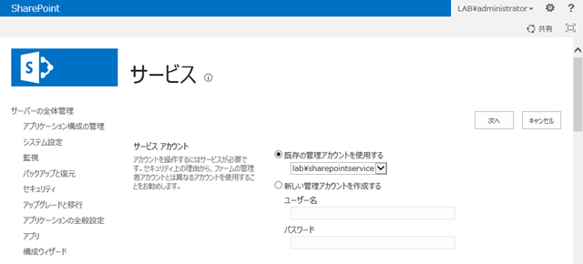
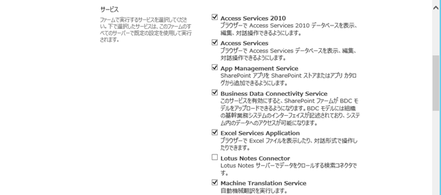
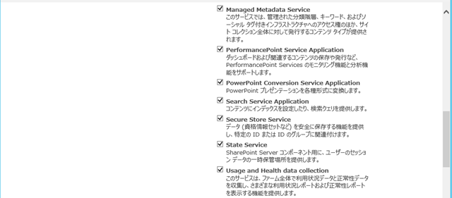
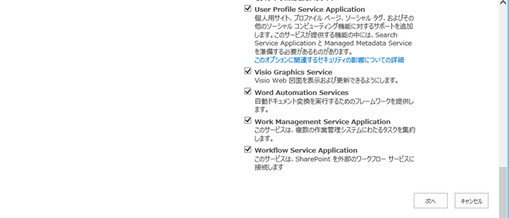
ウィザードが処理を開始すると、このような画面になります。

 
次に、最初のサイトコレクションを作成します。
[タイトル]には、サイトコレクションの名前を付けます。ここでつけた名前が、サイトを開いた時にページ左上に表示されます。
[説明]には、このサイトの簡単な説明を入れます。
[URL]は、このサイトコレクションのURLを指定するのですが、画面ショットのようにルートサイトコレクションとして作成するか、"/sites/"など特定のパスの下になるようにするかを指定します。
特定のパスの下になるようにした場合は、"/sites/○○○"の赤丸部分のURLを指定します。
[エクスペリエンス バージョンの選択]は、"2013"と"2010"が選べるのですが、これにより選べるテンプレートが変わります。
そして、"2010"を選ぶと、見た目も SharePoint 2010 の見た目になります。
[テンプレート]は、これから作成するサイトの検証内容に合わせて選択してください。
全部設定を終えたら、[OK]をクリックします。
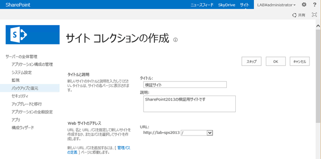
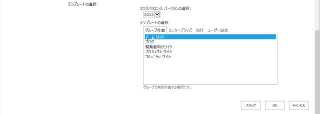
ここまでに設定した内容が表示されるので、確認して問題なければ[完了]をクリックします。
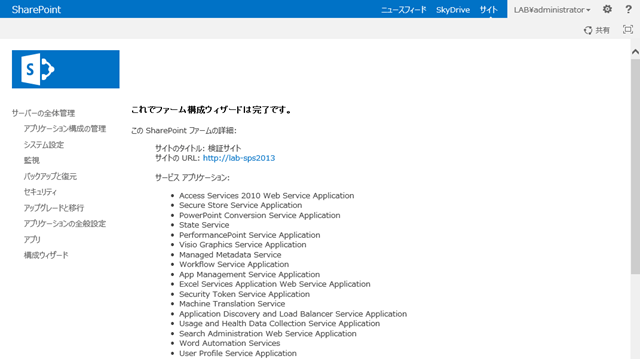
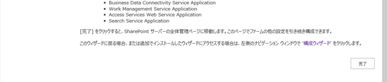
これで最初のサイトコレクション構築も完了し、検証環境が完成しました。
（実際にはこの後、検索設定やユーザープロファイル同期の設定も必要なのですが、また別の機会に）
