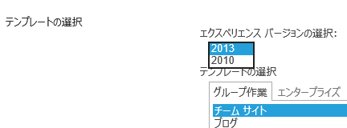
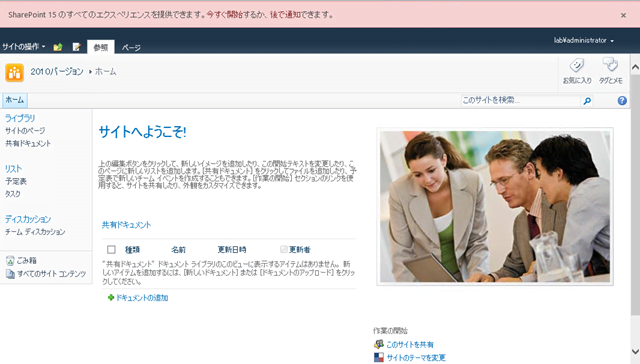
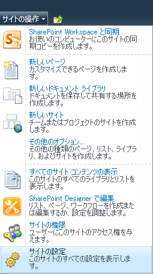
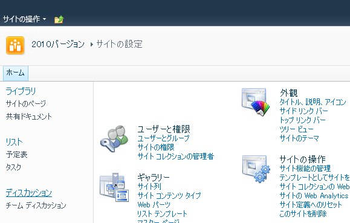
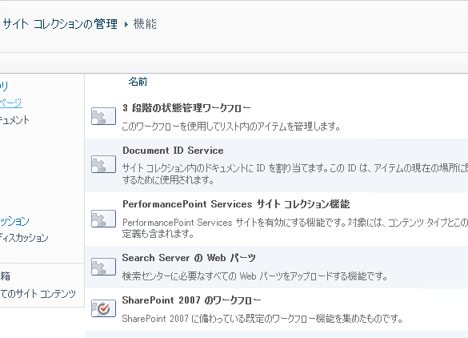
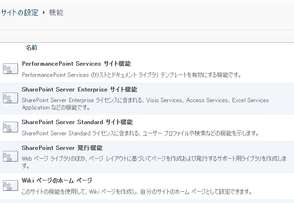

SharePoint 2013 は、サイトコレクションを作成する際に、下の画面ショットにある[エクスペリエンス バージョンの選択]を "2010" にすることで、ページの見た目と機能をひとつ前のバージョンである SharePoint 2010 ベースにすることができます。

 
こうして作られた 2010 ベースのサイトが、2013 ベースのサイトと何が違うのか、見た目に関してさらっとですが調べてみました。
画面ショットでざっとご紹介します。
 
最初にサイトを開くと、ページ上部に警告が出ます。
「SharePoint 15 のすべてのエクスペリエンスを・・・・」と。
SharePoint **15** ですって。はい、こちらRTM版でございますが、 SharePoint 15 という表現が残ってしまっています。
普通の方が見たら何のことかわからないと思いますが、SharePoint 2013 のことを言っています。
つまり、エクスペリエンスを "2010" にしているとすべての機能を利用できませんが、"2013" にするとすべての機能を利用できますということです。
右端の×を押すと消えるので、2010 でいきたい場合には、×を押して消しておきましょう。

 
それ以外の見た目は、2010 を知る方であれば、これが 2010 なのか 2013 なのか見分けはつかないのではないでしょうか。
リボンも見た目は 2010 と変わりません。

 
SharePoint Workspace のボタンもあります。使えるかどうかは試していません。。。

 
ドキュメントライブラリの設定ページも 2010 と変わらないようでした。

 
2010 が出た時にも 旧バージョンの 2007 モードでサイトを作ることができたのですが、その時は多少 2010 の痕跡が残っていたかと思います。
「サイトの操作」メニューが代表的な痕跡を残す部位だったかと思います。（違ったらごめんなさい。）
今回は・・・2010 の見た目と何一つ変わりません！

 
今回の 2010 の再現っぷりは素晴らしいです。
普通に使っていたら、2010 としか思えない。
 
と・・・思ったのですが、サイトの設定を見てみると・・・

 
あ、あれ？？
ユーザーと権限のメニュー位置がおかしい。。。
下にずれてますね。
2010 はこうなっていないので、これは痕跡というか 2013 かどうかを見分けるポイント、ということですかね。
 
最後に、サイトコレクションの機能と、サイトの機能を。

 
これらも、他と同様、並んでいる機能は 2010 と同じでした。
まだまだ確認したのは一部のページ、機能だけですが、前バージョンに比べてより再現性が高くなっていると感じました。
ただ、大事なのは見た目よりも中身の動作、仕様だとは思いますので、それはそれで調べないと。
