SharePoint 2010 から、プロファイル同期の仕組みは FIM(Forefront Identity Manager) がベースとなり、その仕組みが非常に複雑になりました。
それに伴い、プロファイル同期周りのセットアップに関する問題も多く発生しました。
代表的なところでは、User Profile Synchronization Service が起動できないとか、AD から情報をインポートしたいだけなのに、機能的には双方向のやり取りができてしまうためセキュリティ的に不安とか・・・色々あったと思います。
 
そんな問題に対応するため、SharePoint 2013 では、AD インポートという SharePoint 2007 のプロファイル同期と同じ仕組みが復活しました！
AD インポートは、その名の通り AD からのインポートしかできませんが、構成は非常に簡単で仕組みも単純化されているため、インポート速度は従来の FIM を使う形式よりも速いとのこと。
 
今回は、そんな AD インポートの手順を調べてみました。
 
**＜構成手順＞**
全体管理サイトに接続し、[サービスアプリケーションの管理]をクリックします。
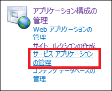
 
[User Profile Service Application]をクリックし、プロファイル サービスの管理ページに遷移します。
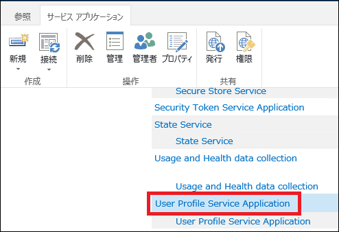
 
[同期設定の構成]をクリックし、同期設定の構成ページに遷移します。
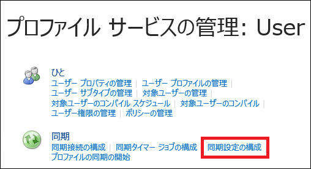
 
[同期のオプション]にある[SharePoint Active Directory インポートを使用する]を選択し、[OK]をクリックします。
デフォルトは[SharePoint のプロファイル同期を使用する]になっていて、これが SharePoint 2010 から採用された FIM を使ったプロファイル同期を行うことを指しています。
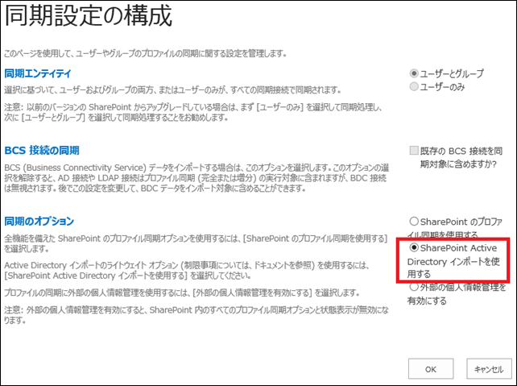
 
次に同期元となる AD を指定するため、プロファイルサービスの管理ページに戻り、[同期接続の構成]をクリックします。
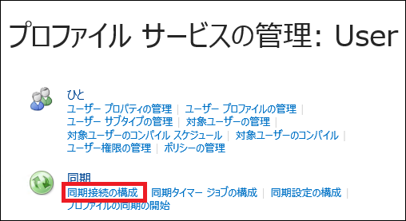
 
同期接続ページにて、[新しい接続の作成]をクリックします。
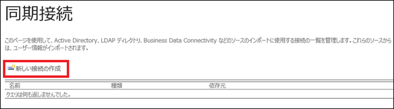
 
新しい同期接続の追加ページで、プロファイルインポートを行う AD への接続情報を設定します。
設定する内容は下図の通りで、AD への接続情報さえ事前におさえておけば、特に問題はないと思います。
ですが、ここで一点だけ注意事項。
ページ内のコメントにも書いてありますが、[アカウント名]で指定したアカウントには[完全修飾ドメイン名]で指定した AD に対して、ディレクトリ同期権限が必要です。
この権限を持たないアカウントを指定していると、インポート時にエラーが発生してしまいます。
詳細は後述します。
 
[接続設定]を入力した後、ページ下部の[コンテナーの作成]をクリックします。
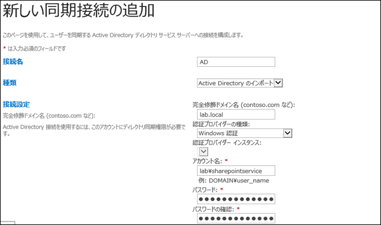
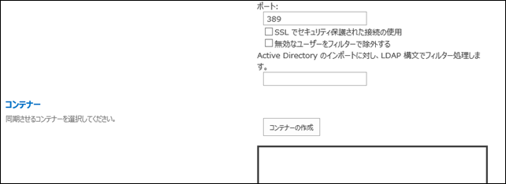
 
[コンテナーの作成]をクリックすると、AD のオブジェクトがツリー形式で表示されます。
この中から、インポートするオブジェクトを選択します。
下図では、"Users"を選択しているので、"Users"に含まれるオブジェクト、今回の場合はすべてのユーザーアカウントがインポート対象となります。
このインターフェイスは、SharePoint 2007 と一緒なので、2007 経験者であれば簡単に設定できるかと思います。
インポート対象を指定したら、[OK]をクリックします。
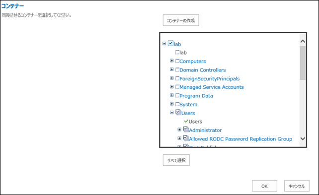
 
以上で設定は完了です。
同期接続のページに戻ると、今追加した接続が一覧に表示されています。
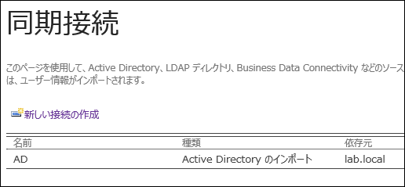
 
最後にきちんとインポート処理が動くかどうか、確認をしてみます。
プロファイルサービスの管理ページに戻り、[プロファイルの同期の開始]をクリックします。
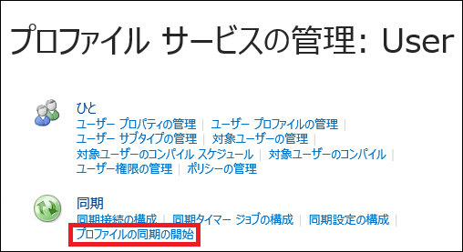
 
[完全同期の開始]を選択して[OK]をクリックし、インポート処理を実行します。
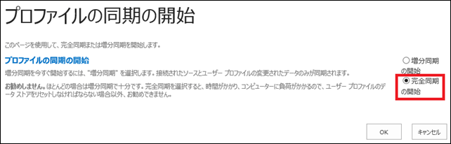
 
きちんと設定ができていれば、プロファイルサービスの管理ページで、プロファイルが増えたことを確認できます。
下図ではユーザープロファイルの数は6しかないですが、元は1でした。
また、プロファイルの同期状態というところがアイドルになっていますが、エラーがあった場合は、ここにエラーと表示されます。
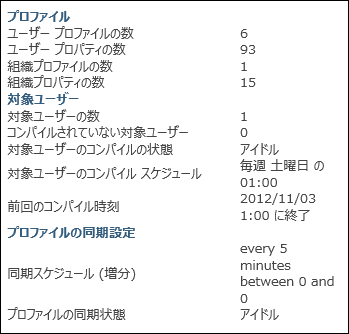
 
**＜ディレクトリ同期権限とは＞**
前述のとおり、インポート処理に利用するアカウントがディレクトリ同期権限を持っていない場合、上記設定はうまくできていても、インポート処理自体は失敗します。
エラーは以下の通りで、イベントログに ID 2896 として「クライアントが、ディレクトリ パーティションに対して DirSync LDAP 要求を行いましたが、次のエラーのために拒否されました。」と記録されます。
エラーメッセージの最後の方に、「"Replicating Directory Changes"制御アクセス権」という言葉が出ていますが、これがディレクトリ同期権限のことを指しています。
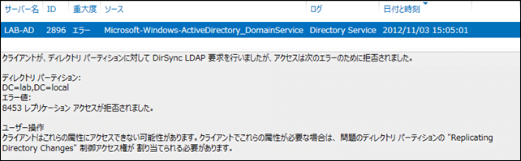
 
では、ディレクトリ同期権限をどうやってアカウントに付与するかですが、以下の手順となります。
 
**＜ディレクトリ同期権限の付与手順＞**
Windows Server の 管理ツールから [Active Directory ユーザーとコンピューター]を起動します。
起動後、下図の通り権限付与の対象となる AD をツリーから選択し、右クリックメニューから、[制御の委任]をクリックします。
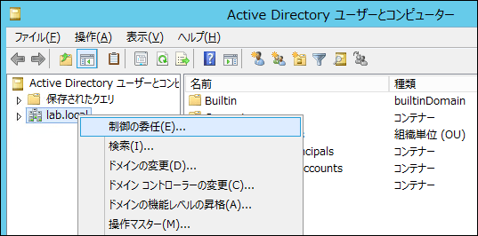
 
オブジェクト制御の委任ウィザードが起動するので、[次へ]をクリックして作業を開始します。
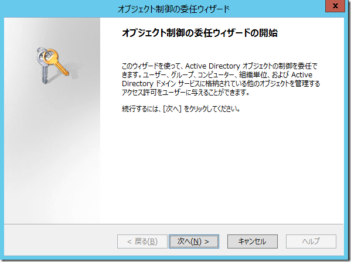
 
権限を付与するユーザーを追加するため、[追加]をクリックします。
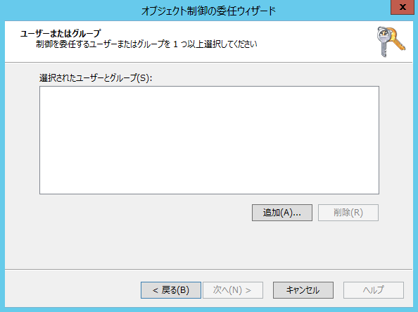
 
[選択するオブジェクト名を入力してください]欄に、権限を付与するユーザー名を入力し、[名前の確認]をクリックします。
正しいユーザー名が指定されていると、ユーザー名にアンダーラインが引かれます。
その後、[OK]をクリックします。
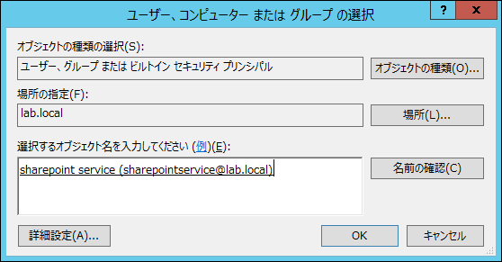
 
これでユーザーを選択することができました。
[次へ]をクリックします。
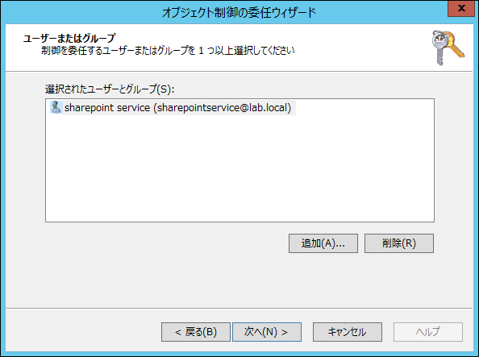
 
[委任するカスタム タスクを作成する]を選択し、[次へ]をクリックします。
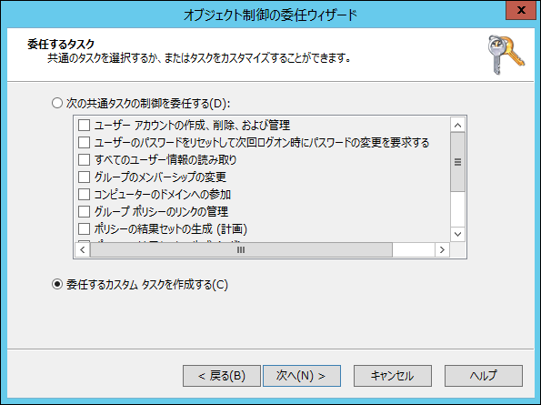
 
[このフォルダー、このフォルダー内の既存のオブジェクト、およびこのフォルダー内の新しいオブジェクトの作成]を選択し、[次へ]をクリックします。
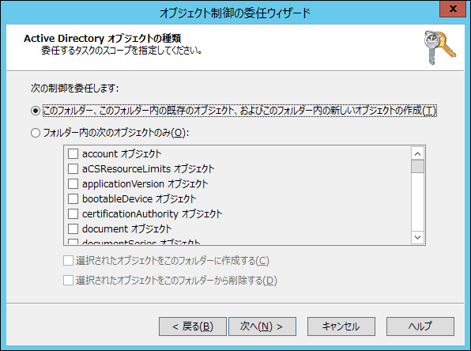
 
[全般]にチェックを入れて、[アクセス許可]のリストから[ディレクトリの変更のレプリケート]を探し、チェックを入れます。
これが、ディレクトリ同期権限の正体です。
チェックを入れたら、[次へ]をクリックします。
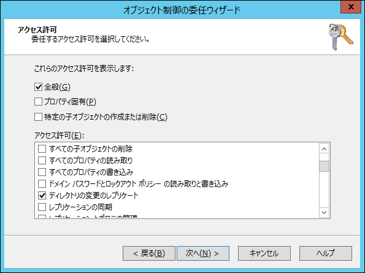
 
これで指定のアカウントに、ディレクトリ同期権限が付与されました。
[完了]をクリックして、ウィザードを終了します。
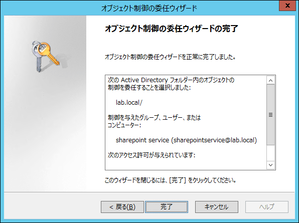
 
初めてプロファイル同期を構成するときには、このディレクトリ同期権限の付与を忘れずに行うようにしてください。
参考URL：
[http://technet.microsoft.com/ja-jp/library/jj219646.aspx](http://technet.microsoft.com/ja-jp/library/jj219646.aspx "http://technet.microsoft.com/ja-jp/library/jj219646.aspx")
