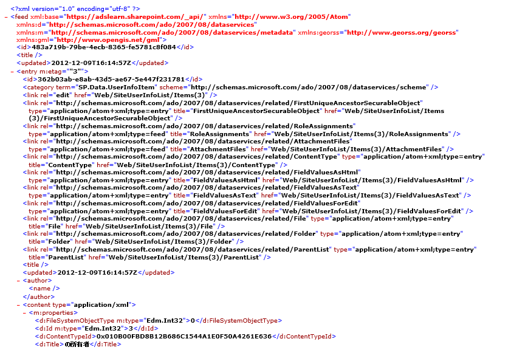
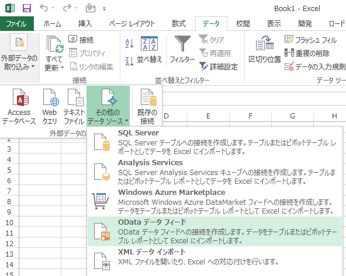
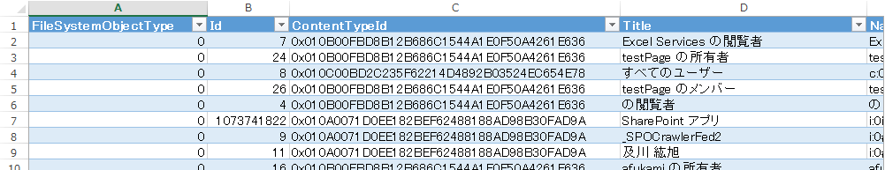

※この投稿は [Office 365 Advent Calendar 2012](http://atnd.org/events/33924) に参加しています。

### はじめに

SharePoint 2013 では、プログラミングインターフェイスの一つとして REST サービスという API を使うことができます。
REST サービスはマイクロソフト独自の企画というわけではなく、[Open Data Protocol](http://www.odata.org/)(OData) という業界団体が決めた標準規約に基づいています。
そのため、OData に対応するアプリケーションがあれば、マイクロソフト製品やマイクロソフトのサードパーティ製品ではなくても、SharePoint 2013 からのデータ取得や登録、削除といった一連の処理を実行することができるわけですが、この処理を行う仕組みが Representational State Transfer (REST) Web サービスとして、SharePoint 2013 に実装されています。
もちろん、REST サービスは 次期 Office 365 でも実装されており、今後の主力 API として位置づけられています。
 
実は REST サービスは SharePoint 2010 や今の Office 365 にも実装されているため利用可能ではあるのですが、記述方法が違っていたり、まだまだ機能としては十分ではない部分があります。
2013 になってついに本格的に使われる時が来たという感じですね。
ということで、この記事では、2013 版の REST サービスについて紹介をします。

### REST サービスに対応したクライアントアプリケーション

REST サービスは SharePoint の Web サービスとして実装されています。
Web サービスなので、HTTP あるいは HTTPS を使用して呼び出すことができます。
つまり、HTTP、HTTPS を使うことができるクライアントアプリケーションであれば、どんなアプリケーションでも REST サービスを呼び出すことができるわけですが、REST サービスからのレスポンスをクライアントアプリケーションが解釈できるかどうかがポイントになります。
例えば、IE を使って REST サービスを呼び出すと、下図のようなレスポンスが返ってきます。

 
ご覧の通り、レスポンスの中身は文字列なので生身の人間でも解釈は可能ですが、少々気合が必要なので、対応するクライアントアプリケーションを用意するのがよいでしょう。
 
REST サービスのレスポンスを解釈できる代表的なアプリケーションは、皆さんおなじみの Excel です。
Excel の「外部データの取り込み」機能を使って REST サービスにつないでデータを取得してくることができます。
Excel 上は REST サービスではなく、下図の通り、そのプロトコルである「OData データ フィード」として書いてありますので、そこから接続の設定をします。

 
接続設定を終えると、SharePoint からデータをダウンロードし、Excel 上にテーブルが作られて、SharePoint からのレスポンスを表として出力してくれます。
下図の通り、これであれば気合を入れなくても内容を確認することができるかと思います。

 
※ Excel を使った REST サービスの呼び出し方については、今後の REST シリーズの記事中で紹介したいと思います。

### REST サービスに対応したプログラミング言語

REST サービスは当然のことながら各種プログラミング言語から呼び出すこともできます。
クライアントアプリケーションの時と考え方は同じで、HTTP、HTTPS を使うことができて、レスポンスを解釈できるかどうかがポイントとなります。
最近の開発言語であれば、HTTP、HTTPS を使うということは大概問題ないかと思いますので、ここでもやはりレスポンスの解釈が重要になってきます。
 
先ほどの画面キャプチャの通り、レスポンスは Atom 形式か JSON 形式の文字列になっています。
これらの形式の文字列を解釈可能な言語というと、代表格は何といっても JavaScript + jQuery です。
JavaScript は REST サービスを呼び出す仕組みも、JSON を解釈する仕組みもライブラリ (jQuery) として提供されており、簡単に利用することができます。
その他、.net 系としては、WCF Data Services を利用する方法があります。
※ REST サービスをプログラミング言語から呼び出す方法についても、今後の REST シリーズの記事中で紹介したいと思います。
 
参考： technetより
[SharePoint 2013 REST サービスを使用したプログラミング](http://msdn.microsoft.com/ja-jp/library/sharepoint/fp142385.aspx)

### まとめ

このように、REST サービスは様々なクライアント、言語で利用可能な仕組みです。
これまで JavaScript を使って SharePoint のクライアント オブジェクト モデルを駆使したり、Web サービスを呼び出したり、時にはサーバーサイドにモジュールを置くなどして対応していた、あるいはそこまでやり切れずあきらめていた処理が、REST サービスを使うことでより手軽に実現できるようになりましたので、ぜひ活用してみてください。
 
なお、今回は REST サービスの説明のみだったので、次回以降の記事でより具体的な話を書いていきたいと思います。
