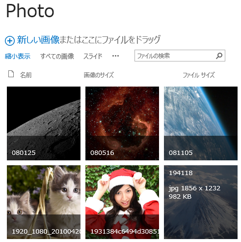
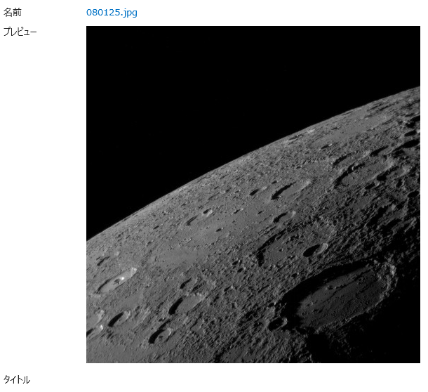

SharePoint (2007, 2010, 2013, Online) の画像ライブラリには、サムネイル画像を自動生成する機能があります。
画像ライブラリはこの機能により、縮小表示ビューでのサムネイル表示用の画像と、プロパティ表示ページで表示する少し大きめの画像を生成・表示しています。
 
SharePoint 2013 画像ライブラリの縮小表示ビュー

 
SharePoint 2013 の画像ライブラリのプロパティ表示ページ

 
これら二種類の画像は、画像ライブラリにファイルをアップロードした時点で自動生成されます。
自動生成された画像ファイルには一意のURLが割り当てられるため、この URL にアクセスすることで縮小表示の画像を表示することができます。
 
 
たとえば、site というサイトの photo という画像ライブラリに moon.jpg というファイルをアップロードした場合の自動生成画像の URL は以下になります。
 
縮小表示ビューの画像の URL：
http://site/photo/\_t/moon\_jpg.jpg
 
プロパティ表示ページの画像の URL：
http://site/photo/\_w/moon\_jpg.jpg
 
ポイントは、ライブラリ名の後に「/t」「/w」が入ること、元の拡張子の「.」がアンダーバーになり、新しい拡張子として「.jpg」が付くことです。
この点だけ押さえておけば自動生成された画像にアクセスできるので、自前で画像一覧などのページを作るときには役に立つのではないでしょうか。
