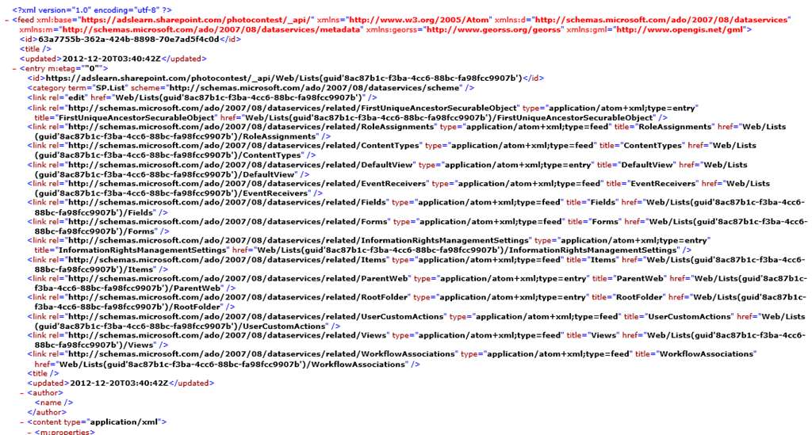
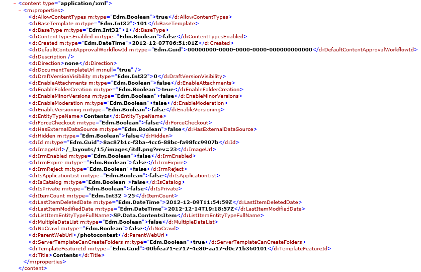
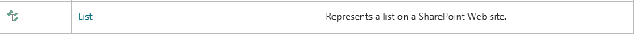
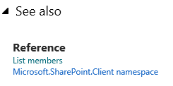
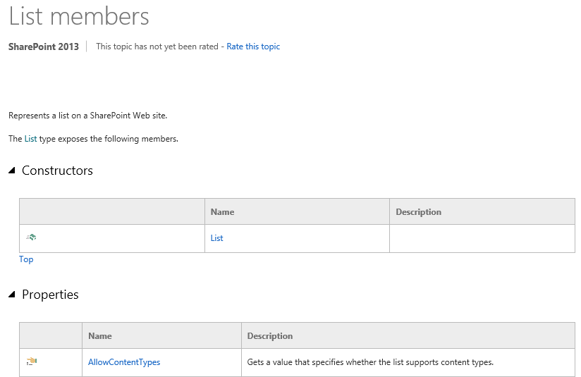
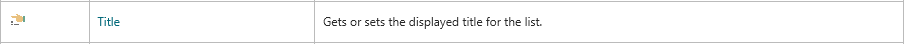
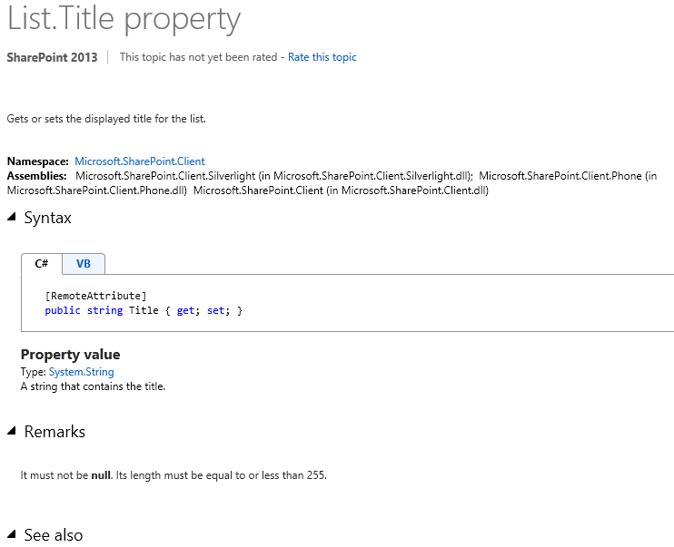

※この投稿は [Office 365 Advent Calendar 2012](http://atnd.org/events/33924) に参加しています。

### はじめに

前回は REST サービスの概要について書いたので、今回から少し具体的な話をします。
今回は、REST サービスを呼び出した際に返ってくる XML の読み方を説明します。
呼び出し方ではなく、呼び出した後に返ってくる XML の読み方の説明をいきなりするわけですが、これがわからなければ REST を使いこなすことができないので、先に説明をさせていただきます。
 
といいつつも、まずは呼び出しをしなければ結果を得ることもできないので、今回は特定サイトに含まれるすべてのリストとライブラリの一覧を取得する REST の結果を題材にしたいと思います。
 
特定サイトに含まれるすべてのリストとライブラリの一覧を取得するには、以下の URL を呼び出します。

```
http://site url/\_api/web/lists/
```

 
上記 URL をブラウザ(IE)で呼び出すと、巨大な XML が返ってきます。
この XML の読み方がわからないと、今後 REST を使う上で何かと不便になってしまうので、ここで少し掘り下げて、XML の読み方を説明します。

### REST サービスから返ってくる XML の読み方

ここでは、先ほどのリストの一覧を取得する URL を呼び出した時に返ってくる XML を例に、 XML の読み方を説明します。
REST サービスを呼び出すと返ってくる XML は下図のようなものになっています。
この XML は ATOM という形式 (XML の書き方) で記述されています。
[](http://sharepoint.orivers.jp/wp-content/uploads/2012/12/REST-4.png)
XML を上から見ていくと、 途中から entry というタグが出てきます。
この entry タグの中身が 1 行分のデータとなっており、先ほどの URL を呼び出すとリスト、ライブラリの分だけ entry タグが含まれる形で XML が返ってきます。
entry タグの中身を見ると、上図のように link タグがずらっと並び、その後に下図のような m:property タグが続きます。
[](http://sharepoint.orivers.jp/wp-content/uploads/2012/12/REST-5.png)
m:property タグの中身(d:Title タグなど)が実際の値が含まれるタグの一覧で、タグの名前からわかるように、m:property タグ内のタグ一つ一つが、取得したデータが持つプロパティ（属性）になっています。
上図は、サイトに含まれるリストの一覧を取得するリクエストを投げて返ってきた XML なので、entry タグ一つが一つのリストの情報を表しており、m:property タグ配下が、リストが持つプロパティを表しています。
例えば d:Title タグはリストのタイトル、d:Description タグはリストの説明になります。
 
m:property タグ配下の各タグ(プロパティ)が、SharePoint の画面上のどの値を表しているのかを、わかりやすく具体的に説明しているドキュメントはおそらく存在しません。（いや、知ってるよ という方、ぜひ教えてください！）
ただし、ヒントになる情報はあるので、そちらを紹介します。
私が普段プロパティの確認に使っているのは、マイクロソフトの公式サイト内にある、msdn ライブラリの以下のサイトです。
[Microsoft.SharePoint.Client namespace](http://msdn.microsoft.com/en-us/library/ee544361.aspx)
 
このサイトは開発者用のサイトなので、色々専門用語が出てきますが、プロパティの意味を調べるだけであればそれほど難しくはありません。
 
例えば今回の例では、リストのプロパティを確認したいので、上記サイトからリスト(List)を探します。
[](http://sharepoint.orivers.jp/wp-content/uploads/2012/12/REST-6.png)
List と書かれた部分をクリックすると、List の詳細説明のページに遷移します。
詳細ページの下部に、List members というリンクがあるので、こちらをクリックします。
[](http://sharepoint.orivers.jp/wp-content/uploads/2012/12/REST-7.png)
すると、List のメンバー一覧が表示されます。
[](http://sharepoint.orivers.jp/wp-content/uploads/2012/12/REST-8.png)
 
一覧はいくつかのセクションに分かれていますが、Properties というところを見てください。
この Properties の一覧の Name 列に、先ほどの XML にあった d:Title タグや d:Description タグと同じ単語を見つけられるかと思います。
この時点で、このプロパティが何を表しているのかを知ることができます。
[](http://sharepoint.orivers.jp/wp-content/uploads/2012/12/REST-9.png)
 
そして、リンク部分をクリックすると、下図の詳細ページが表示され、このプロパティを使う上での注意点などを知ることができます。
[](http://sharepoint.orivers.jp/wp-content/uploads/2012/12/REST-10.png)

### まとめ

今回は XML の読み方を説明しましたが、ここを押さえておくことで、REST ライフがより快適になることは間違いありません。
プロパティを調べるのは大変ですが、ある程度はその英単語から何となく理解できますし、調べないとわからないような難しいプロパティを使うこともそんなにはないと思うので、巨大な XML を見て「げっ」と思わず、一歩踏み込んでみていただけたらと思います。
次回から、いよいよデータ取得のやり方を詳しく説明したいと思います。
