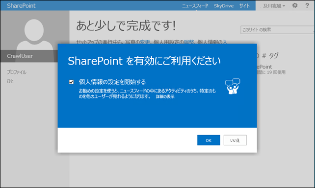
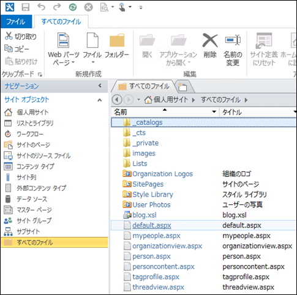
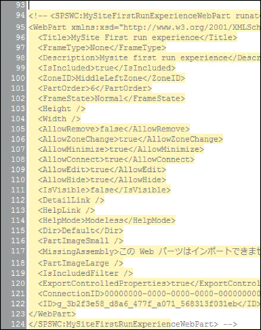

### はじめに

個人用サイトに初めてアクセスした時、「SharePoint を有効にご利用ください」というメッセージが書かれたダイアログが表示されます。

このダイアログ、以前ご紹介した[個人用サイトをあらかじめ作っておく方法](http://sharepoint.orivers.jp/Home/Article/162)で個人用サイトを作った場合でも、ユーザーが初めて個人用サイトにアクセスする場合には表示されてしまいます。
せっかく事前に個人用サイトを作って、個人用サイト作成時のユーザーへの負担や混乱を軽減しても、ここでダイアログが出てきてしまっては余り意味がありませんよね。
（OKかいいえを押すだけなんだから・・・と思っても、全く知らないユーザーにとってはドキドキですからね）
今回はこのダイアログを表示させなくする方法をご紹介します。

### ダイアログを表示させなくする

表示させなくする方法は大きく３つあります。
２つは海外のブログで紹介されています。
[Get Rid Of the MySite "Let's Get Social Dialog"](http://www.ilovesharepoint.com/2013/03/get-rid-of-mysite-lets-get-social-dialog.html)
余談ですけど、「個人情報の設定を開始する」という日本語訳、英語だと「Let's get social!」って、全然違うんですね。
日本語にするとかなり固い感じw
この海外ブログで紹介されている方法は、個人用サイトのホストサイトコレクションのパラメータに「urn:schemas-microsoft-com:sharepoint:portal:profile:SPS-O15FirstRunExperience」というパラメータを追加するやり方で、SharePoint Designer で追加する方法と、PowerShell で追加する方法の 2 つが紹介されています。
この他にもう一つ、個人用サイトのホストサイトコレクションに配置された、このダイアログの表示制御をしている Web パーツを削除する方法があります。
以下、Web パーツ削除方法の手順になります。
実際には削除すると後で戻せないので、コメントアウトをしているだけですが。
**１．SharePoint Designer 2013 で個人用サイトホストサイトコレクションを開く**
SharePoint Designer 2013 を起動し、個人用サイトのホストサイトコレクションを開きます。
**２．default.aspxを開く**
左ペインの[サイト オブジェクト]の下にある、[すべてのファイル]をクリックし、右ペインから "default.aspx" をクリックします。

**３．MySiteFirstRunExperienceWebPart をコメントアウトする**
右ペインに表示されるコードの 94 行目から 124 行目にある SPSWC:MySiteFirstRunExperienceWebPart タグが、今回表示させなくしたいダイアログの表示制御をしている部分になります。
ここを丸ごとコメントアウトします。
94 行目の先頭に "<!-- "を、124 行目の最後に " -->" を追加し、保存します。

以上で設定完了です。
これで個人用サイトを開くとダイアログが表示されなくなります。
個人用サイトをあらかじめ作る前にこの設定を行っておくと、ユーザーさんはすぐに個人用サイトが使えるようになります。
大量展開などする時にお試しいただければと。
最後に・・・
余談ですが、SPD でのページ編集、かなり不安定でした。
勝手に&nbsp;が入ったり保存ボタンを押すと落ちたり・・・
もしそういう事態になったら、あの手この手で編集＆保存してみてくださいw
