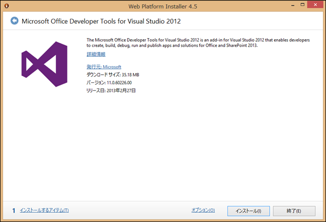
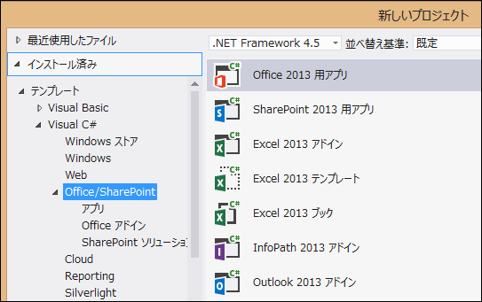

### はじめに

SharePoint 2013 の SharePoint 用アプリ (apps for SharePoint) および Office 2013 の Office 用アプリ (apps for Office) を開発するための環境を構築します。
開発環境としては、Napa というブラウザ上で動作する簡易開発環境も存在するのですが、今回は Visual Studio を使った開発環境を対象とします。

### 構築手順

開発環境の構築は非常に簡単です。
**1. Visual Studio 2012 をインストール**
まずは Visual Studio 2012 をインストールします。
Visual Studio 2012 のエディションは Ultimate、Premium、Professional のいずれかにしてください。
Visual Studio 2012 がない、あるいはインストールできない場合は、[試用版をダウンロード](http://www.microsoft.com/visualstudio/jpn/downloads#vs)するか、[Napa](http://office.microsoft.com/en-us/store/napa-office-365-development-tools-WA102963791.aspx?queryid=cc173dd7-b88c-489e-b9a2-707253d363e6&css=napa) を使うかして開発環境を整えましょう。
**2. Office Developer Tools for Visual Studio 2012 をダウンロード、インストール**
Visual Studio 2012 のインストールが完了したら、次に Office Developer Tools for Visual Studio 2012 を[ダウンロード](http://aka.ms/OfficeDevToolsForVS2012)し、インストーラに従いインストールをします。

**3. Visual Studio 2012 を起動**
インストールが完了したら、Visual Studio 2012 を起動します。
[新しいプロジェクト]のウィンドウに、SharePoint 2013 および Office 2013 のメニューが表示されていれば成功です。

これでコーディングをしていくための準備は整いました。
SharePoint 開発をする場合は開発環境の他に、SharePoint を動かす環境も必要です。
それはまた別の記事にしたいと思います。
