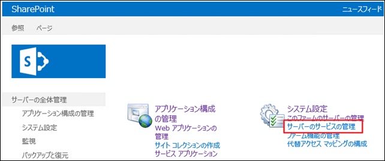
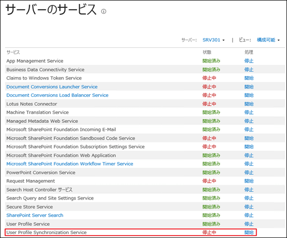
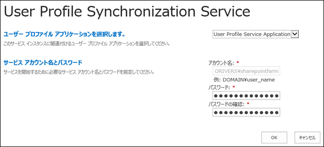

### はじめに

AD (Active Directory)などのディレクトリサービスからユーザープロファイル情報を SharePoint に取り込み個人用サイトにユーザーのプロフィールを表示するためには、プロファイル同期の構成を済ませておく必要があります。
そんな大事な役割を担うプロファイル同期の構成を完了させるには、多くの作業が必要になります。
この記事では、そんなプロファイル同期の構成手順の最初の作業である、User Profile Synchronization Service の構成手順をご紹介します。

### 構成手順

**１．User Profile Service を起動する**
プロファイル同期を構成する前に、User Profile Service を起動しておく必要があります。
User Profile Service はファーム構成ウィザードを実行することで構成、起動されるので、事前にファーム構成ウィザードを完了しておくことをお勧めします。
 
**２．ファームアカウントに「ディレクトリの変更のレプリケート」権限を付与する**
プロファイル同期は、User Profile Synchronization Service というサービスによって行われるのですが、この User Profile Synchronization Service の実行ユーザーがデフォルトではファームアカウント(製品の構成ウィザードの途中で設定するデータベースアクセスアカウント)となっており、このファームアカウントに「ディレクトリの変更のレプリケート」という特殊な権限を付与する必要があります。
ファームアカウントに「ディレクトリの変更のレプリケート」権限を付与する方法は、以下の記事で紹介しています。
下記記事の後半に「ディレクトリ同期権限の付与手順」というセクションがあるので、ご参照ください。
[AD (Active Directory) インポートによるプロファイル同期の構成](http://sharepoint.orivers.jp/Article/144)
ちなみに、上記記事ではプロファイル同期を AD インポートという User Profile Synchronization Service を使わない方法で実現するための手順を紹介しています。
AD インポートでも問題ない場合は、上記記事を構成の参考にしてください。
なお、AD インポートの説明は、以下の technet の記事にありますので、併せてご参照ください。
[http://technet.microsoft.com/ja-jp/library/jj219646.aspx](http://technet.microsoft.com/ja-jp/library/jj219646.aspx "http://technet.microsoft.com/ja-jp/library/jj219646.aspx")
**３．ファームアカウントをローカル Administrators グループに含める**
この手順については technet に記載はないのですが、私がいくつかの環境で試した限りでは、ファームアカウントを User Profile Synchronization Service を起動するサーバーのローカル Administrators グループに含めなければ、User Profile Synchronization Service が起動できませんでした。
従って、念のため含めていただくのが良いかと思います。
**４．User Profile Synchronization Service を起動する**
以上で、前準備が整ったので、いよいよ User Profile Synchronization Service を起動します。
全体管理サイトにアクセスし、[サーバーのサービスの管理]をクリックします。

[User Profile Synchronization Service]を探し、[開始]と書いているリンクをクリックします。

ファームアカウントのパスワードを入力し、[OK]をクリックします。

サーバーのサービスのページに戻ると、User Profile Synchronization Service の状態が「開始処理中」になっているのが確認できるかと思います。

User Profile Synchronization Service の起動には長いと 10 分くらいかかるので、ブラウザの更新ボタンをたまに押しながら、状態が「開始済み」になるまでしばらく待ってください。
無事「開始済み」になれば起動完了です。
これで AD に接続する準備ができました。
AD に接続してユーザーのプロファイル情報を取得してくるためには、もうひと手間必要です。
そちらについては、また別の記事で説明したいと思います。

### うまくいかない時

上記手順を実行してもうまくいかない時、つまり User Profile Synchronization Service が「開始済み」ならず、「停止中」に戻ってしまう場合、一度サーバーを再起動してみてください。
サーバーを再起動することで、これまでの手順で指定した権限の変更などがうまく適用されるようになるのか何なのか、理由は定かではないのですが、うまくいくことが多いです。
それでもうまくいかない時は、technet をよく読んで構成しなおしてください。
SharePoint Server 2013 でユーザーとグループのプロファイルを同期する
<http://technet.microsoft.com/ja-jp/library/ee721049.aspx>
プロファイルの同期を計画する
<http://technet.microsoft.com/ja-jp/library/ff182925.aspx>
SharePoint Server 2013 でプロファイルを同期するために Active Directory ドメインサービスのアクセス許可を付与する
<http://technet.microsoft.com/ja-jp/library/hh296982.aspx>
