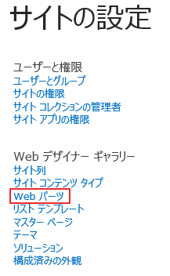
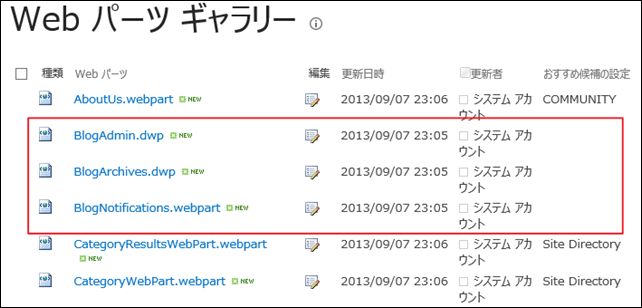
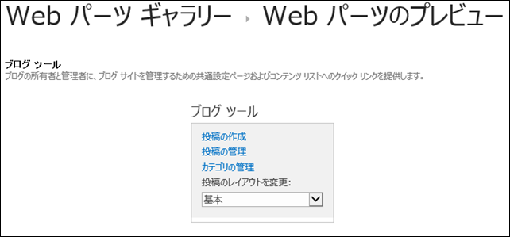
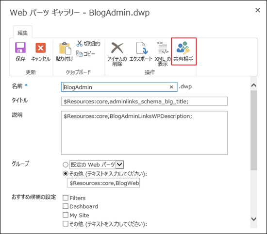
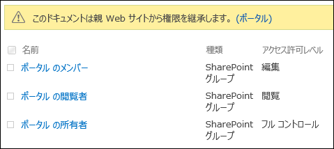
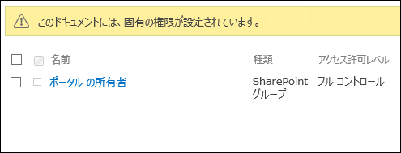
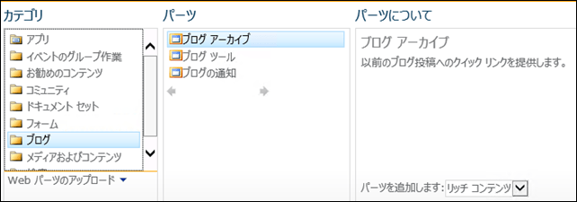
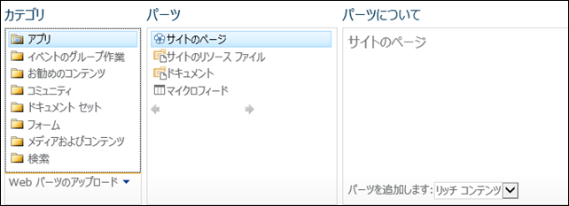

### はじめに

ページの編集権限を持つユーザーは、ページに対して自由に Web パーツを追加することができます。
追加できる Web パーツには SharePoint に最初から組み込まれている標準的な Web パーツの他、市販の Web パーツや、自社の独自の Web パーツなど、色々なものがあります。
自由に Web パーツの追加ができることは良いことではあるのですが、場合によってはある程度規制をかけて使い方を統制したいとか、不具合が直るまで新たに配置させたくないなど、自由に追加されては困るということもあるかと思います。
そのような場合には、以下の手順で追加可能な Web パーツを制御することができます。

### 追加可能な Web パーツの制御手順

**１．Web パーツギャラリーを開く**
ページに追加可能な Web パーツは、Web パーツギャラリーで定義されているので、まずは Web パーツギャラリーを開きます。
この操作は、サイトコレクションの管理者など、サイトコレクションのフルコントロール権限を持つユーザーで行なってください。

**２．追加させたくない Web パーツを探す**
Web パーツギャラリーを開くと、たくさんの Web パーツが表示されます。
ただし、すべて Web パーツファイルの名前で記載されているため、すぐに目的の Web パーツを見つけることができません。
Web パーツファイルの名前の部分をクリックすると、その Web パーツのプレビューが表示されるので、目星をつけて Web パーツファイル名をクリックして、目的の Web パーツを見つけてください。
今回は以下の赤枠内のブログ系の Web パーツを対象にします。

なお、Web パーツのプレビューは以下のように表示されます。

**３．アクセス権限を設定する**
Web パーツギャラリーに表示されている Web パーツファイルは、ドキュメントライブラリに保存されているファイルと同じです。
そのため、Web パーツファイル一つ一つにアクセス権限を設定することが可能で、ここで設定したアクセス権限によって追加可能な Web パーツを制御できるようになっています。
ここでは、サイトコレクションの所有者だけがブログ系の 3 つの Web パーツを配置できないようにするため、閲覧者及びメンバーの権限を削除します。
アクセス権限の設定は、ドキュメントライブラリのアイテムと同様[共有相手]から行います。

権限変更前：

権限変更後：
閲覧者およびメンバーを削除。

**４．結果確認**
まずはサイトコレクションの管理者ユーザーでログインして、追加可能な Web パーツにブログ系の Web パーツが含まれているか確認します。

上図の通り、「ブログ」というフォルダをクリックすると、Web パーツが表示されます。
続いて、サイトコレクションのメンバーのユーザーでログインして、追加可能な Web パーツを確認します。

はい、「ブログ」というフォルダごと消えています。
これで、ブログの Web パーツはサイトコレクションのフルコントロール権限を持つユーザーだけしか追加できなくなりました。
