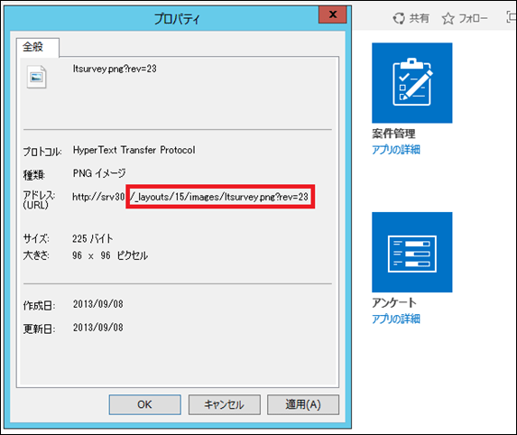
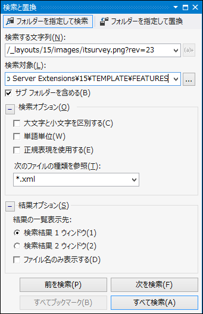
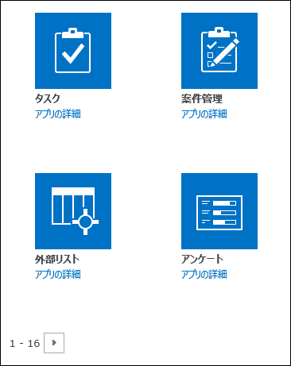
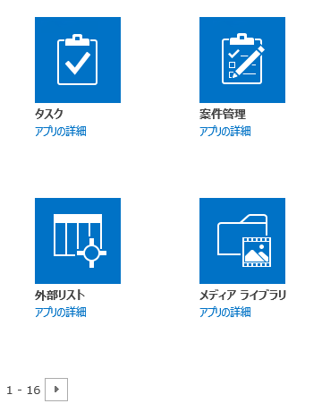

### はじめに

アプリの追加ページ(自分のアプリページ)に表示される標準のリストやライブラリを非表示にして、ユーザーが自由にリストを追加できないようにする方法を説明します。
良く聞く話ですが、サイトコレクションの管理は各ユーザーに任せたいが、会社が許可していないリストやライブラリは追加できないようにしたい、というニーズがある場合に使えるかと思います。

### 特定のリストを非表示にする手順

では、今回はアンケートリストを非表示にしたいと思います。
リストやライブラリは、Webパーツと違ってどこかのライブラリで表示制御されているわけではなく、リスト定義ファイルで表示/非表示等の設定を持ち、フィーチャーとしてSharePointに登録されています。
アプリの追加ページで特定のリストを非表示にするには、このリスト定義ファイルを変更する必要があります。
以下、手順になります。
**１．対象となるリスト定義ファイルを探す**
まずは非表示にするリストのリスト定義ファイルがどこにあるのか探す必要があります。
リスト定義ファイルは、以下のフォルダに入っています。
*C:Program FilesCommon Filesmicrosoft sharedWeb Server Extensions15TEMPLATEFEATURES*
※実際のフォルダはSharePointのインストール場所により異なります。
上記のフォルダの中には無数のサブフォルダがありその中にリスト定義ファイルが含まれています。
目的のリスト定義ファイルを見つけるには、以下のやり方が早そうです。
アプリの追加ページを開き、非表示にしたいリスト、ライブラリのアイコンで右クリックし、コンテキストメニューからプロパティを選択。
ダイアログにあるアドレスの「/\_layouts」以降の部分をコピーしておきます。

次に、コピーしたURLの”ltsurvey.png”の”l”を”i”に変えて”itsurvey.png”としてFEATURESフォルダを検索してください。
ここでは、Visual Studio 2012から検索してみました。

すると、「FEATURESSurveysListListTemplatesSurveys.xml」がヒットします。
このxmlファイルが、アンケートリストのリスト定義ファイルになります。
**２．リスト定義ファイルでHidden属性を指定する**
前述の通り、リストはリスト定義ファイルで定義され、SharePointに登録されています。
従って、リスト定義ファイルの内容を書き替えることで、リストの表示/非表示を切り替えることができます。
表示/非表示の切り替えは、Hidden属性を指定することで行います。
アンケートリストのリスト定義ファイルにHidden属性を追加し、非表示になるようにします。
変更前：

```
1: <?xml version="1.0" encoding="utf-8"?>
```
```
2: <Elements xmlns="http://schemas.microsoft.com/sharepoint/">
```
```
3: <ListTemplate
```
```
4: Name="survey"
```
```
5: Type="102"
```
```
6: BaseType="4"
```
```
7: OnQuickLaunch="TRUE"
```
```
8: FolderCreation="FALSE"
```
```
9: SecurityBits="12"
```
```
10: Sequence="510"
```
```
11: DisplayName="$Resources:core,surveyList;"
```
```
12: Description="$Resources:core,surveyList\_Desc;"
```
```
13: Image="/\_layouts/15/images/itsurvey.png?rev=23"/>
```
```
14: </Elements>
```

変更後：11行目にHidden属性を追加しています。

```
1: <?xml version="1.0" encoding="utf-8"?>
```
```
2: <Elements xmlns="http://schemas.microsoft.com/sharepoint/">
```
```
3: <ListTemplate
```
```
4: Name="survey"
```
```
5: Type="102"
```
```
6: BaseType="4"
```
```
7: OnQuickLaunch="TRUE"
```
```
8: FolderCreation="FALSE"
```
```
9: SecurityBits="12"
```
```
10: Sequence="510"
```
```
11: Hidden="TRUE"
```
```
12: DisplayName="$Resources:core,surveyList;"
```
```
13: Description="$Resources:core,surveyList\_Desc;"
```
```
14: Image="/\_layouts/15/images/itsurvey.png?rev=23"/>
```
```
15: </Elements>
```

変更が完了したらファイルを保存します。
なお、リスト定義ファイルにはHidden属性以外にも様々な属性があります。
詳しくは、technetをご確認ください。
ListTemplate 要素(リスト テンプレート)
[http://msdn.microsoft.com/ja-jp/library/ms462947(v=office.14).aspx](http://msdn.microsoft.com/ja-jp/library/ms462947(v=office.14).aspx "http://msdn.microsoft.com/ja-jp/library/ms462947(v=office.14).aspx")
**３．IISを再起動する**
リスト定義ファイルの編集が完了したら、最後にSharePointが稼働するサーバーにてIISを再起動します。
**４．結果確認**
IIS再起動後、改めてアプリの追加ページに行き、アンケートリストが消えているかどうかを確認します。
変更前：

変更後：外部リストの右隣にあったアンケートが消えています。

これで、アプリの追加ページからアンケートリストを追加することができなくなりました。
なお、これによりSharePoint Designer 2013からもアンケートリストを追加することができなくなっています。

### 注意事項

以下、注意事項となります。
この方法を利用する際には以下の点を十分に考慮してください。
・リストテンプレートを非表示にする場合、影響範囲はファーム全体に及びます。
・SharePointのシステムファイルを書き換えるため、サービスパック等で書き換えた箇所が元に戻る可能性があります。
