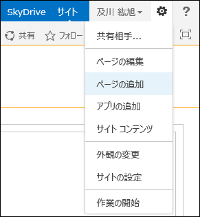
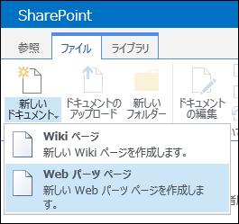
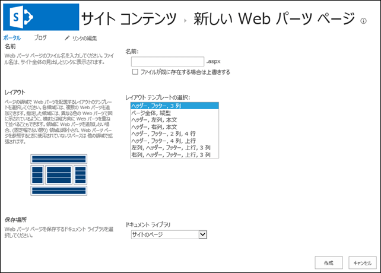

### はじめに

サイトをチームサイトテンプレートで作成すると、サイトのトップページはWikiライクな”サイトのページ”というライブラリ上のページとして作成されます。
こうして作られるページは、ページ上の好きなところにWebパーツを配置したり、画像や文字を挿入することができ、大変便利です。
ところが、Webパーツを綺麗に並べたいとか、Webパーツ接続をやりたいとなると、Wikiライクなページでは実現できない、あるいは非常に手間がかかってしまいます。
そんな時は、Webパーツページを利用します。
Webパーツページを利用すれば、Webパーツを綺麗に並べたり、Webパーツ接続をすることができます。

### Webパーツページの作成方法

Webパーツページは手軽に作成できるのですが、ちょっと見つけ辛いところから作成しなければなりません。
ちなみに、ページの右上のギアマークの中の[ページの追加]の場合は、Webパーツページではなく、Wikiページが作成されます。
ギアマークをクリックした時のメニュー。

Webパーツページの作成は、以下の操作で行います。
**１．サイトコンテンツページに移動する** 
まずはサイトコンテンツページに移動します。
**２．”サイトのページ”をクリックする** 
サイトコンテンツページにある”サイトのページ”をクリックし、サイトのページライブラリのビューページに移動します。

**３．リボンから新しいドキュメントをクリックする** 
リボンの[ファイル]→[新しいドキュメント]→[Web パーツ ページ]をクリックします。

**４．新しい Web パーツ ページを作成する** 
[新しい Web パーツ ページ]というページが表示されます。
ここで作成するWebパーツページの名前、テンプレート、保存場所を指定し、Webパーツページを作成します。

これでWebパーツページが作成されますので、あとはページを開いてWebパーツの配置などを行ってください。
