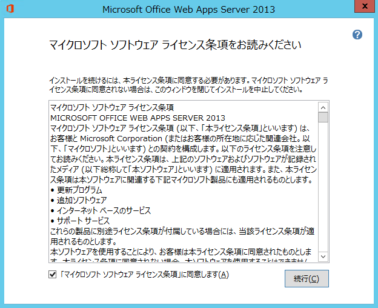
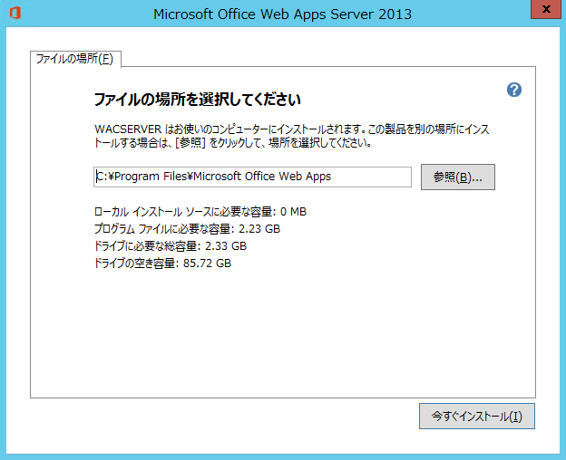
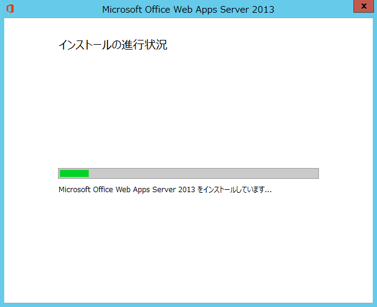
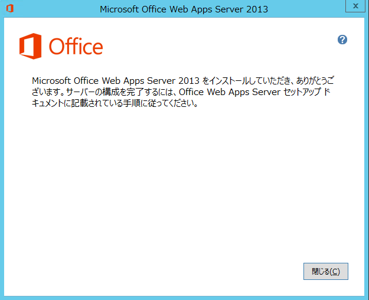
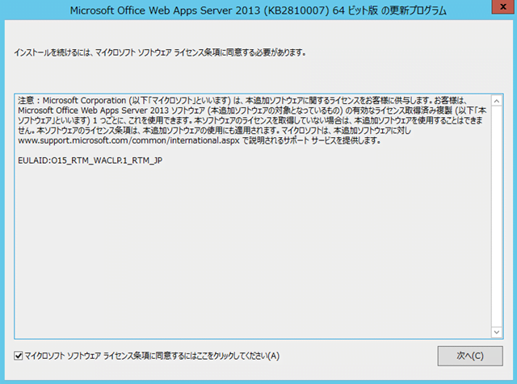
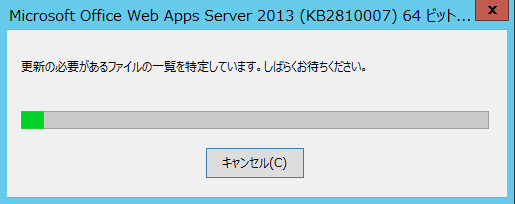
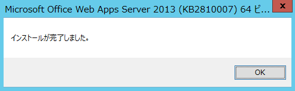
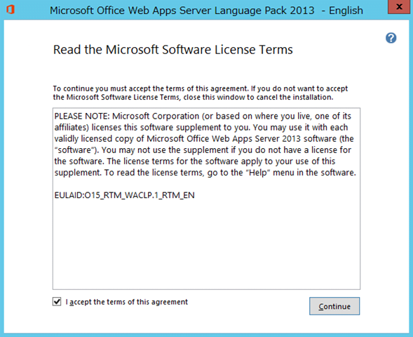
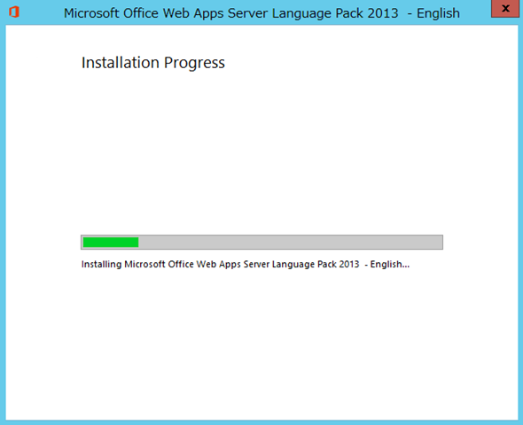
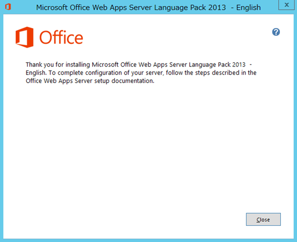

### はじめに

Windows Server 2012 に Office Web Apps Server 2013 をインストールする手順をまとめました。
インストール後は、SharePoint 2013 と接続するための構成が必要ですが、長くなるので別記事にします。
なお、本記事は以下のtechnetサイトを参考にしています。
[http://technet.microsoft.com/ja-jp/library/jj219455.aspx](http://technet.microsoft.com/ja-jp/library/jj219455.aspx "http://technet.microsoft.com/ja-jp/library/jj219455.aspx")

### ０．Office Web Apps Server 2013 の環境要件

Office Web Apps Server 2013 を導入し利用するためには、様々な環境要件を満たす必要があります。
主なところでは、以下のような要件があります。
・OS は Windows Server 2008 SP1 か Windows Server 2012。
・ポート 80,443,809を利用する役割「Web サーバー(IIS)」はインストールしない。またF/Wが空いている。
詳細は以下の technet サイトをご確認ください。
[http://technet.microsoft.com/ja-jp/library/jj219435.aspx](http://technet.microsoft.com/ja-jp/library/jj219435.aspx "http://technet.microsoft.com/ja-jp/library/jj219435.aspx")

### １．サーバーに役割を追加する

Windows PowerShell を管理者モードで起動し、以下のコマンドレットを実行します。
Add-WindowsFeature Web-Server,Web-Mgmt-Tools,Web-Mgmt-Console,Web-WebServer,Web-Common-Http,Web-Default-Doc,Web-Static-Content,Web-Performance,Web-Stat-Compression,Web-Dyn-Compression,Web-Security,Web-Filtering,Web-Windows-Auth,Web-App-Dev,Web-Net-Ext45,Web-Asp-Net45,Web-ISAPI-Ext,Web-ISAPI-Filter,Web-Includes,InkandHandwritingServices
実行が完了したらサーバーを再起動します。

### ２．Office Web Apps Server 2013 をインストールする

Office Web Apps Server 2013 のセットアッププログラムを実行し、ウィザードに従ってインストールします。
[「マイクロソフト ソフトウェア ライセンス条項」に同意します]をチェックし、[続行]をクリックします。

必要に応じてファイルの場所を変更し、[今すぐインストール]をクリックします。
インストールが完了するまで待ちます。。。

インストールが完了しました。
[閉じる]をクリックして、ウィザードを終了します。

### ３．更新プログラムをインストールする

以下のサイトから、Office Web Apps 2013 の更新プログラムをダウンロード、インストールします。
[http://technet.microsoft.com/en-US/office/ee748587.aspx](http://technet.microsoft.com/en-US/office/ee748587.aspx "http://technet.microsoft.com/en-US/office/ee748587.aspx")
参考までに、[2013年4月の更新プログラム](http://support.microsoft.com/kb/2810007)のインストールの流れを書いておきます。
更新プログラムのセットアッププログラムを実行し、[マイクロソフト ソフトウェア ライセンス状況に同意するにはここをクリックしてください]をチェックし、[次へ]をクリックします。

インストールが完了するのを待ちます。。。

インストール完了後、[OK]をクリックします。

### ４．言語パックをインストールする

言語パックをインストールすると、Office Web Apps Server 2013 で表示可能なドキュメントの言語の種類が増えます。
ここでは[英語の言語パック](http://www.microsoft.com/en-us/download/details.aspx?id=35490)を入れてみます。
言語パックのセットアッププログラムを実行し、[I accept the terms of this agreement]をチェックし、[Continue]をクリックします。

インストールが完了するまで待ちます。。。

インストール完了後、[Close]をクリックします。

以上でインストールが完了しました。
