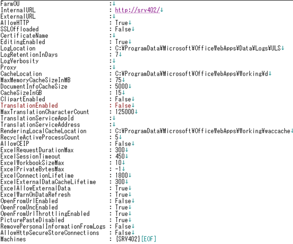
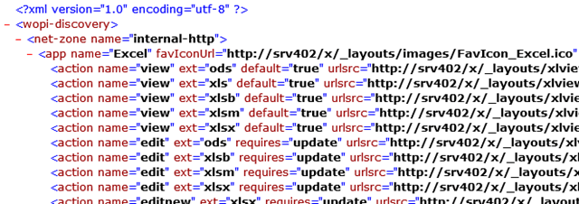
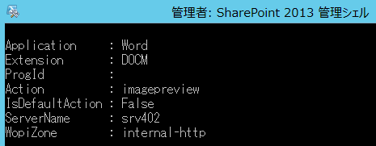
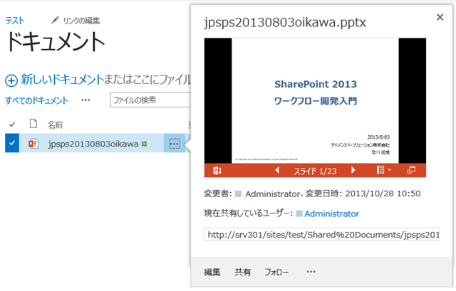

### はじめに

Office Web Apps Server 2013 のインストールが完了した後に行う、構成手順についてまとめました。
この記事では、テスト環境や社内利用を目的とした構成を対象としており、シングルサーバー構成、HTTP を利用した通信となります。
なお、本記事は以下のtechnetサイトを参考にしています。
[http://technet.microsoft.com/ja-jp/library/jj219455.aspx](http://technet.microsoft.com/ja-jp/library/jj219455.aspx "http://technet.microsoft.com/ja-jp/library/jj219455.aspx")

### １．Office Web Apps Server 2013 のファーム構築

まずは Office Web Apps Server 2013 のファームを構築します。
Office Web Apps Server 2013 をインストールしたサーバーにて以下のコマンドを、PowerShell で実行します。
New-OfficeWebAppsFarm –InternalURL “*http://servername*” -AllowHttp -EditingEnabled
InternalURL には、Office Web Apps Server 2013 をインストールしたサーバーの URL を指定します。
この記事では “http://srv402” を指定して進めます。
AllowHttp は、HTTP 通信を許可することを、EditingEnabled は Office Web Apps 上でのドキュメントの編集を許可することを指定しています。
なお、コマンドを実行しても何も反応がない場合、一度 Enter キーを押してみてください。
すると以下のメッセージが表示されるかと思います。
（本来は何もしなくてもメッセージが表示されるようですが、２回中１回は表示されなかったので・・・）
EditingEnabled を TRUE に設定します。この操作は、この Office Web Apps サーバー のユーザーに、Office Web Apps を使った編集を許可するライセンスがある場合にのみ行ってください。
この操作を続行しますか?
[Y] はい(Y)  [N] いいえ(N)  [S] 中断(S)  [?] ヘルプ (既定値は "Y"):
上記メッセージで “Y” を入力すると構成が進み、しばらくすると構成した Office Web Apps Server 環境のパラメータが出力されます。

### ２．構成の確認

ファームの構成が正常に完了したことを確認するために、ブラウザから 以下の URL を開きます。
*InternalURL*/hosting/discovery
今回は、InternalURL が http://srv402 なので、ブラウザに指定するURLは、http://srv402/hosting/discovery となります。
http://srv402/hosting/discovery を開くと、以下のような結果が返ってきます。
この結果が返ってくれば、構成完了となります。

### ３．SharePoint の構成

Office Web Apps Server 2013 に接続する SharePoint Server 2013 にログインし、SharePoint 2013 管理シェルを管理者モードで起動し、以下のコマンドを実行します。
New-SPWOPIBinding –ServerName *ServerName* –AllowHTTP
ServerNameには、Office Web Apps Server 2013 のサーバー名を指定します。
今回は、srv402 が接続先となるのでコマンドは、
New-SPWOPIBinding –ServerName srv402 –AllowHTTP
となります。
コマンドを実行すると、プロンプト上に以下のような設定結果が対応する拡張子の分だけ表示されます。

次に、SharePoint 2013 と Office Web Apps Server 2013 の間の通信に HTTP を利用するよう、SharePoint 2013 の設定を変更します。
以下のコマンドを、SharePoint 2013 管理シェルで実行します。
Set-SPWOPIZone –zone “internal-http”
$config = (Get-SPSecurityTokenServiceConfig)
$config.AllowOAuthOverHttp = $true
$config.Update()
以上で設定完了です。

### ４．動作確認

全ての設定が完了したので、SharePoint にファイルをアップして動作確認してみます。
なお、動作確認はシステムアカウント以外のユーザーで行ってください。
システムアカウントでは、プレビューが表示されないようなので。

無事表示できました！
