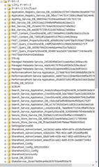
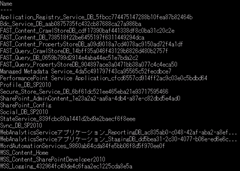

### はじめに

開発環境や検証環境として、SharePointファームをたくさん立てていると、いつの間にかデータベースがたくさんできてしまい、いざデータベースを整理しようと思った時にどのデータベースを消してよいのかが判別できなくなることがあると思います（私だけ！？）
SQL Server Management Studioのオブジェクトエクスプローラを見ると、データベースが多すぎてどうしたらよいものかと・・・

※画像はあえて小さくして載せてます。
そんな時にファームで利用しているデータベースの一覧が見れるととても便利なわけですが、PowerShell で手軽に実現できてしまいます。

### データベースを一覧表示するコマンドレット

SharePointの管理シェルを立ち上げ、以下のコマンドを実行してください。
Get-SPDatabase | select Name | Sort-Object { $\_.Name }
すると以下のような結果が得られます。
※小さくて見えないと思いますが、データベース名の一覧が名前の昇順で表示されています。

あとはこの一覧を片手に、SQL Server Management Studio のオブジェクトエクスプローラを見ながら、一覧に無いデータベースを探して消してよいかどうか判断しながら作業をしていくだけです。

### データベースサイズの一覧を取得するコマンドレット

ついでに、データベースサイズを含む一覧を取得するコマンドレットも紹介します。
これも何かと使いそうですよね。
Get-SPDatabase | select Name, DiskSizeRequired | Sort-Object { $\_.Name }
コマンドとしては select に [DiskSizeRequired](http://msdn.microsoft.com/ja-jp/library/microsoft.sharepoint.administration.spdatabase.disksizerequired.aspx) を追加しているだけです。
このプロパティは、実際のデータベースサイズとは異なるのですが、ざっと確認する限り実サイズとの差はそれほどないので、データベースサイズの目安にはなると思います。
