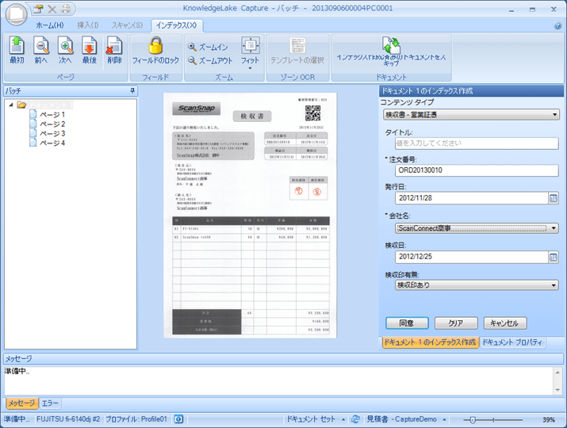

### はじめに

これまで製品紹介やレビューといったことをこのブログでやってきたことはなかったのですが、これを機にそういうことも少ししてみようかと思っています。
ということで、第一弾は既に各所で紹介記事が書かれていますが、PFU社のドキュメントソリューションである[KnowledgeLake](http://www.pfu.fujitsu.com/sharepoint/)です。

### ドキュメントソリューションとは？

SharePointの利用方法は数々ありますが、その代表格はドキュメント管理ではないでしょうか。
SharePointには、ドキュメントに対して会社で取り決めたタグを付与する管理メタデータ機能や、承認ワークフロー、情報管理ポリシーといったライフサイクル管理系の機能、そして検索機能などなど、ドキュメント管理に関する機能は数多く実装されており、SharePointユーザーは少なからずこれらの機能を使っているかと思います。
このようなドキュメント管理機能を業務と結び付けて、業務効率化を実現する文書活用系のソリューションが、ドキュメントソリューションとなります。

### KnowledgeLakeの特徴

今回紹介するKnowledgeLakeという製品は、上記のようなSharePointが持つドキュメント管理機能を強化する、ソフトウェアと対応スキャナが一体となったソリューションで、端的にいうとスキャナから取り込んだ文書を簡単にSharePointに登録することができ、登録したドキュメントを効率的に検索、利活用することができるようになります。

### 製品ごとの説明

KnowledgeLakeは4つのソフトウェアと対応するスキャナで構成されており、基本的には全ソフトウェアを組み合わせて使うものですが、個別に導入・利用することも可能です。
以下が、4つのソフトウェアとなります。(ロゴ、説明文は製品紹介資料から抜粋）

|  |  |
| --- | --- |
| image_thumb_18539358 | SharePointのライブラリ機能を“業務システム”に拡張する機能をSharePointに追加します。 スキャナ登録機能、高度で柔軟な検索機能、専用ビューワで、SharePointの登録、検索、閲覧機能を大幅に強化します。 その他の主な機能：注釈・メモ、データベース連携によるタグ付け（インデックス化）等 |
| image_thumb_1_18539358 | 他システム（既存の基幹システム や 業務アプリケーション）の画面上の項目をキーにして、ワンクリックで SharePoint から文書を取得します。 その際に、他システム側のカスタマイズは不要です。他システム上のキーワードを元にした登録も可能です。 ※Unifyを使用するには、Imaging もしくは Connect が必要です。 既存システムとの連携可否を事前に確認する必要があります。 |
| image_6_18539358 | 業務用イメージスキャナ「fiシリーズ」と連携し、紙文書のスキャン、インデックス作成およびSharePointのライブラリへ文書を登録します。 OCR・バーコード認識など入力業務を効率化します。既に電子化済みのデータの一括登録も可能です。 |
| image_thumb_3_18539358 | Microsoft Officeライクなインタフェースで、SharePointのライブラリへの登録、検索、閲覧を簡単に利用できる、クライアントアプリケーションです。 スキャナ登録に加えて、Officeアドインを使えば、Officeアプリケーション（Word, Excel, PowerPoint, Outlook）から直接SharePointのライブラリへ登録することも可能です。 |

この中から私が注目＆おすすめしたいのは、KnowledgeLake Capture for SharePoint です。
Capture は、紙文書を一括でSharePointに登録するための機能を備えた製品です。
業務効率化のためのドキュメント管理を検討する場合、必ず問題になるのが紙文書の取り扱いです。
紙文書を完全にゼロにできれば良いのですが、一気に紙文書ゼロを実現することは現実的には難しいと思います。
そうすると、どうしても紙文書の管理をどうするかという話になるわけですが、そんな時にこのCaptureが非常に有効かと思います。

### SharePointでのドキュメント管理に有効な KnowledgeLake Capture for SharePoint

紙文書をSharePointで管理するとなると、当然ドキュメントをSharePointに登録するための作業が必要になります。
Captureはこの登録作業を効率化するための製品です。
紙文書のSharePointへの登録業務で行うことといえば、
①紙文書をスキャン
②スキャンしたデータをSharePointに登録
③登録したデータに属性情報を付与
という作業が必要になりますが、Captureはこれらの業務をサポートしてくれます。
紙文書のスキャンは同社の「[fiシリーズ](http://imagescanner.fujitsu.com/jp/)」のスキャナで行い、そのままCaptureで属性情報やタグ付けをし、SharePointに登録することができます。
登録する文書の様式ごとに属性情報の付与ルールを定義することで、一括での文書登録も可能になります。
例えば、文書の右上にある２次元バーコードで様式を識別しコンテンツタイプと紐づけ、文書内の注文番号を自動的にOCRで読み取り、注文番号列に値をセット、OCRで読み取れない部分は、手動での入力や、マスタからの選択をしてアップロード、という感じでサクサクと登録をすることができます。

### 文書情報管理士

最後にもう一つ。
このようなドキュメントソリューションは導入するのも運用するのも初めは大変ですが、もっと大変なのは導入するための下地を作ること、つまり、社内の紙文書を棚卸して整理・分類して、分類ごとにコンテンツタイプを定め、マスタを整備し、運用ルールを定め、紙文書の最終的な取り扱い方法を決める・・・といった、既存の業務整理や業務フローの整備が何より大変で、非常に大事なことだと思います。
この作業を何の道しるべもなくやろうとしても、当然スムーズに進むことはなく四苦八苦しながら何とか進めていくということになると思います。
そんな非ソフトウェアな部分も、このKnowledgeLakeソリューションの一環として、コンサルティングサービスという形でサポートしていただけるとのこと。
同社のコンサルタントは、[文書情報管理士](http://www.jiima.or.jp/bunkan/buntest_07_index.html)という資格の有資格者ばかりで、この専門家たちが先ほど説明したようなドキュメントソリューション導入のための道しるべを示してくれます。
これであれば安心ですよねー。
とはいえ、社内の情報整理や業務フローの徹底など、当然発注側の企業でないとできない部分はたくさんあるわけで、通常のプロジェクトと同様、コンサルタントやSIerに任せっきりではいい仕組みは作れません。
この辺りをご理解いただき、コンサルティングサービスを活用するのが良いと思います。

### 対応状況

KnowledgeLakeは、製品ごとにSharePointやOSへの対応状況が異なるため、[詳細はWebで](http://www.pfu.fujitsu.com/sharepoint/environment.html)ご確認ください。
サーバーに導入する必要のある製品もあるので(Imaging)、SharePoint Onlineに完全対応というわけではありませんが、前述のとおり一部製品のみの導入でも効果はあると思いますので、SharePoint Onlineユーザーの方もご検討いただければと思います。

### 最後に

以上、長くなりましたがPFU社のKnowledgeLakeの説明でした。
実は手元にKnowledgeLakeではないですが、同社のScanSnapシリーズのスキャナとSharePoint連携ツールがあるので、こちらについても別の機会に紹介、レビューさせていただきたいと思います。

### ご参考：

ソリューションホームページ：
[http://www.pfu.fujitsu.com/products.html](http://www.pfu.fujitsu.com/products.html "http://www.pfu.fujitsu.com/products.html")
