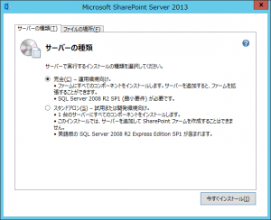

### はじめに

SharePoint 2013 のソリューションを開発するための環境を構築する方法を説明します。
なお、SharePoint 用アプリや Office 用アプリの開発環境構築については、以下の記事をご参照ください。
[SharePoint 用アプリおよび Office 用アプリの開発環境を構築する](http://sharepoint.orivers.jp/Article/174)
SharePoint ソリューションの開発環境は、SharePoint と Visual Studio を同居させる必要がありますので、全開発環境に SharePoint をインストールすることとなります。
そのため、全開発環境にサーバー OS も必要になり、非常にコストがかかることとなります。
従って、開発期間が短いのであれば、[評価版](http://technet.microsoft.com/ja-jp/bb291020.aspx)で環境をそろえるということも検討されるとよいかと思います。

### 構築手順

開発環境は以下の手順で構築します。
**0. 開発環境に必要なマシンスペック**
SharePoint 開発環境には、SharePoint も SQL Server も Visual Studio もインストールする必要があるため、非常に高いマシンスペックが必要になります。
[msdn](http://technet.microsoft.com/JA-JP/library/cc262485.aspx) によると最少マシンスペックは以下となります。
CPUコア：4コア
メモリ：10GB
ディスク：80GB
ちなみに上記スペックで試したところ、ビルドしてデバッグ実行できるようになるまで、2,3 分待つ感じでした。
CPU コアを 8 コアにすることで、1 分弱まで抑えることができました。
快適な開発をするには、やはり最少スペック以上の構成にする必要がありそうです。
**1. SharePoint Server 2013 のインストール**
まずは SharePoint Server 2013 をインストールします。
インストール時には一点だけ注意点があります。
インストールオプションでサーバーの種類を指定することができますが、ここでの選択内容によりこの後の構築手順が変わります。
[](http://sharepoint.orivers.jp/wp-content/uploads/2013/12/image_thumb_0FB28C3A.png)
ここでスタンドアロンを選択した場合は、SQL Server が自動的にインストールされ、特に難しい設定はなく SharePoint を立ち上げることができます。
完全を選択した場合は、別途 SQL Server のインストールが必要になり、SharePoint の細かな設定も行う必要があります。
インストールと構成が完了すると、SharePoint が動作する環境が一通りそろいます。
**2. Visual Studio をインストール**
次に Visual Studio をインストールします。
Visual Studio は 2012 か 2013 をインストールしてください。
ここでも注意点があります。
一点目、Visual Studio のエディションは、Professional、Premium、Ultimate のいずれかである必要があります。
二点目、Visual Studio 2012 を使用する場合は、Visual Studio 2012 をインストール後、[Office Developer Tools for Visual Studio 2012](http://aka.ms/OfficeDevToolsForVS2012)(無償) もダウンロード、インストールしてください。
**3. SQL Server の[最大サーバーメモリ]を変更する**
手順 2 までで、SharePoint ソリューション開発は可能になるのですが、SQL Server の[最大サーバーメモリ]を設定しておくと、より快適に開発ができるようになるかと思います。
SQL Server は SharePoint に同梱されている Express Edition がインストールされているため、SQL Server Management Studio のような GUI ツールがインストールされていません。
従って、sqlcmd ユーティリティを使って、[最大サーバーメモリ]の設定をします。
コマンドプロンプトを管理者モードで起動し、以下のコマンドを入力してください。
```
sqlcmd -S ServerSHAREPOINT
sp\_configure 'show advanced options', 1;
go
RECONFIGURE;
go
sp\_configure 'max server memory', 2048;
go
RECONFIGURE;
go
```
1 行目の –S オプションの値は、接続する SQL Server インスタンスの名前になります。
SharePoint をスタンドアロンでインストールすると、”サーバー名SHAREPOINT” というインスタンスが作成されますので、サーバー名の部分を任意の名前に変えて入力してください。
6 行目の数字が割り当てる最大メモリになります。上記コマンドでは、2048MB 割り当てています。
全体のメモリ容量にもよりますが、開発で使うだけであれば大量のコンテンツデータを扱うわけでもないと思うので、メモリは少な目にしておいて問題ないかと思います。
