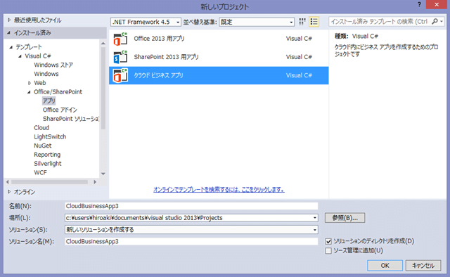

来る 2/22、[jpsps in 大阪](http://jpsps.com/event/20140222/)にて、クラウドビジネスアプリの話をさせていただきます。

持ち時間 30 分の中で、クラウドビジネスアプリがどういうものなのか、何ができるのか、という点を、デモを中心に説明させていただきます。
勉強会資料は slideshare 等で公開させていただきますので、当日はメモよりもデモに集中いただければと。
それでは当日、よろしくお願いいたします。
