### はじめに

SharePoint Conference 2014 で発表された Office 365 API。
この Office 365 API を Visual Studio 2013 からより手軽に利用できるようにするためのツールとして先日リリースされた、[Office 365 API Tools](http://blogs.msdn.com/b/officeapps/archive/2014/03/12/announcing-office-365-api-tools-for-visual-studio-preview.aspx) を早速使ってみましたので、使用方法など残しておきたいと思います。

### セットアップ

まずは、Office 365 API Tools をダウンロード、インストールします。
１．Visual Studio 2013 を起動する。
２．メニューから [ツール] – [拡張機能と更新プログラム] をクリックする。
３．左メニューの [オンライン] をクリックし、検索ボックスに “Office 365” と入力し検索を実行する。
４．検索結果の中から “Office 365 API Tools – Preview” を探し、[ダウンロード] をクリックする。
ダウンロードサイズは 1.5MB くらい。
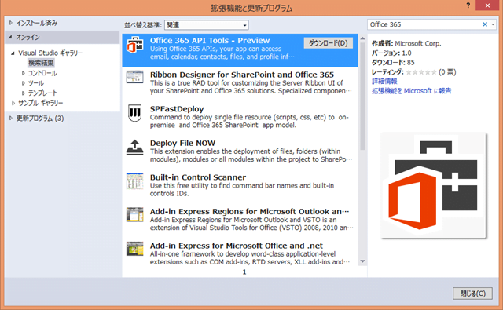
５．[インストール] をクリックする。
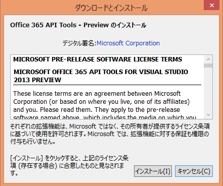
６．インストール完了後、Visual Studio 2013 を再起動する。

### プロジェクトの作成

Office 365 API Tools のセットアップが完了したら、次にプロジェクトを作成します。
なお、今回は SharePoint 用アプリでプロジェクトを作成してみたいと思います。
１．SharePoint 用アプリプロジェクトを作成する。
プロジェクト名は、”Office365APITools” としました。
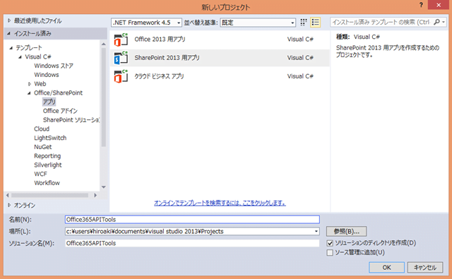
２．デバッグで使用する Office 365 の SharePoint サイトを指定。ホスト方法は手軽に実験するために [自動ホスト] を選択し、[次へ] をクリックする。
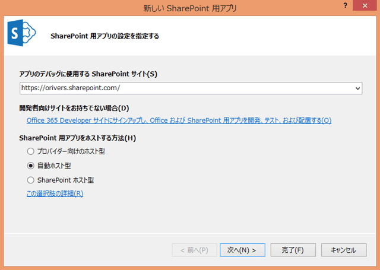
３．プロジェクトのタイプは、大好きな [ASP.NET MVC Web アプリケーション] を選択。もちろん、Web フォームでも問題ないと思います。
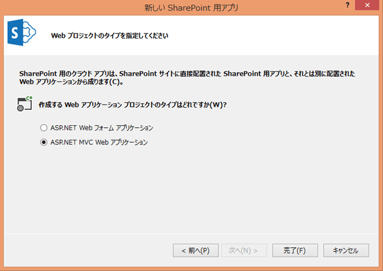
以上で、プロジェクト作成完了です。

### Office 365 API Tools の利用

いよいよ、Office 365 API Tools を利用します。
今回は、SharePoint の API を利用したいので、SharePoint への接続を行います。
１．ソリューションエクスプローラにて、Web アプリケーションのプロジェクトを右クリックする。
２．右クリックメニューの [追加] – [接続済みサービス] をクリックする。
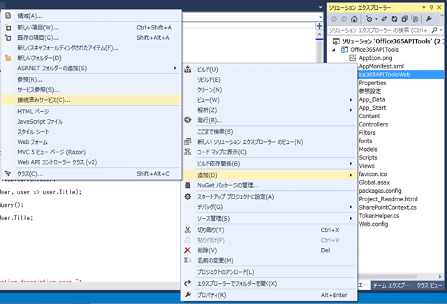
３．サービスマネージャーダイアログの [Sign in] をクリックする。
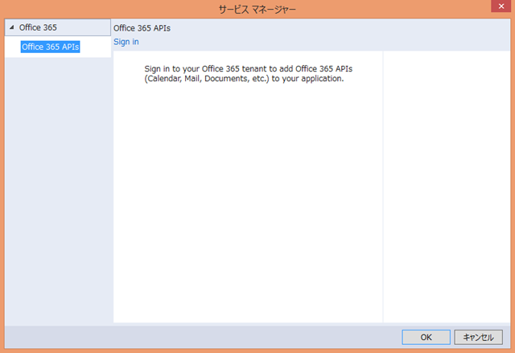
４．認証情報を入力し、SharePoint サイトに接続する。
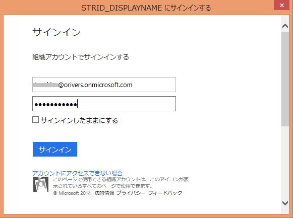
５．認証完了後、サービスマネージャーダイアログで、”SharePoint” を選択し、[OK] をクリックする。
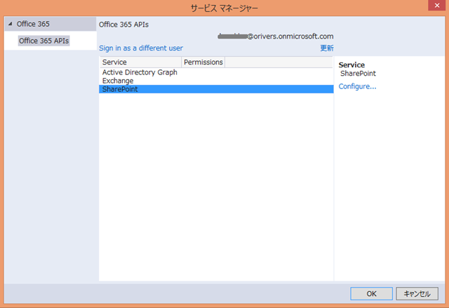
６．以下のダイアログが表示されるので、[OK] をクリックする。
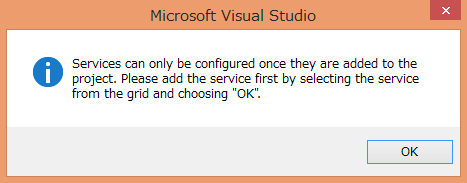
７．今回開発している SharePoint 用アプリに与える権限を指定し、[OK] をクリックする。
”MyFiles” では、おそらく自分が作成、更新したファイルに与える権限を指定するものと思います。
”AllSites” は、サイトコレクションに対する権限を指定するものと思います。
最後の “Make this app available to” では、どのテナントでアプリを利用できるようにするか、ということを指定するものと思います。
すみません、この辺り、色々なパターンを試したわけではないので、詳細は不明です。
今回は、”MyFiles” は ”Edit or delete user’s files (preview)” を、”AllSites” は、 “Read items in all site collections (preview)” を、”Make this app available to” は、”My tenant only” を選択しました。
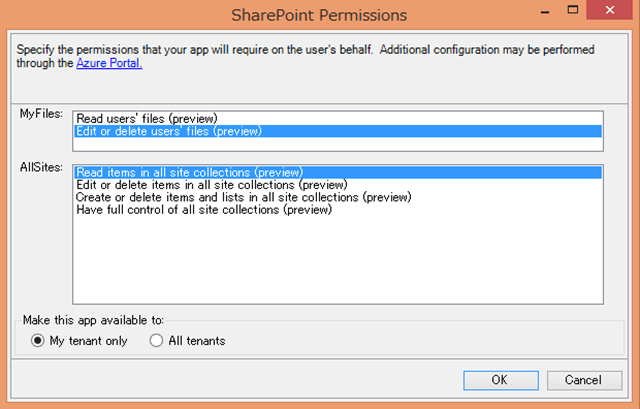
以上で、Office 365 API Tools の設定が完了です。
上記画面で [OK] ボタンをクリックすると、Webアプリケーションのプロジェクトに、Office 365 へアクセスするためのヘルパーコードやサンプルコードが追加されます。

### サンプルコードの実行

ここからは、Office 365 API Tools の設定をすると自動的に追加されるサンプルコードを実行する手順を記載します。
ちなみに、サンプルコードが何をするものかというと、Office 365 にログインしたユーザーの OneDrive for Business に接続し、”全員と共有” フォルダに格納されたファイルの一覧を表示する、というサンプルになっています。
１．サンプルコードを修正する。
ということで、早速実行をしたいわけですが、そのままサンプルコードをデバッグ実行しようとすると正しく動作しません。
サンプルコードが日本語環境に対応していないため、日本語版の SharePoint に接続する場合は、サンプルコードを修正する必要があります。
修正個所は、Web アプリケーションプロジェクトの Controllers フォルダ内の、SharePointSampleController.cs になります。
下図で示す 50 行目のフォルダ名が英語表記となっており、このままではフォルダが見つからないというエラーになってしまいます。
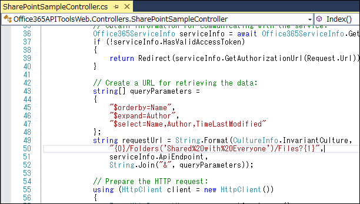
ということで、以下の通り 50 行目の “Shared%20with%20Everyone” を、”全員と共有” に変更します。
”全員と共有” というのが、“Shared%20with%20Everyone” に当たる日本語環境でのフォルダ名になります。
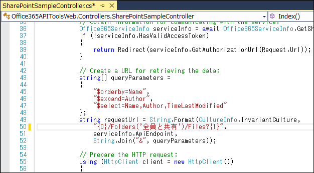
これで準備が整いました。
最後にデバッグ実行をします。
２．[F5] キーを押して、デバッグ実行を開始。
３．SharePoint 用アプリを信頼するか聞かれるので、迷わず [信頼する] をクリックする。
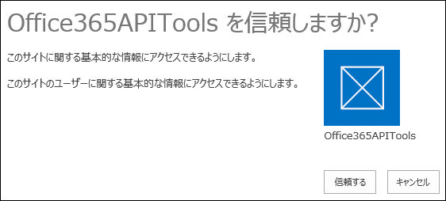
４．サンプルアプリのページに移動する。
Office 365 の認証後、以下の初期ページが表示されます。
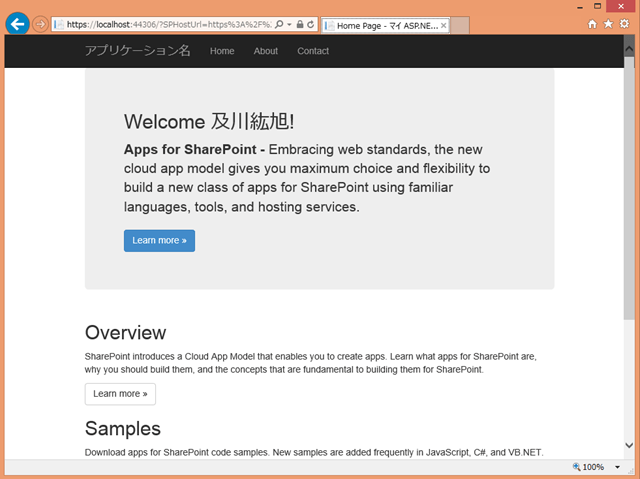
このページが表示された後、ブラウザの URL 欄を、”https://*ホスト名:ポート番号*/SharePointSample/” に変更します。
すると、以下のサンプルページが表示され、接続したユーザーの OneDrive の “全員と共有” フォルダの中身が表示されます。
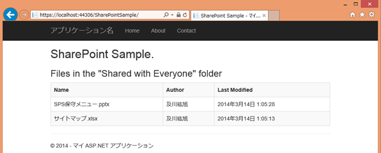
ちなみに、OneDrive の中は以下のようになっています。
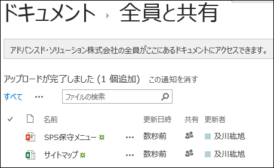
OneDrive に格納されたファイルが、SharePoint 用アプリの画面上に表示されていることが確認できるかと思います。
サンプルコードの中身の確認は、別記事でまとめたいと思います。
