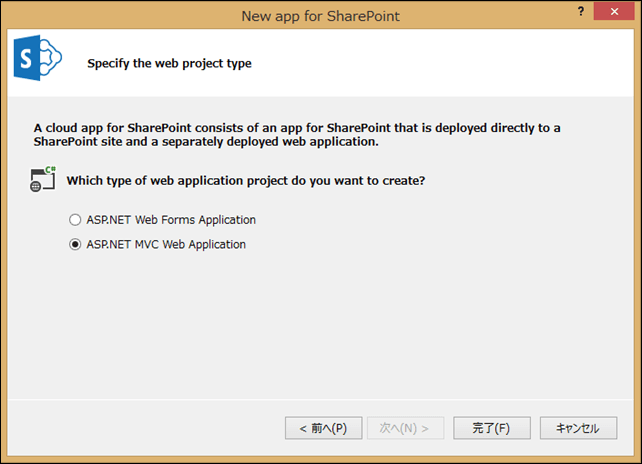

### はじめに

Visual Studio 2013 では、SharePoint app (apps for SharePoint のこと) を作成する際に、
・ASP.NET Web Forms Application (初代 ASP.NET の頃から存在するイベントドリブンなフレームワーク)
・ASP.NET MVC Web Application (Model-View-Controller パターンなフレームワーク)
のどちらかを最初に選択してプロジェクトを作ります。

※上図の通り、デフォルトは ASP.NET MVC Web Application となっています。
ASP.NET MVC Web Application 形式でプロジェクトを作成すると、モバイルデバイス向け開発に便利ないくつかの JavaScript ファイルが最初からプロジェクトに含まれているのですが、これらの JS ファイルについては Project\_Readme.html 等を読んでも特に説明がなく、SharePoint app 開発用の msdn の記事をあさってもなかなか情報が見つかりません。
ということで、プロジェクトに最初から含まれている JS ファイルは何のために使うものなのか調べてみました。
ASP.NET MVC Web Application での開発をバリバリやっていらっしゃる方や、モバイルデバイス向けの開発をされている方にとっては「そんなことも知らないの！？」ということかもしれませんが、古い人間な私には分からなかったので、一応ここにまとめておきます。。。

### ASP.NET MVC Web Application に最初から含まれている JS ファイル

#### \_references.js

このファイルは JavaScript のインテリセンスを有効にするために必要なファイルです。
中を開くと Script フォルダ内の JS ファイルのパスがコメントアウト状態で記載されています。
[参考情報はこちら](http://bartwullems.blogspot.jp/2013/03/aspnet-mvc-4-referencesjs-file.html)

#### bootstrap.js、bootstrap.min.js

[こちらのサイト](http://getbootstrap.com/)にあるような見た目の Web サイトを簡単に作成できるようにするためのスクリプトファイルです。
使い方のサンプルは[こちらのサイト](http://shiba-yan.hatenablog.jp/entry/20120107/1325872372)に載っています。

#### jquery-xxx.js 関係 (xxxにはバージョン番号が入ります)

クライアントサイドで多くの処理を行う最近の Web アプリケーションの開発では聞かないことがないくらいに有名なライブラリ。
これについては情報がたくさんあるので、色々調べてみてください。
[この辺りがおすすめ。](http://js.studio-kingdom.com/jquery)

#### modernizr-xxxx.js (xxxにはバージョン番号が入ります)

ブラウザが HTML5、CSS3 のどの機能に対応しているかを判別するためのライブラリです。
Internet Explorer 8 以下のような古いブラウザに対して、 新しいスタイルの代りに古いスタイルを適用させるというようなことができます。
使い方のサンプルは[こちらのサイト](http://shiba-yan.hatenablog.jp/entry/20110427/1303831927)に載っています。

#### respond.js

Internet Explorer 8 以下のような古いブラウザに対して、レスポンシブ Web デザインなインターフェースを提供するためのライブラリです。
レスポンシブ Web デザインとは、デバイスの解像度に合わせてデザインを最適化するそんな仕組み、デザインのことを言います。
スマホ向けサイトと PC 向けサイトを一つのページで作ってしまう場合などで効果を発揮します。
使い方のサンプルは[こちらのサイト](http://lab.informarc.co.jp/javascript/ie_responsive_webdesign.html)に載っています。

#### spcontext.js

SharePoint app の開発でよく使う処理が定義された JavaScript ファイルです。
SharePoint app 開発を志すなら、このファイルの存在意義はご自身で確か見てみてください。（って、便利関数が定義されているだけですけど）
 
以上になります。
使わないライブラリを入れておくのは気持ち悪いという方は、上記情報をもとに必要性を見極めて、シンプルなプロジェクトを作ってみてください。
