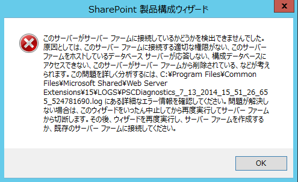

### はじめに

複数の開発者に SharePoint の開発環境を提供するために、SharePoint や Visual Studio を導入した環境をマスターイメージとして作成し、この環境を複製して各開発者に提供するということは、チーム開発を行う上では良くある話かと思います。
また、開発環境に限らず、SharePoint の動作検証環境を丸っと複製したいというニーズもあると思います。
このようなニーズを満たすための方法としてよくあるのは、仮想環境を丸ごとコピーして複製するとか、マスターとなるイメージを作成してそこから環境を構築するとかという手段が思いつきます。
ただ、そのまま仮想環境を丸ごとコピーすると、コンピュータ名や SID が被ってしまったりするため、複製された各環境がネットワーク的に分断された状態を作らなければ、何かと問題が起きてしまいます。
そのような状況になるのを防ぐため、環境を丸ごとコピーするような場合には、sysprep を使えばいいと考えるかと思います。
sysprep を使うことでコピーされた環境を初めて立ち上げる際にコンピュータ名などを設定しなおすことができるようになりますので。
※sysprep についての情報は[こちら](http://www.atmarkit.co.jp/ait/articles/1307/12/news062.html)
この手法を SharePoint が入った環境で行うとどうなるか・・・・ということを調べてみました。
結果は目に見えてはいたのですが、一応。

### SharePoint では sysprep は NG

はい、結論はそういうことです。
SharePoint の構成ウィザードが実行された環境で sysprep を実行しても、新しい環境は正しく動きません。
構成ウィザードの処理の中で、データベースやレジストリなどに対して SharePoint がインストールされた環境のコンピュータ名などが書き込まれるのでしょう。
そのため、sysprep を掛けたマスターイメージから新しい環境を作って起動し、新しいコンピュータ名を設定すると、SharePoint がデータベースにアクセスできなくなったり、全体管理サイトの URL が元の環境の URL のままになってしまっており全体管理サイトを開けなくなったりと、まったく動かなくなってしまいます。
試しに、[Rename-SPServer](http://technet.microsoft.com/ja-jp/library/ff607556(v=office.15).aspx) コマンドレットを実行してみましたが、ローカルファームに接続できないというエラーがでてしまいました。
また、構成ウィザードを実行しなおせばどうかと思い試してみましたが、こちらも下図のようなエラーが出て動かすことができませんでした。

ということで、SharePoint の環境を複製する際には sysprep は使えないという結論に至りました。
ちなみに、[KB](http://support.microsoft.com/kb/2728976/ja)にもこの件についての記述がありました。
KBによると sysprep を使いたいということであれば、構成ウィザードを実行する前に sysprep を実行するようにとのこと。
とりあえずそれだけでも、必須コンポーネントのインストールや SharePoint 本体のインストールの手間は省けるので良しとしましょうか。
