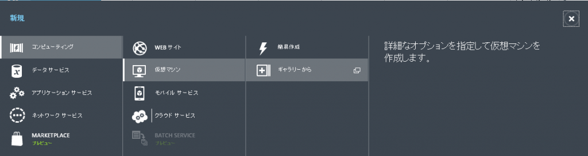
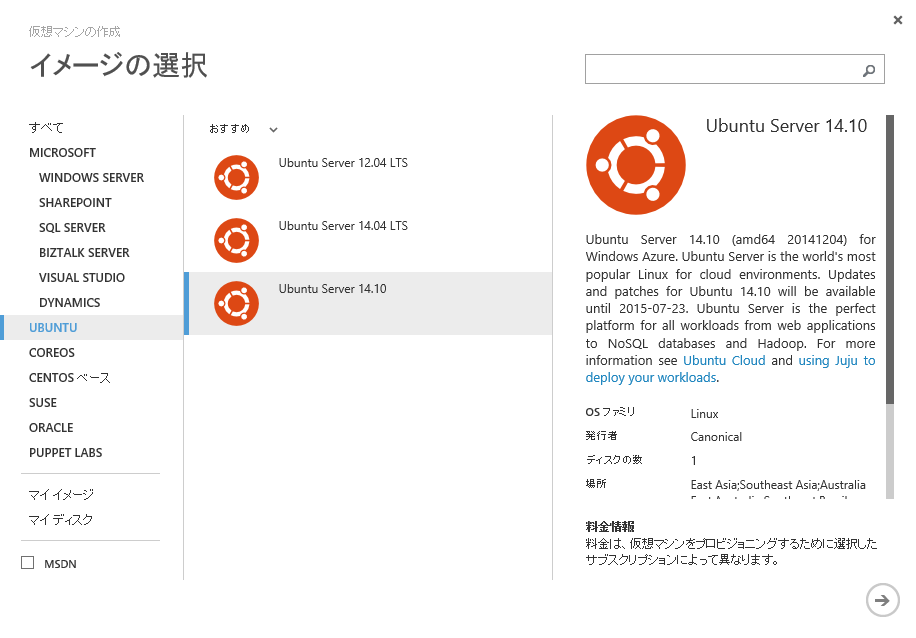
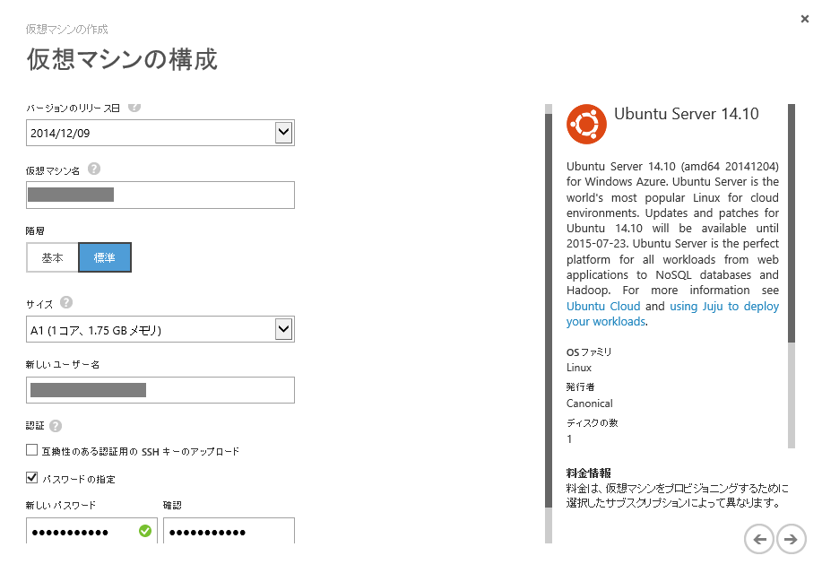
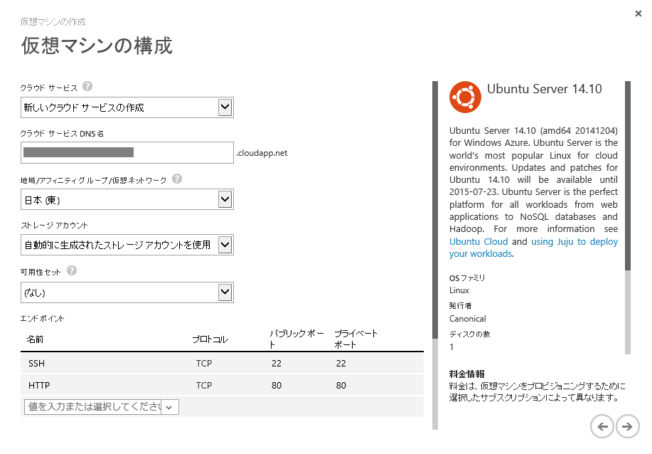
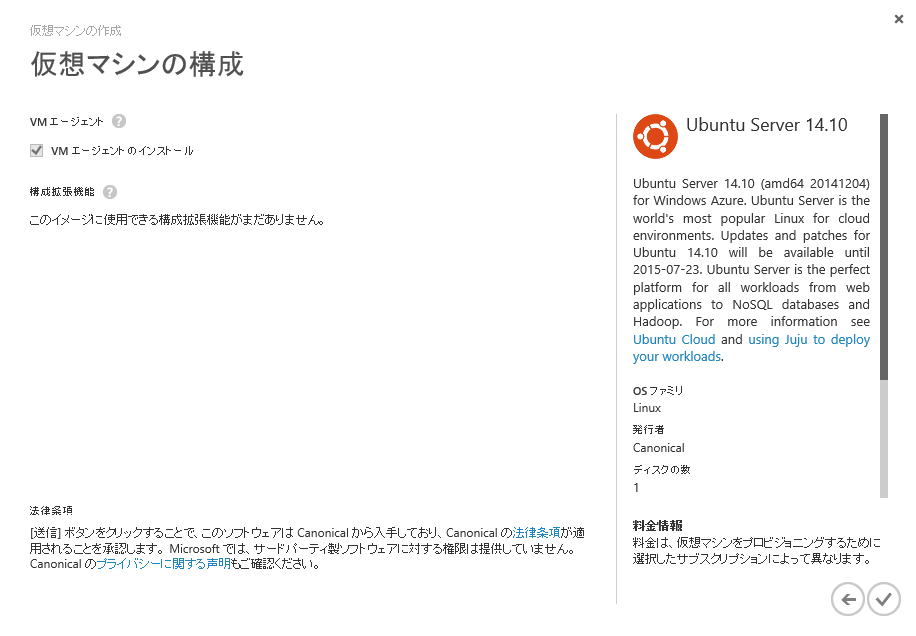
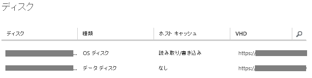
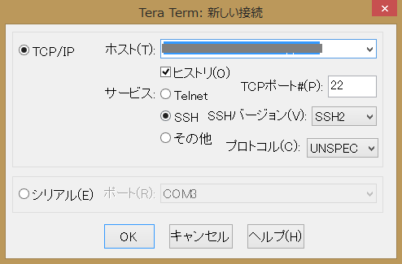
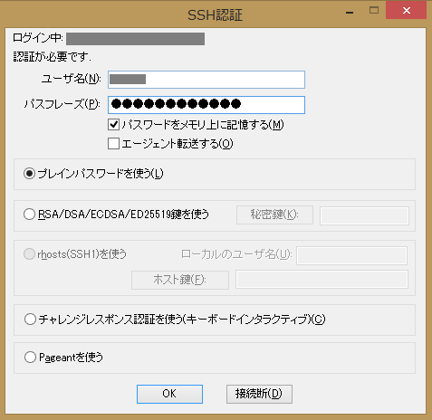
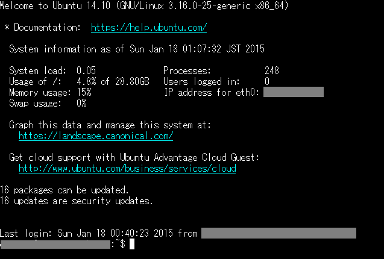

新年一発目は SharePoint ではないネタからｗ
昨年から年始にかけて、SharePoint ベースの独自ブログから Azure Web Site の WordPress へブログを移行しました。
移行は1か月ほどで無事済んだのですが、Azure Web Site で使える MySQL のデータベース容量が無料コースだと 20MB しかないことにブログ移行後に気づき、日々アラートメールが届くようになってしまいました。
MediaWiki のサイトもあるし、20MB ではとてもとても容量が足りないので、またまた引っ越すことに。
今度は Azure の仮想マシンに LAMP (Linux + Apache + MySQL + PHP) 環境を構築し、そこに WordPress と MediaWiki を移行することに決めました。
そして本日、無事 WordPress の引っ越しが済んだので、備忘録がてらその手順をブログに残しておこうと思います。
ちなみに Linux 環境は 20 代のころに 1、2 か月触ったくらいの経験しかありませんので、この記事では Linux の超基本的なところから書いてます。
まず初回は仮想マシンの立ち上げまで。

## Azure 仮想マシンの立ち上げ

**1. Azure ポータルに接続**
[Azure ポータル](https://manage.windowsazure.com "Azure ポータル")に接続します。
**2. 仮想マシンの作成**
画面下のメニューから[新規]→[コンピューティング]→[仮想マシン]→[ギャラリーから]をクリックします。

**3. イメージの選択**
今回は Linux OS として、Ubuntu Server を導入してみます。
[UBUNTU]→[Ubuntu Server 14.10]をクリックし右下の矢印をクリック。
**4. 仮想マシンの構成**
仮想マシンのスペックと管理者アカウントを決めます。
今回は、スペックとしては[標準]階層、サイズは[A1 (1コア、1.75GBメモリ)]を選択してみました。
SSH キーは良くわらから無かったので、とりあえずチェックを外し、[パスワードの指定]をすることにしました。
全部入力したら、画面右下の矢印をクリック。

**5. ストレージ、エンドポイント等の設定**
[クラウドサービス DNS 名]で設定した DNS 名が、仮想マシンにインターネットから直接接続する際の URL になります。
なお、ここで指定した内容で、仮想マシンが作られるのと合わせてクラウドサービスが作成されます。
[地域/アフィニティグループ/仮想ネットワーク]は適当に。日本があったのでとりあえず選びました。
[ストレージアカウント]は、仮想マシンの VHD ファイルの置き場所となるストレージを使うためのアカウントを指定します。
まだストレージアカウントを持っていない場合は、[自動的に生成されたストレージアカウントを使用]を選択します。
[エンドポイント]にはデフォルトで SSH が追加されていますが、Web ブラウザからの接続も行うので、[HTTP]をエンドポイントとして追加します。
全部指定したら、画面右下の矢印をクリック。

**6. 仮想マシン作成完了**
最後に出てくる画面は何も変更することはできないので、そのまま 画面右下のチェックをクリック。
これで仮想マシンの作成は完了。

**7. データ用ディスク追加**
今回仮想マシンで MySQL を動かすわけですが、 MySQL を動かす上でディスクのホストキャッシュ機能が邪魔になるらしく、MySQL 用にホストキャッシュを持たないディスクを追加する必要があります。

画面下のメニューから[ディスクの接続]→[空のディスクの接続]をクリック。

**8. ディスクサイズ等の指定**
追加するディスクのファイル名、サイズ、ホストキャッシュの設定を指定します。
ホストキャッシュの設定は忘れずに[なし]にしてください。
全部入力したら、画面右下の矢印をクリック。

**9. 追加されたディスクの確認**
無事ディスクが追加されました。

**10. TeraTerm のインストール**
Linux のリモート接続というと私は TeraTerm しか使ったことが無いので、迷わず TeraTerm をダウンロード、インストール。
<http://sourceforge.jp/projects/ttssh2/>
**11. TeraTerm で接続確認**
TeraTerm を起動し、[新しい接続]ダイアログの[ホスト名]に「5. ストレージ、エンドポイント等の設定」で設定した [クラウドサービスの DNS 名]を入力し、[OK]をクリック。

[SSH認証]ダイアログの[ユーザ名]と[パスフレーズ]に「4. 仮想マシンの構成」で設定した[ユーザー名]と[パスワード]を入力し、[OK]をクリック。

**12. 接続！**
無事接続できると、Welcome to Ubuntu 14.10 と書かれた画面が表示されます。
これでまずは Linux OS が立ち上がりました。

次は Apache、MySQL、PHP のインストールと追加ディスクのマウントですが、長くなったので今回はここまで。

### 参考にしたサイト

こちらのサイトを参考にしました。
[Azureの仮想マシン（Ubuntu）でWordPressサイトを立ち上げる](http://www.lizardk.net/2014/10/azure-vm.html)
[Azure仮想マシンへのディスク追加](http://qiita.com/unosk/items/330376faadf648aa8ccc)
**関連記事：**
[Azure 仮想マシンに LAMP 環境を構築し WordPress を立ち上げる -その１-](http://sharepoint.orivers.jp/article/9572)
[Azure 仮想マシンに LAMP 環境を構築し WordPress を立ち上げる -その２-](http://sharepoint.orivers.jp/article/9623)
[Azure 仮想マシンに LAMP 環境を構築し WordPress を立ち上げる -その３-](http://sharepoint.orivers.jp/article/9679)
[Azure 仮想マシンに LAMP 環境を構築し WordPress を立ち上げる -その４-](http://sharepoint.orivers.jp/article/9711)
