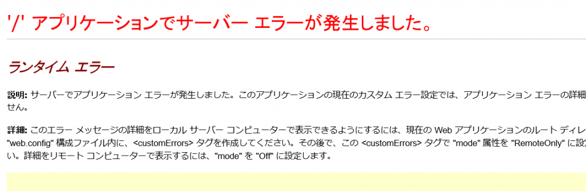
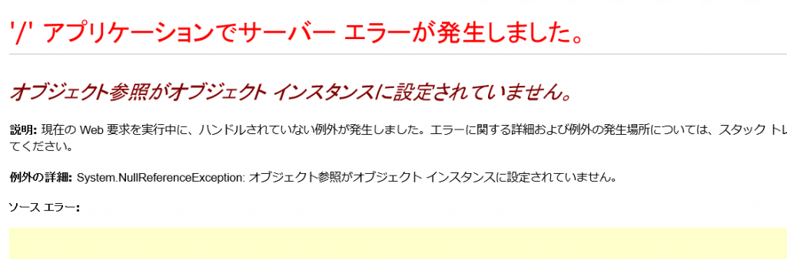

SharePoint 開発をしていると一度は悩む(?)、どこでもキャッチしていない例外(未処理の例外)が起きた時に表示するエラーページを切り替える方法についてまとめました。

#### 切り替え方法

エラーページは SharePoint の IIS サイトの物理フォルダにある web.config の以下の属性の設定により切り替えることができます。
・SharePoint タグ配下にある SafeMode タグの CallStack 属性
・system.web タグ配下にある customErrors タグの mode 属性
・system.web タグ配下にある compilation タグの debug 属性
SharePoint の IIS サイトは以下の場所にあります。
C:\inetpub\wwwroot\wss\VirtualDirectories\80 ←最後の 80 はポート番号
また、\_layouts フォルダ配下のアプリケーションページ等で発生した未処理の例外に対するエラーページの表示切り替えを行う場合は、\_layouts フォルダ配下にある web.config の customErrors タグの設定も忘れずに行ってください。
\_layouts フォルダは以下の場所にあります。
C:\Program Files\Common Files\microsoft shared\Web Server Extensions\15\TEMPLATE\LAYOUTS
※15 フォルダは SharePoint のバージョンにより数字が異なります。2013 の場合は 15 となります。
web.config の各属性の具体的な設定は以下の通りとなります。

|  |  |  |  |
| --- | --- | --- | --- |
| エラーページの種類 | CallStack 属性 | mode 属性 | debug 属性 |
| 不明なエラー | false | On | false |
| 標準エラー | true | On | true |
| 詳細エラー | true | Off または RemoteOnly | true |

以下、各エラーページのキャプチャーです。
**不明なエラーページ**

**標準エラーページ**

**詳細エラーページ**

