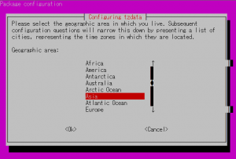
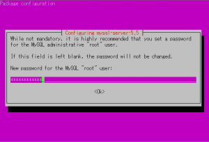
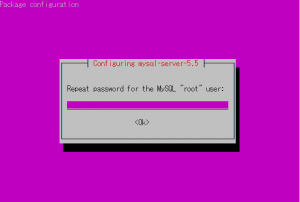
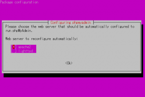
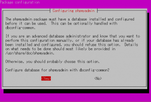
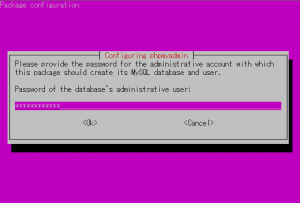
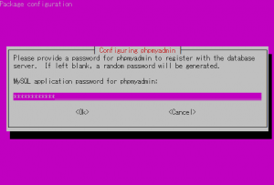
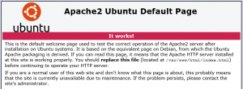
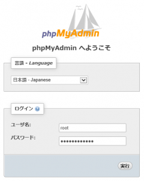

[前回](http://sharepoint.orivers.jp/article/9572) Azure 仮想マシン上に Linux (Ubuntu) を立ち上げたので、次は Apache、MySQL、PHP をセットアップします。

## Apache、MySQL、PHP のインストール

**1. 接続**TeraTerm を起動して、環境に接続します。
**2. タイムゾーンの変更**まずはシステムのタイムゾーンを変更するため、以下のコマンドを TeraTerm で入力します。
```
sudo dpkg-reconfigure tzdata
```
すると以下の画面が表示されるので、タイムゾーンを日本にするのであれば [Asia] を選択して Enter キーを押し、その後 [Tokyo] を選択して Enter キーを押します。
[](http://sharepoint.orivers.jp/wp-content/uploads/2015/01/linux-lang.png)
**3. システムを最新状態に更新**まるで Windows Update のように、システムを最新の状態に更新します。
以下のコマンドを入力してください。
```
sudo apt-get update
sudo apt-get upgrade
```
途中、Do you want to continue? と聞かれるので、y を入力してください。
しばらくするとアップデートが完了します。
**4. Apache、MySQL、PHP と phpMyAdmin (MySQL のブラウザ版管理ツール) をインストール**以下のコマンドを入力し、インストールを開始します。
```
sudo apt-get install apache2 mysql-server phpmyadmin
```
途中で MySQL の管理者ユーザー (root ) のパスワードを聞かれるので、任意のパスワードを入力します。
[](http://sharepoint.orivers.jp/wp-content/uploads/2015/01/linux-setup-1.png)
確認でもう一度聞かれるので、先ほどと同じパスワードを入力します。
[](http://sharepoint.orivers.jp/wp-content/uploads/2015/01/linux-setup-2.png)
次に phpMyAdmin の設定として、Web Server に何を使うかの指定をします。
今回は Apache を使いたいので、[apache2] を選択します。
ちなみにこの選択画面、少しはまりました。
[apache2] を選択するには、キーボードの矢印キーで [apache2] をハイライト表示し、忘れずにキーボードのスペースキーを押してください。
すると下の画面ショットのように [apache2] のところに \* が付きます。
[](http://sharepoint.orivers.jp/wp-content/uploads/2015/01/linux-setup-3.png)
phpMyAdmin の設定が続きます。
dbconfig-common の設定を聞かれるのでここは [Yes] を選択します。
[](http://sharepoint.orivers.jp/wp-content/uploads/2015/01/linux-setup-4.png)
続いて MySQL の root のパスワードを聞かれるので入力します。
[](http://sharepoint.orivers.jp/wp-content/uploads/2015/01/linux-setup-5.png)
次に phpMyAdmin のパスワードを設定します。
[](http://sharepoint.orivers.jp/wp-content/uploads/2015/01/linux-setup-6.png)
確認を求められるので、再度先ほどの phpMyAdmin のパスワードを入力します。
[](http://sharepoint.orivers.jp/wp-content/uploads/2015/01/linux-setup-7.png)
以上でインストールは完了です。
非常に簡単にインストールできますね。
正直びっくりしました。
最後に動作確認をしましょう。
Apache を入れているので Web ブラウザから動作確認ができます。
ご自身の Azure 仮想マシンの HTTP エンドポイントにブラウザでアクセスします。
URL は http://xxx.cloudapp.net です。xxx の部分は 仮想マシンを作成する際に指定した値を入れてください。
インストールがうまくいっていれば、以下のようなページが表示されます。
[](http://sharepoint.orivers.jp/wp-content/uploads/2015/01/linux-setup-8.png)
ついでに phpMyAdmin も確認しておきましょう。
http://xxx.cloudapp.net/phpmyadmin にアクセスしてみると、以下のようなページが表示されます。
[](http://sharepoint.orivers.jp/wp-content/uploads/2015/01/linux-setup-9.png)
これで LAMP 環境が構築できました。
次は MySQL のデータファイルの置き場所を追加ディスクに変更する手順を書きたいと思いますが、長くなったので次回に。
 
**関連記事：**
[Azure 仮想マシンに LAMP 環境を構築し WordPress を立ち上げる -その１-](http://sharepoint.orivers.jp/article/9572)
[Azure 仮想マシンに LAMP 環境を構築し WordPress を立ち上げる -その２-](http://sharepoint.orivers.jp/article/9623)
[Azure 仮想マシンに LAMP 環境を構築し WordPress を立ち上げる -その３-](http://sharepoint.orivers.jp/article/9679)
[Azure 仮想マシンに LAMP 環境を構築し WordPress を立ち上げる -その４-](http://sharepoint.orivers.jp/article/9711)
