Office 365 のテナントに独自のドメインを追加するという作業を行なったので、その際の流れを残しておきたいと思います。
ちなみにここで紹介する流れは 2015 年 2 月 1 日時点の Office 365 が対象です。
今後は流れが変わる可能性がありますのでご了承ください。
また、利用しているドメイン管理業者は [Value Domain](http://value-domain.com/) になります。
**1. Office 365 管理センターよりドメイン追加を開始**
Office 365 管理センターにアクセスし、メニューから[ドメイン]をクリック。
その後、右ペインの[ドメインの追加]をクリックします。
[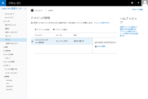](http://sharepoint.orivers.jp/wp-content/uploads/2015/02/o365domain-1.png)
**2. ドメインと DNS の説明**
ドメイン名の登録をするわけですから、DNS のことをきちんと理解しておきなさいということですね。
[始めましょう]をクリックします。
[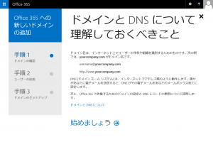](http://sharepoint.orivers.jp/wp-content/uploads/2015/02/o365domain-2.png)
**3. ドメインの指定**
追加するドメインをテキストボックスに入力し[次へ]をクリックします。
ちなみに私は以前から使っている orivers.jp を指定しました。
ドメインを持っていない場合は事前にドメインをゲットしてください。
[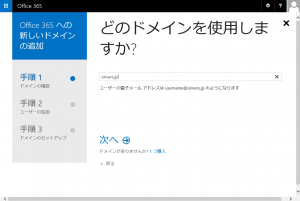](http://sharepoint.orivers.jp/wp-content/uploads/2015/02/o365domain-3.png)
**4. DNS に TXT レコードを追加**
前の手順で指定したドメインを所有していることを確認するため、DNS に TXT レコードを追加します。
画面に TXT 名、TXT 値、TTL が表示されるので、これをご自身が利用している DNS に登録します。
[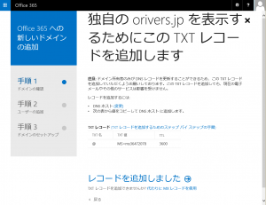](http://sharepoint.orivers.jp/wp-content/uploads/2015/02/o365domain-4.png)
Value Domain の場合は、DNS の管理画面にて以下のように記述します。
入力ミスを防ぐため画面からコピペします。
txt @ MS=ms36472078
DNS の登録が済んだら、Office 365 の画面に戻り、[レコードを追加しました]をクリックします。
DNS の登録が無事済んでいたら、次のステップに進むことができます。
[次へ]をクリックします。
[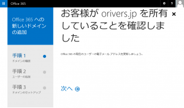](http://sharepoint.orivers.jp/wp-content/uploads/2015/02/o365domain-7.png)
DNS の登録が失敗している場合や、登録結果がまだ反映されていない場合は、以下のようなエラーが出ます。
[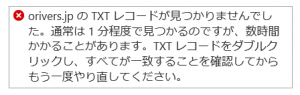](http://sharepoint.orivers.jp/wp-content/uploads/2015/02/o365domain-6.png)
ちなみに私の場合は、DNS の登録から 30 分くらいして、ようやく次のステップに行けるようになりました。
**5. 既存ユーザーのドメイン更新**
現在のドメイン「xxx.onmicrosoft.com」に登録されているユーザーを新しいドメインに移行します。
移行したいユーザーをチェックして、[選択したユーザーの更新]をクリックします。
[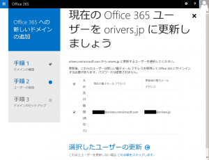](http://sharepoint.orivers.jp/wp-content/uploads/2015/02/o365domain-8.png)
無事更新が完了しました。
[次へ]をクリックします。
[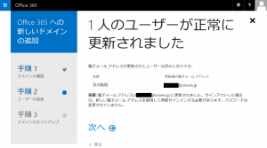](http://sharepoint.orivers.jp/wp-content/uploads/2015/02/o365domain-9.png)
ここで一度サインアウトします。
[サインアウト]をクリックします。
[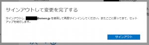](http://sharepoint.orivers.jp/wp-content/uploads/2015/02/o365domain-10.png)
**6. 新規ユーザーを追加する**
新しいドメインに追加するユーザーをここで登録します。
登録が完了したら[これらのユーザーの追加]をクリックします。
[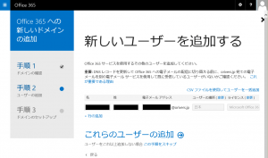](http://sharepoint.orivers.jp/wp-content/uploads/2015/02/o365domain-11.png)
無事登録が完了しました。
[次へ]をクリックします。
[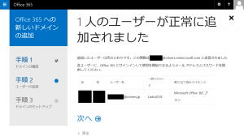](http://sharepoint.orivers.jp/wp-content/uploads/2015/02/o365domain-12.png)
**7.  DNS レコードの更新を開始**
いよいよ Office 365 に新しいドメインを追加するための DNS の設定をします。
[次へ]をクリックします。
[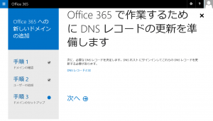](http://sharepoint.orivers.jp/wp-content/uploads/2015/02/o365domain-13.png)
**8. サブドメイン「www」の使用状況確認**
SharePoint サイト用のサブドメインを作成するためかと思いますが、「www」サブドメインの使用状況の確認が入ります。
今回は「www」サブドメインは何もせずに残しておきたいので[はい、www.orivers.jp に Web サイトがあります]を選択します。
[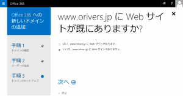](http://sharepoint.orivers.jp/wp-content/uploads/2015/02/o365domain-14.png)
すると、この Web サイトを使い続けるかと聞かれるので、[はい、現在の Web ホストでこの Web サイトを使い続けます]を選択し、[次へ]をクリックします。
[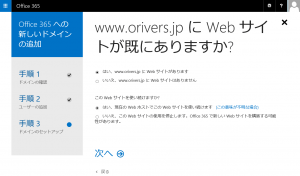](http://sharepoint.orivers.jp/wp-content/uploads/2015/02/o365domain-15.png)
**9. 使用するサービスの選択**
新しいドメインで使用するサービスを選択します。
今回はメールだけ使いたいので、[電子メール、予定表、および連絡先用の Outlook]にチェックをして、[次へ]をクリックします。
[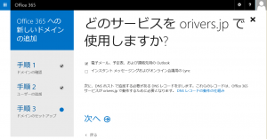](http://sharepoint.orivers.jp/wp-content/uploads/2015/02/o365domain-16.png)
**10. DNS レコードの追加**
MX レコード、CNAME レコード、TXT レコードが表示されます。
[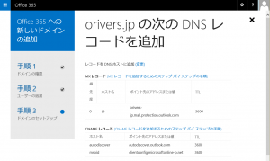](http://sharepoint.orivers.jp/wp-content/uploads/2015/02/o365domain-17.png)
[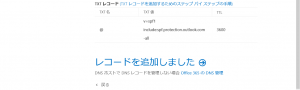](http://sharepoint.orivers.jp/wp-content/uploads/2015/02/o365domain-18.png)
これらのレコードを先ほどと同様 DNS に登録します。
入力ミスを防ぐため画面からコピペします。
なお、前の手順で追加した TXT レコードはこのタイミングで削除します。
Value Domain の場合は、DNS 管理画面で以下のように記述します。
mx orivers-jp.mail.protection.outlook.com. 0
cname autodiscover autodiscover.outlook.com.
cname msoid clientconfig.microsoftonline-p.net.
txt @ v=spf1 include:spf.protection.outlook.com -all
※cnameの最後は必ず「.」で。
DNS にレコードを追加した後、Office 365 の画面に戻り、[レコードを追加しました]をクリックしますが、 先ほどと同様、DNS 更新のタイムラグがあるので、先ほどと同じくらいの時間待ちましょう。
DNS の更新がまだ済んでいない場合は、以下のようなエラーが表示されます。
「何を修正しますか？」って、ちょっと日本語変ですねｗ
[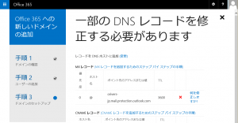](http://sharepoint.orivers.jp/wp-content/uploads/2015/02/o365domain-20.png)
この不思議な日本語をクリックすると、以下のようにエラーの対応方法が表示されます。
[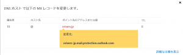](http://sharepoint.orivers.jp/wp-content/uploads/2015/02/o365domain-21.png)
**11. 設定完了！**
前の画面でしばらく待ってから[レコードを追加しました]をクリックし、以下の画面が表示されれば設定完了です。
[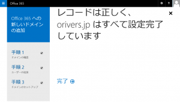](http://sharepoint.orivers.jp/wp-content/uploads/2015/02/o365domain-22.png)
設定そのものは難しくないのですが、DNS の登録方法がドメイン管理業者により異なるので、そこがはまりどころですね。
あとタイトルが大きすぎｗ
