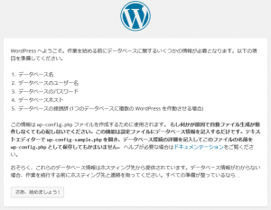
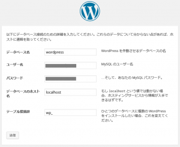
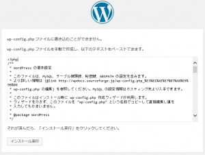
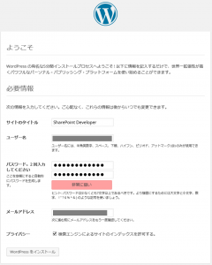
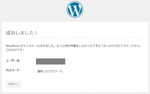

いよいよ本シリーズも最後になりました。
[前回](http://sharepoint.orivers.jp/article/9679)までで WordPress をインストールする準備が整ったので、今回は WordPress をインストールして初期設定を行い、WordPress が利用できる状態まで持って行きたいと思います。

## WordPress 用データベースの作成

WordPress のインストールを行うため、まずはデータベースを作成します。
1. MySQL にログインする
TeraTarm でサーバーに接続して以下のコマンドを実行し、パスワードを入力して MySQL に接続します。
```
mysql -u root -p
```
すると下記のようなメッセージが表示されます。
```
Welcome to the MySQL monitor. Commands end with ; or \g.
Your MySQL connection id is 42
Server version: 5.5.40-0ubuntu1 (Ubuntu)
Copyright (c) 2000, 2014, Oracle and/or its affiliates. All rights reserved.
Oracle is a registered trademark of Oracle Corporation and/or its
affiliates. Other names may be trademarks of their respective owners.
Type 'help;' or '\h' for help. Type '\c' to clear the current input statement.
```
2. WordPress 用データベースを作成する
以下のコマンドを TeraTarm から実行し、WordPress 用データベースを作成します。
```
CREATE DATABASE wordpress;
GRANT ALL PRIVILEGES ON wordpress.\* TO "username"@"localhost"
-> IDENTIFIED BY "password";
FLUSH PRIVILEGES;
exit
```
username と password の部分は任意の値に置き換えてください。
3. unzip をインストールする
WordPress のインストールファイルが zip ファイルなので、事前に unzip をインストールしておきます。
以下のコマンドを TeraTarm から実行し、unzip をインストールします。
```
sudo apt-get install unzip
```
4. WordPress を取得し仮想マシンに送信、解凍する
ローカルの PC にて http://ja.wordpress.org をブラウザで開き、WordPress の zip ファイルをダウンロードします。
その後、TeraTarm のメニューから[ファイル]→[SSH SCP]をクリックし、表示されたダイアログにて、[From]に WordPress の zip ファイルを指定し、[Send]ボタンをクリックして、ファイルをアップロードします。
最後にアップロードしたファイルを以下のコマンドで解凍します。
```
unzip wordpress-4.1-ja.zip
sudo cp -r wordpress /var/www/
```
5. Apache のドキュメントルートを変更する
Azure 上の自サイトのドメイン(http://xxx.cloudapp.net)にアクセスしたら WordPress で作成したサイトが表示されるようになるよう、Apache のドキュメントルートの設定をします。
TeraTarm にて以下のコマンドを実行し、既定の設定ファイル (000-default.conf) をコピーして、新しい設定ファイル (blog.copnf) を作成します。
```
sudo cp /etc/apache2/sites-available/000-default.conf /etc/apache2/sites-available/blog.conf
```
新しく作成した設定ファイルを vi で挿入モードで開き、 のタグの間に、 http://xxx.cloudapp.net にアクセスされたら WordPress が開くように以下の設定を追記します。
また、ログファイルの出力先も wordpress ディレクトリ内にまとめます。
```
ServerAdmin serveradminname
DocumentRoot /var/www/wordpress
ServerName xxx.cloudapp.net
<Directory "/var/www/wordpress">
AllowOverride All
<Directory "/var/www/wordpress" />
ErrorLog /var/www/wordpress/logs/error.log
CustomLog /var/www/wordpress/logs/access.log combined
```
serveradminname は任意の値に、ServerName は Azure 上のドメイン名に変更してください。
blog.conf への設定の追記が終わったら、TeraTarm にて以下のコマンドを実行し、blog.conf を通常使う設定ファイルとして指定します。
```
sudo a2ensite
```
すると、以下のメッセージが表示されるので、blog と入力してください。
```
Your choices are: 000-default blog default-ssl
Which site(s) do you want to enable (wildcards ok)?
blog
Site blog already enabled
```
最後に Apache の再起動をして、ユーザーに WordPress への閲覧権限を付与します。
```
sudo service apache2 restart
sudo chown -R www-data:www-data /var/www/wordpress/\*
```
ここまでの設定がうまく行っていれば、以下の URL を Web ブラウザにて表示することができるはずです。
http://xxx.cloudapp.net/license.txt
※xxx の部分は、任意の URL に合わせて変更してください。
6. WordPress のインストールウィザード
これがいよいよ最後の手順です。
ここからは Web ブラウザのみでの作業となります。
Web ブラウザにて以下のサイトを開きます。
http://xxx.cloudapp.net/wp-admin/install.php
[さあ、始めましょう!]をクリックします。
[](http://sharepoint.orivers.jp/wp-content/uploads/2015/06/wordpressinst1.png)
データベース名、ユーザー名、パスワード、データベースのホスト名は、手順２で SQL 文に指定した値と同じものを指定してください。
テーブル接頭辞は「wp\_」で特に問題ないかと思います。
すべて入力したら、[送信]をクリックします。
[](http://sharepoint.orivers.jp/wp-content/uploads/2015/06/wordpressinst2.png)
「wp-config.php ファイルの書きこむことができません。」というエラーが出力された場合は、仮想マシン上の /var/www/wordpress/wp-config.php ファイルを開き、ダイアログに表示されているテキストを貼り付けてから、[インストール実行]をクリックします。
[](http://sharepoint.orivers.jp/wp-content/uploads/2015/06/wordpressinst3.png)
必要事項を一通り入力し、[WordPress をインストール]をクリックします。
[](http://sharepoint.orivers.jp/wp-content/uploads/2015/06/wordpressinst4.png)
インストールが完了すると、以下の画面が表示されます。
[](http://sharepoint.orivers.jp/wp-content/uploads/2015/06/wordpressinst5.png)
これで、一通りのセットアップが完了し、WordPress が使えるようになりました。
こうして頑張って作成した WordPress は、Azure Web Site の標準テンプレートに含まれる WordPress テンプレートと違い、データベースが ClearDB サービスを使用しないので、Azure の課金体系の中にデータベースの料金も含まれる形になりますし、Azure Web Site よりもパフォーマンスが良くなった気がします。
Linux 不慣れな私でもいろいろ調べながらセットアップができたので、みなさんもぜひお試しください。
**関連記事：**
[Azure 仮想マシンに LAMP 環境を構築し WordPress を立ち上げる -その１-](http://sharepoint.orivers.jp/article/9572)
[Azure 仮想マシンに LAMP 環境を構築し WordPress を立ち上げる -その２-](http://sharepoint.orivers.jp/article/9623)
[Azure 仮想マシンに LAMP 環境を構築し WordPress を立ち上げる -その３-](http://sharepoint.orivers.jp/article/9679)
[Azure 仮想マシンに LAMP 環境を構築し WordPress を立ち上げる -その４-](http://sharepoint.orivers.jp/article/9711)
