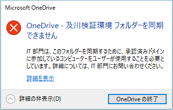

OneDrive 同期クライアントを使っている場合、OneDrive for Business 上のデータの情報漏洩対策として、会社 PC では同期を許可するけど、自宅 PC は同期を許可させたくないという話はよくあることかと思います。
SharePoint 管理コンソールから「Set-SPOTenantSyncClientRestriction」を実行すると、上記のような制限をかけることができるようになります。
また、「Get-SPOTenantSyncClientRestriction」で現在の状態を確認することができます。
```
# テナントに接続 (URL は SharePoint 管理センターの URL です
PS> Connect-SPOService https://[テナント名]-admin.sharepoint.com
# 現在のOneDrive同期設定を確認
PS> Get-SPOTenantSyncClientRestriction
TenantRestrictionEnabled : False
AllowedDomainList : {}
BlockMacSync : False
ExcludedFileExtensions : {}
OptOutOfGrooveBlock : False
OptOutOfGrooveSoftBlock : False
DisableReportProblemDialog : False
# 同期を許可するドメインのドメインGUIDを取得する
PS> $domains = (Get-ADForest).Domains; foreach($d in $domains) {Get-ADDomain -Identity $d | Select ObjectGuid}
ObjectGuid
----------
99999999-9999-9999-9999-999999999999
# OneDrive 同期制限をかけ、上記ドメインのみ同期を許可する
PS> Set-SPOTenantSyncClientRestriction -Enable -DomainGuids "99999999-9999-9999-9999-999999999999"
TenantRestrictionEnabled : True
AllowedDomainList : {99999999-9999-9999-9999-999999999999}
BlockMacSync : False
ExcludedFileExtensions : {}
OptOutOfGrooveBlock : False
OptOutOfGrooveSoftBlock : False
DisableReportProblemDialog : False
```
制限がかかった状態の OneDrive for Business に OneDrive 同期クライアントで同期をしようとすると、使用中の PC が同期が許可されたドメインに属する PC でない場合に、以下のエラーが表示されます。

なお、エラーが出ていても同期ができないだけで、過去に同期されたファイルはローカルに残り続けます。
制限を解除する場合は「Remove-SPOTenantSyncClientRestriction」を実行します。
```
# 制限を解除する
PS> Remove-SPOTenantSyncClientRestriction
TenantRestrictionEnabled : False
AllowedDomainList : {99999999-9999-9999-9999-999999999999}
BlockMacSync : False
ExcludedFileExtensions : {}
OptOutOfGrooveBlock : False
OptOutOfGrooveSoftBlock : False
DisableReportProblemDialog : False
```
それから、すべてのドメインに対して同期を許可しない場合の設定ですが・・・これはできなさそうです。
「Set-SPOTenantSyncClientRestriction」コマンドの「DomainGuids」パラメータは省略することができず、存在しない適当なドメイン GUID を入力しても設定が反映されません。
あくまでも、同期を許可するドメインを制限するというのが目的になります。
そして、旧同期クライアントや Mac の同期クライアントについては、上記のコマンドでは制限設定を変更できません。
「SPOTenantSyncClientRestriction」コマンドのパラメータとして、旧同期クライアント、Mac クライアント用のパラメータが用意されているので、TechNet で確認してください。
TechNet - Set-SPOTenantSyncClientRestriction
<https://technet.microsoft.com/ja-jp/library/dn917455.aspx>
セキュリティに関することなので、設定前には上記 TechNet を確認して、用法を理解した上で使いましょう。
