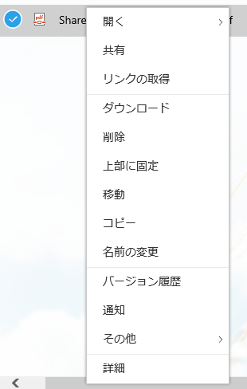
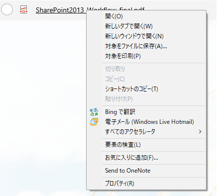

ちょっとした小ネタを。（もしかしたら有名な話かもしれないけど、私は初めて知ったので・・・）
とある記事を見ていて、もしかして SharePoint Online でも使えるかも！？と思い試してみました。
通常、ドキュメントライブラリのファイル名のところで右クリックをすると、SharePoint 専用の右クリックメニューが表示されますよね。
ところが、キーボードの Shift キーを押しながら右クリックをすると、SharePoint 専用の右クリックメニューではなく、ブラウザの右クリックメニューを表示することができます。
SharePoint専用右クリックメニュー (右クリックで表示)

ブラウザ(IE11)の右クリックメニュー (Shiftキーを押しながら右クリックで表示)

これで、ドキュメントライブラリに格納されたファイルの直リンクを手軽にコピーできるか！？
と思いましたが、コピーできた URL は Web 表示用のリンクでした。。。ちょっと残念。
でも、手軽に URL が取得できるので便利ですね。
なお、ブラウザは IE11、Edge、Chrome で確認済みです。
