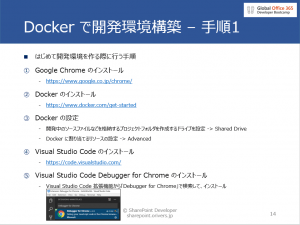

ただいま、10/27 開催の Global Office 365 Developer Bootcamp in Japan に向けてスライドやらハンズオンのネタやらを準備しているところです。
今回は SharePoint Framework を使った開発のハンズオンになるので、マイクロソフト系開発者が当たり前のように使っている Visual Studio 2017 を使うことはありません。
Web フロント開発の経験がない方だと、もしかすると普段はあまり使うことのない環境で開発をすることになるため、ハンズオンでは開発環境の構築から行う予定です。
 
ただ、開発環境構築のために色々ダウンロードしなければならず、会場の Wifi を使ってみんなが一斉にダウンロードをすると時間がかかってしまう可能性が高いです。
ということで、私のハンズオンにご参加いただく方は可能であれば以下の事前設定を終えておいていただけると、この後のハンズオンがスムーズに進められるかと思います。
①以下のスライドに記載のツール類のインストール

②Docker イメージのダウンロード
PowerShell を起動して、以下のコマンドを実行
docker pull waldekm/spfx:1.5.1
 
事前準備としてご協力いただけると幸いです。

[AdSense-B]
