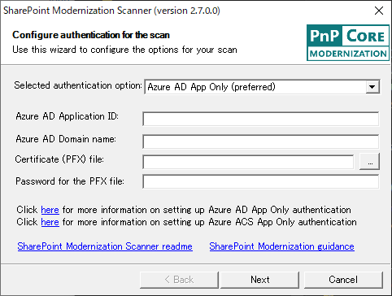
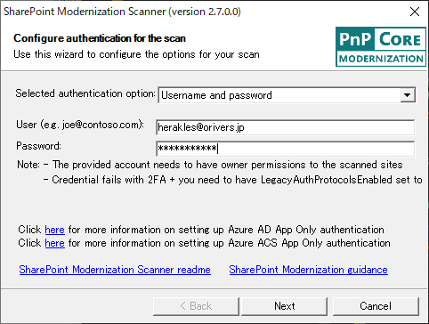
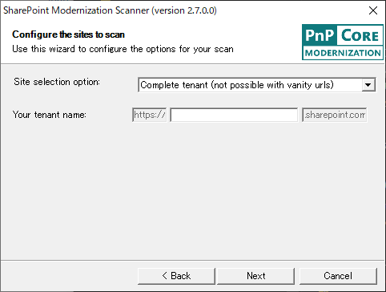
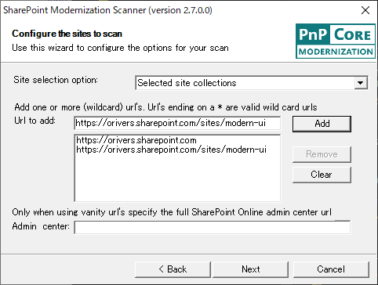
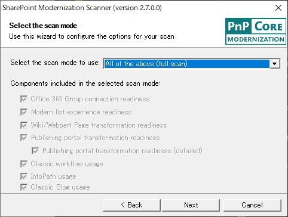
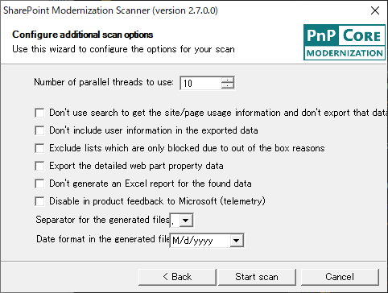
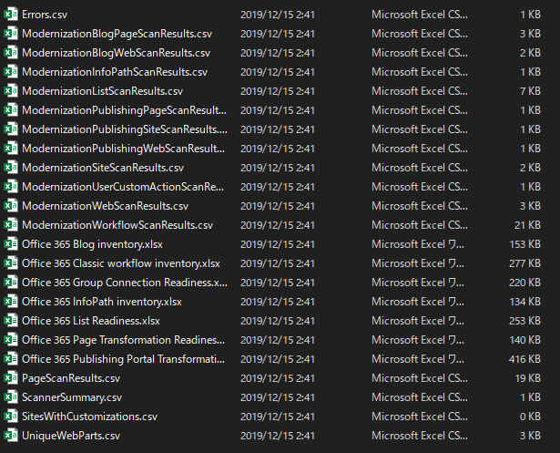

# SharePoint Modernization Scanner とは

SharePoint Modernization Scanner は、SharePoint Online サイトのモダン化を進めるために、SharePoint Online サイトをスキャンしてモダンに切り替えられていないサイトを抽出するツールです。
PnP コミュニティにより維持管理されており、[GitHub](https://github.com/SharePoint/sp-dev-modernization) からダウンロードして無償で使用することができます。
また、詳細な説明資料はマイクロソフトの [Docs](https://docs.microsoft.com/ja-jp/sharepoint/dev/transform/modernize-scanner?WT.mc_id=M365-MVP-4012897) に掲載されており、Docs に最新モジュールへのリンクも掲載されています。
SharePoint Modernization Scanner は随時アップデートがされており、ドキュメントもそれに合わせて更新されているので、使用する際には常に Docs を確認して最新の情報を参照するようにしてください。
このブログでも、ツールの紹介だけを行い詳細な使い方については割愛しています。

# スキャンの結果、どんな情報を得られるのか？

SharePoint Modernization Scanner でスキャンをすると、サイトをモダン対応させるために足かせとなっているサイト、リスト、ワークフローなどの情報が Excel のレポートとして出力されます。
出力されるレポートは以下の通りで、レポート内容の詳細な説明はすべて [Docs](https://docs.microsoft.com/ja-jp/sharepoint/dev/transform/modernize-scanner-reports?WT.mc_id=M365-MVP-4012897) に記載されています。
なお、Docs は日本語表記のレポートになっていますが、実際は英語表記のレポートです。

|  |  |
| --- | --- |
| レポート名（リンク先は Docs の説明ページ） | 説明 |
| [Office 365 Group Connection Readiness.xlsx](https://docs.microsoft.com/ja-jp/sharepoint/dev/transform/modernize-scanner-reports-groupconnect) | "Office 365 グループ接続" ("Groupify") の準備状況を評価するのに役立つデータを要約したレポート |
| [office 365 List Readiness.xlsx](https://docs.microsoft.com/ja-jp/sharepoint/dev/transform/modernize-scanner-reports-lists) | モダン環境では表示されないリストを要約したレポート |
| [Office 365 Page Transformation Readiness.xlsx](https://docs.microsoft.com/ja-jp/sharepoint/dev/transform/modernize-scanner-reports-pages) | "ページ変換" (クラシック ページからモダン ページへの変換) の準備状況を評価するために役立つデータを要約したレポート |
| [Office 365 Publishing Portal Transformation Readiness.xlsx](https://docs.microsoft.com/ja-jp/sharepoint/dev/transform/modernize-scanner-reports-publishingportals) | クラシック発行ポータルをモダン発行ポータルに変換するために理解しておく必要があるデータを要約したレポート |
| [Office 365 Classic workflow inventory.xlsx](https://docs.microsoft.com/ja-jp/sharepoint/dev/transform/modernize-scanner-reports-workflow) | 利用可能なワークフローの詳細情報、それらの Microsoft Flow アップグレード性スコア、およびワークフローの最終更新日時に関するレポート |
| [Office 365 InfoPath inventory.xlsx](https://docs.microsoft.com/ja-jp/sharepoint/dev/transform/modernize-scanner-reports-infopath) | 検出された InfoPath フォームとその使用法、種類と、フォームが最後に使用された日時の情報を要約したレポート |
| [Office 365 Blog inventory.xlsx](https://docs.microsoft.com/ja-jp/sharepoint/dev/transform/modernize-scanner-reports-blogs) | テナント内のブログ サイトとブログ投稿についての要約と使用状況に関するレポート |

# 使い方

[Docs](https://docs.microsoft.com/ja-jp/sharepoint/dev/transform/modernize-scanner?WT.mc_id=M365-MVP-4012897) 内のリンクから、最新の SharePoint Modernization Scanner の EXE ファイル (SharePoint.Modernization.Scanner.exe) をダウンロードします。
ダウンロードした EXE を実行します。
実行するとしばらくコンソール画面が表示されたのち、以下のダイアログ画面が表示されます。

[Selected authentication option] を [Username and password] にして、ユーザー名、パスワードを入力して、[Next] ボタンをクリックします。
なお、この場合は、指定したユーザーがアクセス可能なサイトのみスキャン対象となります。
もし、ユーザーの権限に左右されることなくすべてのサイトをスキャンしたい場合には、[Username and password] 以外の選択肢を選択する必要があります。

続いてスキャン対象を指定します。
テナント全体をスキャンする場合は、以下の画面でテナントの URL を入力します。
特定のサイトコレクションのみスキャンする場合は、[Site selection option] で [Selected site collections] を指定します。
この手順では、指定のサイトコレクションのみスキャンするようにしたいと思います。

[Site selection option] で [Selected site collections] を選択した後、[Url to add] のテキストボックスにスキャン対象にしたいサイトコレクションの URL を入力して、[Add] ボタンを追加します。
同様の手順で必要なサイトコレクションをすべて一覧に追加し、[Next] ボタンをクリックします。

続いてスキャンする内容を選択します。
[Select the scan mode to use] を [All of the above (full scan)] にするとすべての項目をスキャンします。

最後にオプションを指定しますが、特に変更する必要はないかと思います。
準備が整ったので、[Start scan] ボタンをクリックしてスキャンを開始します。

テストで使用した 5GB 程度のサイトコレクションは、5分もかからずスキャンが完了しました。
スキャンが完了すると、EXE と同じフォルダに「637119744228632768」のような数字の羅列のフォルダが作成されます。
その中に、Excel のレポートファイルと、レポートファイルのデータソースとなっている各種 CSV ファイルが格納されています。

モダン対応を進めていく上でとても便利なツールですが、サイトの分析ツールとしても使えるかと思います。
ぜひ一度スキャンしてみてください。何か思いもよらない発見があるかもしれませんよー。
[AdSense-B]
