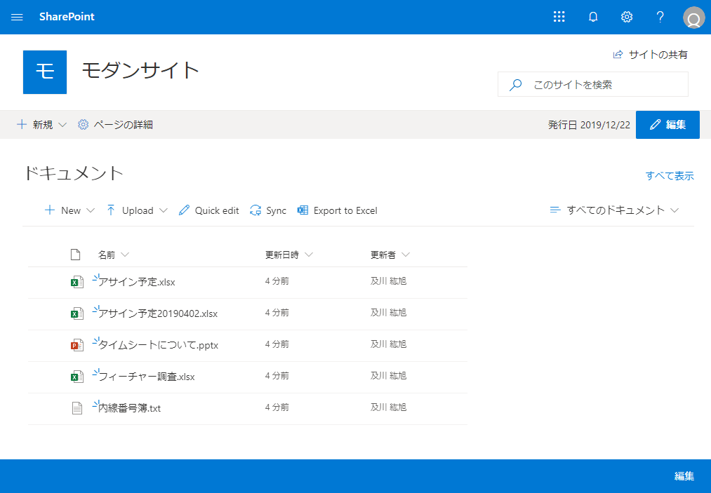
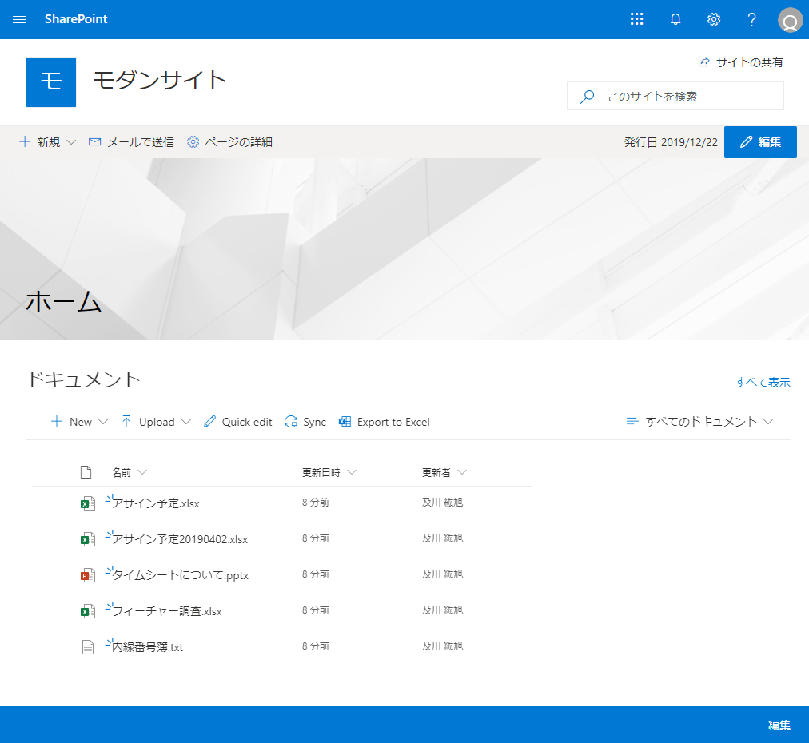
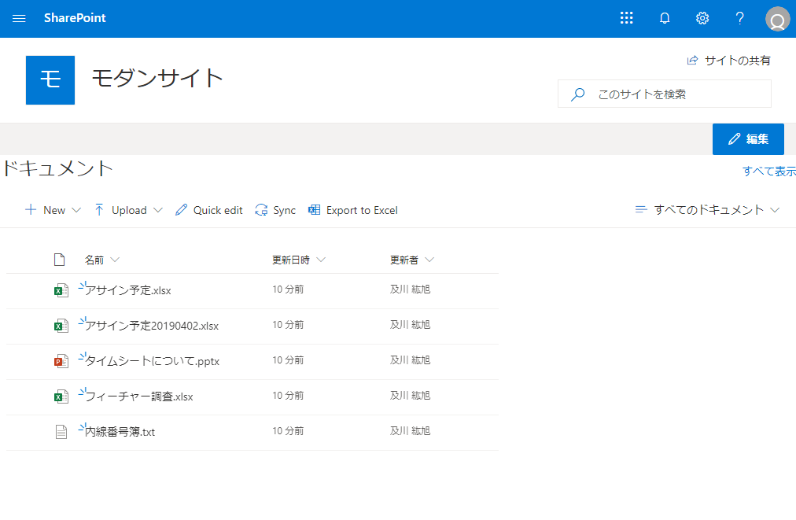

# はじめに

モダンページには複数の種類 (ページレイアウト) があり、それぞれページの特徴が異なります。
ページレイアウトは、いくつかの方法で切り替えることができるのですが、この記事ではページレイアウトの種類と [PnP PowerShell](http://sharepoint.orivers.jp/article/10024) を使用した切り替え方法をまとめています。
今後も新しいページレイアウトが追加された際には記事をアップデートしていきたいと思います。

# ページレイアウトの種類

2019年12月時点では、以下の3つのページレイアウトが用意されています。
なお、今回のサンプルはコミュニティサイトとして作成したサイトをベースにしているので、サイドリンクバーが表示されていません。

## Home

モダンサイトを作成した際に Home.aspx に適用されているページレイアウトです。
ページヘッダーとページタイトルが表示されない状態になります。
[](/wp-content/uploads/2019/12/ModernPageLayout-2.png)

## Article

サイトページを新規作成した際に適用されるページレイアウトです。
ページヘッダーとページタイトルが表示された状態になります。
[](/wp-content/uploads/2019/12/ModernPageLayout-3.png)

## SingleWebPartAppPage

単一の Web パーツのみ設置可能なページレイアウトです。
UI 上からは作成することができず、この後に記載しているコマンドでページレイアウトを切り替えることで作成することができます。
ページヘッダーとページタイトルが表示されず、設置した Web パーツが横幅いっぱいに表示されます。
[](/wp-content/uploads/2019/12/ModernPageLayout-1.png)

## ページレイアウトの切り替え方法

ページレイアウトは以下のコマンドで切り替えることができます。
PnP PowerShell を使用するため、PowerShell にて以下のコマンドを実行してください。
```
Connect-PnPOnline -Url [サイトのURL]
Set-PnPClientSidePage -Identity [ページの名前] -LayoutType [ページレイアウト名 (Home, Article, SingleWebPartAppPage)]
```
 
例: Home ページを SingleWebPartAppPage ページレイアウトに切り替える
```
Connect-PnPOnline -Url https://xxxx.sharepoint.com/sites/modern
Set-PnPClientSidePage -Identity "Home" -LayoutType SingleWebPartAppPage
```
 
今後もきっと新たなページレイアウトが追加されていくと思いますが、それぞれのページレイアウトの特徴を理解して、適切なページレイアウトを選択していけるようにしたいですね。
[AdSense-B]
