# はじめに

マイクロソフト純正の SharePoint Online 用ページ診断ツール「Page Diagnostics for SharePoint」が、google chrome 拡張機能としてリリースされています。
このツールを使ってどんな診断ができるのか試してみました。

# Page Diagnostics for SharePoint の入手とインストール

chrome ウェブストアで「SharePoint」で検索すると出てきます。
<https://chrome.google.com/webstore/search/sharepoint?hl=ja>

[Chromeに追加]ボタンをクリックすると、確認メッセージが表示されるので[拡張機能を追加]をクリックします。

インストールするとブラウザの右上に拡張機能のボタンが追加されます(下図赤枠部分)

# 使い方と診断内容

使い方はとっても簡単。
チェックしたいページを開いた後、ツールバーから診断ツールを起動させて、[Start]ボタンをクリックするだけ。
[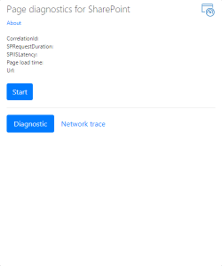](http://sharepoint.orivers.jp/wp-content/uploads/2019/01/spodig4.png)
 
すると、診断が開始されて、結果がすぐに表示されます。
[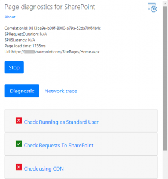](http://sharepoint.orivers.jp/wp-content/uploads/2019/01/spodig5.png)
[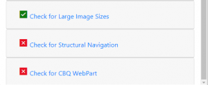](http://sharepoint.orivers.jp/wp-content/uploads/2019/01/spodig6.png)
結果が OK のところは緑のチェック、NG のところは赤のチェックが表示され、文字の部分をクリックすると NG の場合には NG の理由、改善策が英語で表示されます。
今回試しにすべてのチェックが NG になるようにして、どんな説明が表示されるのかを調べてみました。
Check Running as Standard  User
[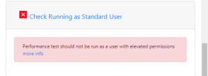](http://sharepoint.orivers.jp/wp-content/uploads/2019/01/spodig7.png)
Check Requests To SharePoint
[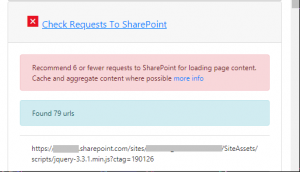](http://sharepoint.orivers.jp/wp-content/uploads/2019/01/spodig8.png)
Check using CDN
[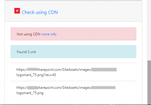](http://sharepoint.orivers.jp/wp-content/uploads/2019/01/spodig9.png)
Check for Large Image Sizes
[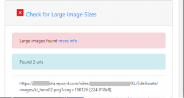](http://sharepoint.orivers.jp/wp-content/uploads/2019/01/spodig10.png)
Check for Structural Navigation
[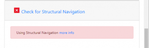](http://sharepoint.orivers.jp/wp-content/uploads/2019/01/spodig11.png)
Check for CBQ WebPart
[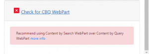](http://sharepoint.orivers.jp/wp-content/uploads/2019/01/spodig12.png)

# ちょっと試してみた

試しに以下二つの実験をしてみました。
実験１：
SharePoint のページライブラリに自分でコーディングした HTML ファイルの拡張子を aspx にしたファイルをアップロード。
このファイルの診断ができるかどうかをチェック。
結果は以下の通り、SharePoint ページではないと診断されチェックできませんでした。
[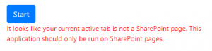](http://sharepoint.orivers.jp/wp-content/uploads/2019/01/spodig14.png)
実験２：
モダンページを診断できるかどうかをチェック。
結果は以下の通り、モダンページには対応していないとのこと。
[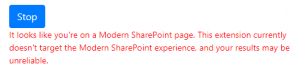](http://sharepoint.orivers.jp/wp-content/uploads/2019/01/spodig15.png)
 
今のところ、クラシック UI の診断しかできませんが、SPO のパフォーマンスが気になった場合は試してみると何か発見があるかもしれません。
 
[AdSense-B]
