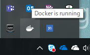
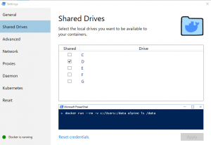
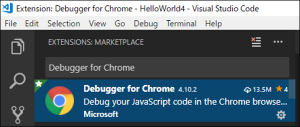

# はじめに

※2019年12月8日更新
Docker 上に SharePoint Framework の開発環境を構築する手順をまとめました。
この資料の内容は、[こちらのスライド](https://www.slideshare.net/HiroakiOikawa/sharepoint-framework-teams)からの抜粋となります。
構築手順をまとめて確認したい方は、スライドをダウンロードしてください。
なお、環境構築手順は、
・[開発環境を構築するためにホストとなる PC で行う手順](http://sharepoint.orivers.jp/?p=9954)
・[Docker イメージを準備する手順](http://sharepoint.orivers.jp/?p=9965)
・[Docker 上でプロジェクトごとに行う手順](http://sharepoint.orivers.jp/?p=9998)
の３部構成になっています。
この記事では、開発環境を構築するためにホストとなる PC で行う手順について記載します。

# 開発環境として Docker を使うことの利点

ローカル PC に開発環境を作らず、わざわざ Docker を使用する利点は、マイクロソフトの公式文書の中に記載があります。
[SharePoint Framework におけるチーム ベースの開発](https://docs.microsoft.com/ja-jp/sharepoint/dev/spfx/team-based-development-on-sharepoint-framework)
端的に言うと、プロジェクト毎の異なる環境要件に柔軟に対応できるようになるということが利点です。
例えばプロジェクト毎に SharePoint Framework のバージョンが異なっていたとしても、それぞれのバージョンの Docker 環境を作ることで複数環境を切り替えながら開発することができます。
SharePoint Framework はバージョンアップの頻度が高いため、こうしたバージョンを固定させる環境の仕組みづくりが非常に重要になると思います。
もう一つの利点は、SharePoint Framework のバージョン毎のイメージが提供されていることです。
そのため、バージョン毎の環境を簡単に用意することができます。
また、自分でイメージを作成することもできるので、開発に必要なツールを一式インストールした環境を用意して複数の開発者に展開すると言ったことも可能です。
ということで、この記事を参考にぜひ Docker を使って開発環境を構築してみてください。

# SharePoint Framework の開発環境として必要なもの

SharePoint Framework の開発環境を構築する前に、以下のものを用意してください。
※この記事でインストールするものは除いています。

- **OS**
  - Windows、Mac、Linux など
- **ブラウザ**
  - [Google Chrome](https://www.google.co.jp/chrome/)
    ※もちろん他のブラウザでも良いですが Chrome であればデバッガ機能があるので便利です。
- **コードエディタ**
  - [Visual Studio Code](https://code.visualstudio.com/)
    ※このブログでは VSCode を使用しますが、Sublime、ATOM など愛用のエディタでも良いです。
- **実行環境**
  - Office 365 の契約をしてください。
    Office 365 の契約がない方は、[開発者プログラムに参加する](https://developer.microsoft.com/ja-jp/office/dev-program)のがおすすめ

# 開発環境を構築するためにホストとなる PC で行う手順

それでは、SharePoint Framework の開発環境を構築するため、ホスト PC で行う手順を順を追って説明します。

## Docker のインストール

Docker をダウンロードします。
<https://www.docker.com/get-started>
Windows ユーザー用ダウンロードリンクは[こちら](https://store.docker.com/editions/community/docker-ce-desktop-windows)。
なお、Windows で Docker を使用する場合、以下の点に注意してください。

- Hyper-V が有効化されていること
- ローカルアカウントで Windows にログインしていること
- ローカルアカウント以外でログインする場合は、そのアカウントがローカルアカウントと紐付けされていること
- Docker を利用するユーザーが、ローカルグループの「docker-users」に登録されていること（Docker をインストールすると自動でセットされます）
- ファイアーフォールやウィルス対策ソフトウェアが、以下のポートを塞いでいないこと
  4321、5432、35729

ダウンロード後、インストーラの指示に従って Docker をインストールします。
インストールが完了すると、タスクトレイに Docker アイコンが表示されます。

## Docker の設定

タスクトレイから Docker の[Settings]メニューを開きます。
[Shared Drives]タブを開き、開発中のソースファイルを格納する場所となる「プロジェクトフォルダ」を作成するドライブにチェックを付け、[Apply]ボタンをクリックします。

## Visual Studio Code Debugger for Chrome のインストール

Visual Studio Code 拡張機能から[Debugger for Chrome]を検索しインストールします。

## SharePointPnPPowerShellOnline のインストール

開発した SharePoint Framework アプリをデプロイする際に使用する PowerShell のコマンドレットをインストールします。
PowerShell を管理者モードで起動し Install-module SharePointPnPPowerShellOnline を実行します。
既に古いバージョンがインストールされている場合、上記コマンドを実行するとインストールエラーとなります。
その場合は、Update-Module SharePointPnPPowerShellOnline を実行してください。
 
以上が、ホスト PC で行う手順です。
この手順は、はじめて開発環境を構築する際に一度だけ行う作業となります。
ホスト PC の準備ができたので、別記事にてプロジェクト毎に行う作業について説明します。
[AdSense-B]
