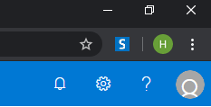
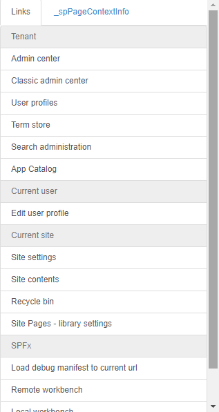
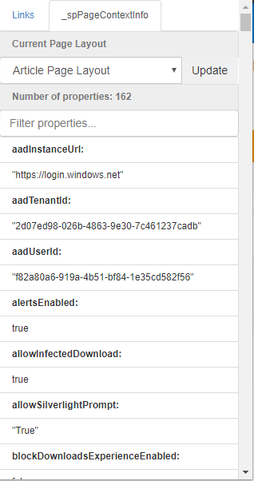
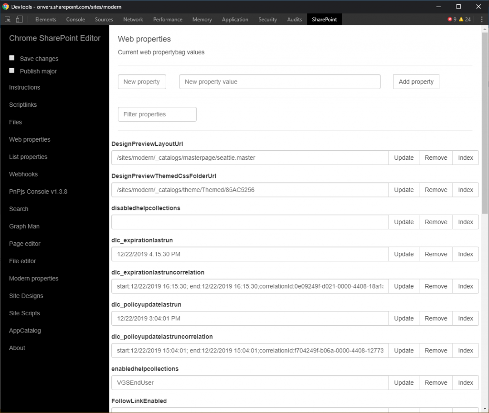

# はじめに

Chrome ブラウザの拡張機能として、[SP Editor](https://github.com/tavikukko/Chrome-SP-Editor) という万能ツールが提供されています。
SP Editor を使うことで、PnP PowerShell を使わなくてもページレイアウトの変更ができたり、スクリプトを書かなくてもサイトやリストの設定を即座に変更することができるようになります。
色々試すにはとても重宝するツールになりそうなので、ちょっと試してみました。
ちなみに、この拡張機能は先日リリースされた Chromium 版 Microsoft Edge でも動作しました。
Edge にインストールするためには、[他のストアからの拡張機能を許可します] をオンにして、Chrome ウェブストアから拡張機能をインストールする必要があります。

# インストール

Chrome ブラウザの拡張機能なので、他の拡張機能と同様にウェブストアからインストールします。
ウェブストアのページは以下になります。
<https://chrome.google.com/webstore/detail/sp-editor/ecblfcmjnbbgaojblcpmjoamegpbodhd?hl=ja>
インストールすると、Chrome ブラウザの右上にアイコンが表示されます。

# 使い方

SharePoint サイトを開いて、ブラウザ右上の S アイコンをクリックすると、以下のメニューが表示されます。
メニューには、Links と \_spPageContextInfo のタブがあり、Links は現在開いている SharePoint サイトに関連する各種ページのショートカットが、\_spPageContextInfo は現在開いているページの各種プロパティ情報がそれぞれ表示されます。
**Links タブ**

**\_spPageContextInfo タブ**

\_spPageContextInfo タブでは、モダンページのページレイアウトを変更することができます。
PnP PowerShell を使わなくても手軽に変更できるので、テストしてみる分にはかなり便利です。
**F12 DevTools**
そして、さらに凄いのが、F12 キーを押すと表示される開発者ツール。
ここにも SP Editor による拡張機能が追加されています。
下図の通り、タブの一番右に SharePoint というタブが追加されています。

この SharePoint タブを開くと、サイトやリストのプロパティ一覧が見れたり、ロードされるスクリプトファイルなどを直接編集して保存できたりします。
まだ全然使い込んでいませんが、デバッグや調査の段階ではかなり強力なツールになるのではないかと思います。
[AdSense-B]
