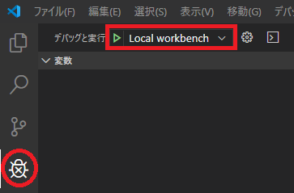
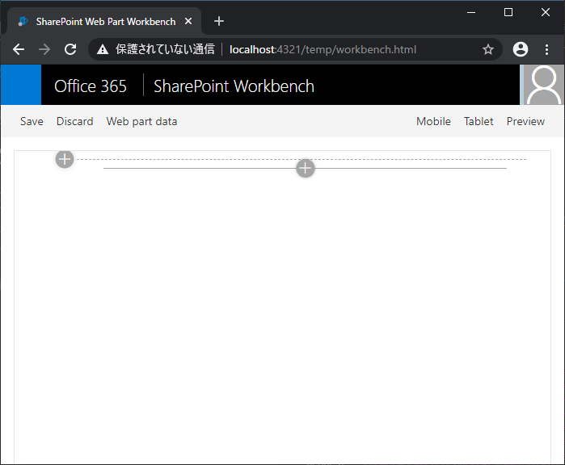
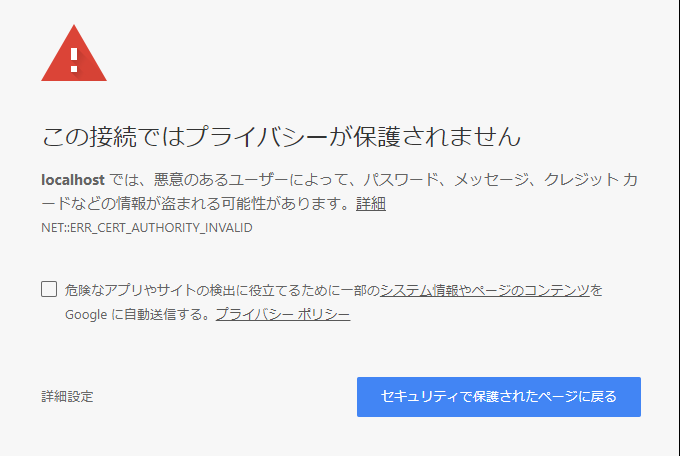
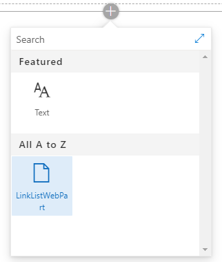
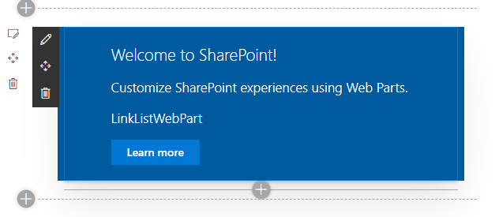
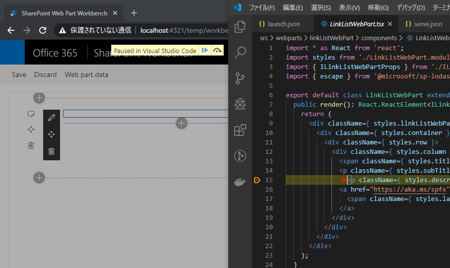

# はじめに

この記事では、SharePoint Framework で作成した Web パーツをビルドおよびデバッグするための手順を説明します。
まだ SharePoint Framework で Web パーツを作成していない場合は、以下の記事を参考に Web パーツを作ってください。
[SharePoint Framework Web パーツ開発 その１：プロジェクトの作成](https://sharepoint.orivers.jp/article/10111)

# ビルド手順

## プロジェクトを開き docker を起動

※「[SharePoint Framework Web パーツ開発 その１：プロジェクトの作成](https://sharepoint.orivers.jp/article/10111)」の続きで作業を行う場合は、このステップは不要です。
Visual Studio Code を起動してメニューから ファイル > フォルダーを開く をクリックし、プロジェクトフォルダを開きます。
続いて、メニューから 表示 > ターミナル をクリックし、PowerShell のターミナルを開きます。
ターミナルに、 Docker を起動するためのコマンドを入力し実行します。
```
docker run -it --rm --name LinkListWebPart -v ${PWD}:/usr/app/spfx -p 4321:4321 -p 5432:5432 -p 35729:35729 orivers/spfx
```
無事、Docker が起動すると、以下のような表示になります。
```
spfx@1aff9c9c9d11:/usr/app/spfx$
```
以後、上記のプロンプトにコマンドを入力していきます。

## ビルド＆実行

Web パーツのビルドと Web パーツの実行環境の起動は以下のコマンドでまとめて行います。
```
gulp serve --nobrowser
```
コマンドを実行するとターミナルに以下のようにずらずらと文字が並びます。
```
spfx@fb126b787c8a:/usr/app/spfx$ gulp serve --nobrowser
Build target: DEBUG
[10:00:07] Using gulpfile /usr/app/spfx/gulpfile.js
[10:00:07] Starting gulp
[10:00:07] Starting 'serve'...
[10:00:07] Starting subtask 'configure-sp-build-rig'...
[10:00:07] Finished subtask 'configure-sp-build-rig' after 7.75 ms
[10:00:07] Starting subtask 'spfx-serve'...
[10:00:07] [spfx-serve] To load your scripts, use this query string: ?debug=true&noredir=true&debugManifestsFile=https://0.0.0.0:4321/temp/manifests.js
[10:00:08] Starting server...
Starting api server on port 5432.
Registring api: /workbench
Registring api: \*/\*
[10:00:08] Finished subtask 'spfx-serve' after 1.05 s
[10:00:08] Starting subtask 'pre-copy'...
[10:00:08] Finished subtask 'pre-copy' after 52 ms
[10:00:08] Starting subtask 'copy-static-assets'...
[10:00:08] Starting subtask 'sass'...
[10:00:08] Server started https://0.0.0.0:4321
[10:00:08] LiveReload started on port 35729
[10:00:08] Running server
[10:00:09] Finished subtask 'copy-static-assets' after 52 ms
[10:00:09] Finished subtask 'sass' after 309 ms
[10:00:09] Starting subtask 'tslint'...
[10:00:10] [tslint] tslint version: 5.12.1
[10:00:10] Starting subtask 'tsc'...
[10:00:10] [tsc] typescript version: 3.3.4000
[10:00:14] Finished subtask 'tsc' after 3.63 s
[10:00:14] Finished subtask 'tslint' after 5.09 s
[10:00:14] Starting subtask 'post-copy'...
[10:00:14] Finished subtask 'post-copy' after 250 μs
[10:00:14] Starting subtask 'collectLocalizedResources'...
[10:00:14] Finished subtask 'collectLocalizedResources' after 4.54 ms
[10:00:14] Starting subtask 'configure-webpack'...
[10:00:15] Finished subtask 'configure-webpack' after 775 ms
[10:00:15] Starting subtask 'webpack'...
[10:00:17] Finished subtask 'webpack' after 2.49 s
[10:00:17] Starting subtask 'configure-webpack-external-bundling'...
[10:00:17] Finished subtask 'configure-webpack-external-bundling' after 471 μs
[10:00:17] Starting subtask 'copy-assets'...
[10:00:17] Finished subtask 'copy-assets' after 37 ms
[10:00:17] Starting subtask 'write-manifests'...
[10:00:19] Finished subtask 'write-manifests' after 1.7 s
[10:00:19] Starting subtask 'reload'...
[10:00:19] Finished subtask 'reload' after 885 μs
```
最終行にある Finished subtask 'reload' が表示されたら Web パーツをデバッグ実行するための環境の起動が完了となります。

# デバッグ手順

## VSCode からデバッグ実行

VSCode のサイドバーからデバッグボタン(下図左下の赤丸)をクリックし、右上の [デバッグと実行] の右隣にあるプルダウン(下図中央上の赤四角)に「Local workbench」と表示されている状態で、▶ ボタンをクリックします。
なお、デバッグボタンが表示されない場合は、デバッグ用の拡張機能がインストールされていないことが考えられるので、以下の記事を参考に「Visual Studio Code Debugger for Chrome のインストール」をインストールしてください。
[Docker を使った SharePoint Framework 開発環境の構築 その１](https://sharepoint.orivers.jp/article/9954)

すると、Chrome ブラウザが起動し、下図の通り Web パーツの動作確認をするための Local Workbench ページが表示されます。

なお、はじめて Local Workbench を表示する場合、以下のような Chrome ブラウザのセキュリティ警告ページが表示されるかと思いますが、ここでは特に問題は無いので [詳細設定] を押して先に進めてください。


## Local Workbench にテスト対象 Web パーツを配置

Local Workbench は通常のモダンページと同じなので、モダンページと同じ操作でデバッグ対象の Web パーツを配置します。
＋ ボタンをクリックすると、Web パーツの一覧の中にデバッグ対象の「LinkListWebPart」が追加されているので、これをクリックしてページに配置します。
Web パーツ一覧

Web パーツを配置したところ


## デバッグ実施

デバッグは、Chrome ブラウザの F12 開発者ツールか VSCode で行います。
VSCode の方がソースコードの編集なども直ぐにできるため、今回は VSCode でデバッグします。
と言っても特に難しいことはなく、ソースコード上にブレイクポイントを置いたり変数のウォッチをしたり、他の開発と同様に行うことができます。
例えば、LinkListWebPart.tsx ファイルにブレイクポイントを置いて、Local Workbench で Web パーツを配置しなおすと、きちんとブレイクポイントが効いていることが確認できます。

なお、デバッグ実行中に VSCode 上でソースコードを編集して保存すると、変更したソースコードがすぐにビルドされてデバッグ中の Web パーツに反映されるため、変更の度に自分でビルドしなおしてデプロイしてというような手順が不要なため、サーバーサイド で動く従来の Web パーツの開発に比べると格段に生産性が上がります。

## デバッグの終了

デバッグが完了したら、Chrome ブラウザを閉じて、VSCode のターミナル上でキーボードの Ctrl + c キーを押下して、実行中の環境を停止させます。
停止すると以下のようなメッセージがターミナルに表示されます。
```
^C[05:32:35] Server stopped
About to exit with code: 0
Process terminated before summary could be written, possible error in async code not
continuing!
Trying to exit with exit code 1
```
 
以上で、Web パーツのビルドとデバッグは完了です。
開発が終わった Web パーツをいよいよ本番環境にデプロイしたいと思います。
デプロイ手順についてはこちらの記事を参照してください。
[SharePoint Framework Web パーツ開発 その３：デプロイ](https://sharepoint.orivers.jp/article/10302)
[AdSense-B]
