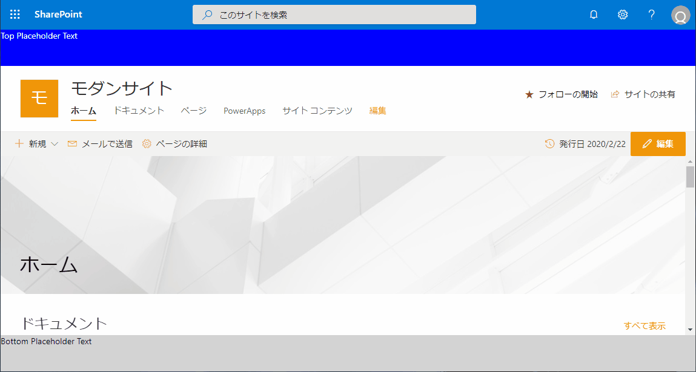
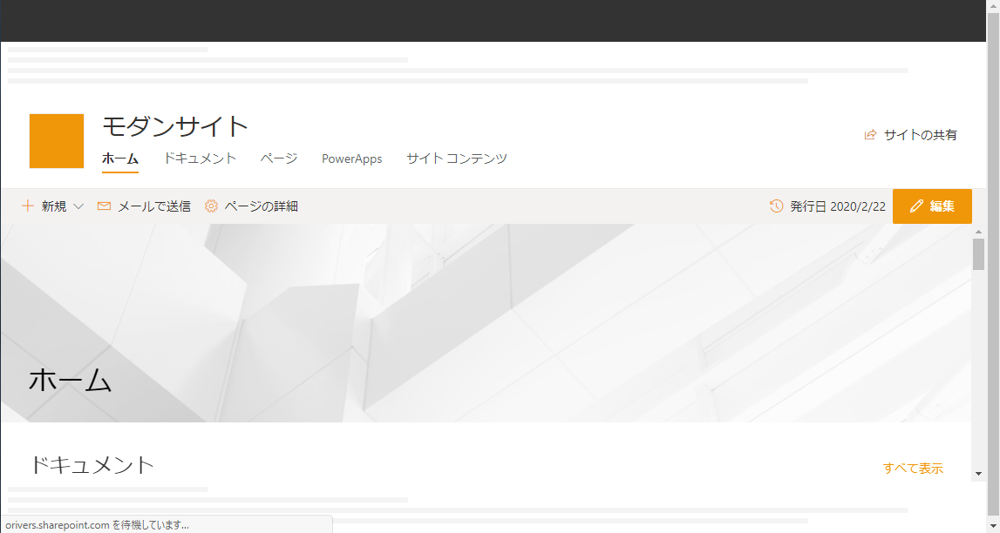

# はじめに

SharePoint Framework v1.10 で実装されたプレースホルダーの事前領域確保の効果を確認してみました。

# ページプレースホルダーとは

SharePoint Framework 拡張機能であるアプリケーションカスタマイザーのページプレースホルダーを使用することで、すべてのモダンページに共通のヘッダーとフッターを追加することができます。
ですが、ページプレースホルダーはモダンページのレンダリングの順序において比較的遅めにレンダリングされるため、SharePoint 標準のヘッダーとコンテンツの領域が表示された後に、SharePoint 標準ヘッダーの下にページプレースホルダーによるヘッダーが挿入される動きが目で見て分かってしまいます。
SharePoint Framework v1.10 では、このちょっとカッコ悪い動きを改善するため、ページプレースホルダーの事前領域確保の設定ができるようになりました。
ページプレースホルダーの詳細は、[Docs](https://docs.microsoft.com/ja-jp/sharepoint/dev/spfx/extensions/basics/preallocated-space-placeholders?WT.mc_id=M365-MVP-4012897) を参照してください。

# 効果

事前領域確保の有無の違いが分かるように両方で動画を撮ってコマ送りにして比べてみました。
SharePoint 標準のヘッダーの下に青色のブロックがありますが、こちらがページプレースホルダーのヘッダーの部分、下部の灰色のブロックがフッターの部分になります。
上の動画が事前領域確保無し、下の動画が事前領域確保有りです。
事前領域確保無し

事前領域確保有り

比べてみると効果は一目瞭然。
事前領域確保無しの方は、ページのタイトル部分がヘッダーの表示のタイミングで下にずれ込むのが分かります。
動画をコマ送りで見ると、ページプレースホルダーの事前領域確保をした場合、下図の通りブランクの領域（横線が入った部分）がページプレースホルダーの表示領域としてあらかじめ確保される動きになっていました。


# 実装方法

sharepoint/assets/elements.xml の CustomAction タグ内に HostProperties 属性を追加することで、事前に確保する領域のサイズを指定することができるようになります。
以下のコードの 8 行目が追加した行です。
```
<?xml version="1.0" encoding="utf-8"?>
<Elements xmlns="http://schemas.microsoft.com/sharepoint/">
<CustomAction
Title="ApplicationCustomizerSample"
Location="ClientSideExtension.ApplicationCustomizer"
ClientSideComponentId="8d92d593-2b52-48c1-a549-661134b6a713"
ClientSideComponentProperties="{&quot;testMessage&quot;:&quot;Test message&quot;,&quot;topText&quot;:&quot;Top Placeholder Text&quot;,&quot;bottomText&quot;:&quot;Bottom Placeholder Text&quot;}"
HostProperties="{&quot;preAllocatedApplicationCustomizerTopHeight&quot;:&quot;60&quot;,&quot;preAllocatedApplicationCustomizerBottomHeight&quot;:&quot;60&quot;}"
>
</CustomAction>
</Elements>
```
HostProperties 属性の値は、ダブルクォーテーションがエスケープされていますが、以下の通り Top と Bottom の高さを指定しています。(エスケープは解除)
```
{"preAllocatedApplicationCustomizerTopHeight":"60","preAllocatedApplicationCustomizerBottomHeight":"60"}
```
preAllocatedApplicationCustomizerTopHeight にて、ヘッダー部分のページプレースホルダーの高さを指定しています。
同様に、preAllocatedApplicationCustomizerBottomHeight にて、フッター部分のページプレースホルダーの高さを指定しています。
elements.xml に記述するので、恐らく動的に予約する高さを変更するということはできないかと思います。
なお、テナント全体にアプリケーションカスタマイザーを適用している場合は、sharepoint/assets/ClientSideInstance.xml に HostProperties 属性を追加することでテナント全体にて事前領域確保の動作が行われます。
```
<?xml version="1.0" encoding="utf-8"?>
<Elements xmlns="http://schemas.microsoft.com/sharepoint/">
<ClientSideComponentInstance
Title="ApplicationCustomizerSample"
Location="ClientSideExtension.ApplicationCustomizer"
ComponentId="8d92d593-2b52-48c1-a549-661134b6a713"
Properties="{&quot;testMessage&quot;:&quot;Test message&quot;}"
HostProperties="{&quot;preAllocatedApplicationCustomizerTopHeight&quot;:&quot;60&quot;,&quot;preAllocatedApplicationCustomizerBottomHeight&quot;:&quot;60&quot;}">
</ClientSideComponentInstance>
</Elements>
```
[GitHub](https://github.com/HiroakiOikawa/spfx-sample/tree/master/ApplicationCustomizerSample) に上記内容を含むサンプルコードをアップしましたので、参考にしてください。

# まとめ

ページプレースホルダーの事前領域確保の効果は目で見て分かるほどですし設定自体も難しくはないので、アプリケーションカスタマイザーを開発する際には事前領域確保を設定することをお勧めします。
[AdSense-B]
