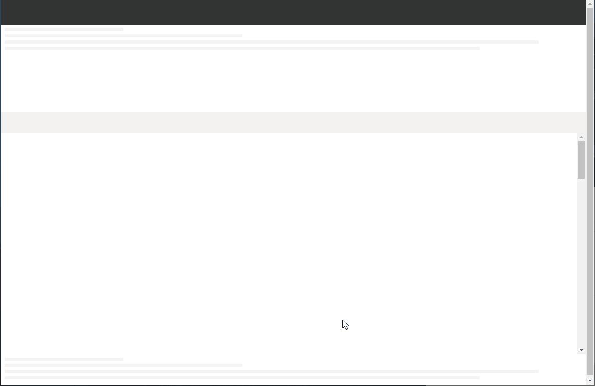

# はじめに

SharePoint Framework v1.10 で実装されたライブラリの変更通知を受信する機能を試してみました。

# ライブラリの変更通知受信機能とは

指定したライブラリでファイルが登録、更新、削除された際に、その変更通知を受け取ることができるようになる機能です。
SharePoint Framework で開発する Web パーツやアプリケーションカスタマイザーで変更通知を受け取ることができます。
なお、SharePoint Framework v1.10 では、ドキュメントライブラリ系（ドキュメント、サイトのページ、メディアなど）の変更通知のみ対応しており、リストの変更通知を受信することはできません。
また、変更通知として受け取れる情報は、ライブラリが変更されたという情報だけで、何が変更されたのかといった情報はセキュリティ観点から取得することができなくなっています。
なので、必要に応じて変更通知の受信をトリガーに REST や spHttpClient でアイテムを取りに行く処理を実装する必要があります。
変更通知受信機能の詳細は、[Docs](https://docs.microsoft.com/ja-jp/sharepoint/dev/spfx/subscribe-to-list-notifications?WT.mc_id=M365-MVP-4012897) を参照してください。

# 効果

変更通知機能を使うと何ができるのか、実装して調べてみました。
Web パーツに変更通知を購読、受信するための処理を追加し、その Web パーツをページに貼り付けて、対象となるドキュメントライブラリにファイルを追加するという操作を行ってみました。
実際の動作は以下の動画の通りですが、動画はページに Web パーツを貼り付けてブラウザをリフレッシュするところから始まります。
リフレッシュすると Web パーツに表示している通知状態が「ライブラリの変更通知購読開始」になり、対象のドキュメントライブラリにエクスプローラからファイルをドラッグ＆ドロップすると、通知状態が「ライブラリから変更通知を受信」に変わります。
ライブラリで発生した変更を Web パーツが受信している様子が分かるかと思います。


# 実装方法

## ライブラリのインポート

ライブラリの変更通知を受信するためには、@microsoft/sp-list-subscription をインポートする必要があります。
以下の通りコマンドを入力して、ライブラリを開発環境にインストールします。
```
yarn add @microsoft/sp-list-subscription
```

## コードの追加

ライブラリの変更通知を受信する処理を記述する ts ファイルにコードを追加します。
今回は ListSubscriptionSample という名前の Web パーツで実装を進めます。
なお、フルセットのコードは [GitHub](https://github.com/HiroakiOikawa/spfx-sample/tree/master/ListSubscriptionSample) にアップしてありますのでそちらを参照してください。
ここではポイントとなるコードのみ説明します。

### ライブラリの変更通知用クラスのインポート

先ほどインポートしたライブラリを読み込みます。
```
import {ListSubscriptionFactory, IListSubscription} from '@microsoft/sp-list-subscription';
import {Guid} from '@microsoft/sp-core-library';
```

### 変更通知の購読

変更通知を購読するため、7 行目で ListSubscriptionFactory.createSubscription メソッドを呼び出しています。
このメソッドは、変更通知を購読するリストを listId というパラメータで指定します。
サンプルでは 8 行目の this.properites.listId にある通り、購読するリストのリスト ID を Web パーツのプロパティとして受け取り、それを createSubscription メソッドの引数に渡しています。
また、callback というパラメータでは変更通知を受信する際に呼び出される以下の 3 つのコールバック関数を指定します。
connect: 変更通知の購読を開始した際に呼び出される
notification: 対象のライブラリでアイテムが変更されるたびに呼び出される
disconnect: 変更通知の購読を解除した際に呼び出される
```
private listSubscriptionFactory: ListSubscriptionFactory;
private listSubscription: Promise<IListSubscription>;
private createListSubscription(): void {
if (this.properties.listId) {
this.listSubscriptionFactory = new ListSubscriptionFactory(this);
this.listSubscription = this.listSubscriptionFactory.createSubscription({
listId: Guid.parse(this.properties.listId),
callbacks: {
connect: this.connect.bind(this),
notification: this.notificate.bind(this),
disconnect: this.disconnect.bind(this)
}
});
}
}
```

### コールバック関数

ListSubscriptionFactory.createSubscription メソッドに指定するコールバック関数を作成します。
コールバック関数は引数を持たないため、変更通知の内容を取得することはできません。
```
private message: string;
private connect(): void {
this.message = "ライブラリの変更通知購読開始";
this.render();
}
private notificate(): void {
this.message = "ライブラリから変更通知を受信";
this.render();
}
private disconnect(): void {
this.message = "ライブラリの変更通知購読終了";
this.render();
}
```

### HTML レンダリング

Web パーツの HTML レンダリング処理を作成します。
```
public render(): void {
this.domElement.innerHTML = `
<div class="${ styles.listSubscriptionSampleWebPart }">
<div class="${ styles.container }">
<div class="${ styles.row }">
<div class="${ styles.column }">
<span class="${ styles.title }">変更通知購読</span>
<p class="${ styles.subTitle }">対象リスト：${this.properties.listId}</p>
<p class="${ styles.subTitle }">通知状態　：${this.message}</p>
</div>
</div>
</div>
</div>`;
}
```

# まとめ

コールバック関数内で変更内容を受け取れないというところがややこしさを増してそうな気がしますが、変更通知を受信するために必要なコードは複雑ではないので、積極的に取り入れてリアルタイム性の高いパーツを開発していけたらよいかなと思います。
[AdSense-B]
