# はじめに

SharePoint Server 2013 で導入された SharePoint に機能を追加する仕組みとして、プロバイダーホスト型の高信頼性 SharePoint アドイン（以降「SharePoint アドイン」と表記）というものがあります。
SharePoint アドインは、もともと SharePoint アプリと呼ばれていたので、SharePoint アプリとして覚えている方もいらっしゃるかもしれません。
この SharePoint アドインですが、少々レガシーな仕組みかもしれませんが、SharePoint Online でもきちんと動作することが確認できました。
ただし、オンプレ環境で動作させる場合と展開する方法が少々異なるので、展開の仕方をまとめました。

# SharePoint アドインの作成、デプロイ手順

## サイト作成

### SharePoint アドインを配置するサイト

SharePoint アドインを配置するサイトを作成します。
ここでは、チームサイト（グループ付き）のサイトを作成しました。
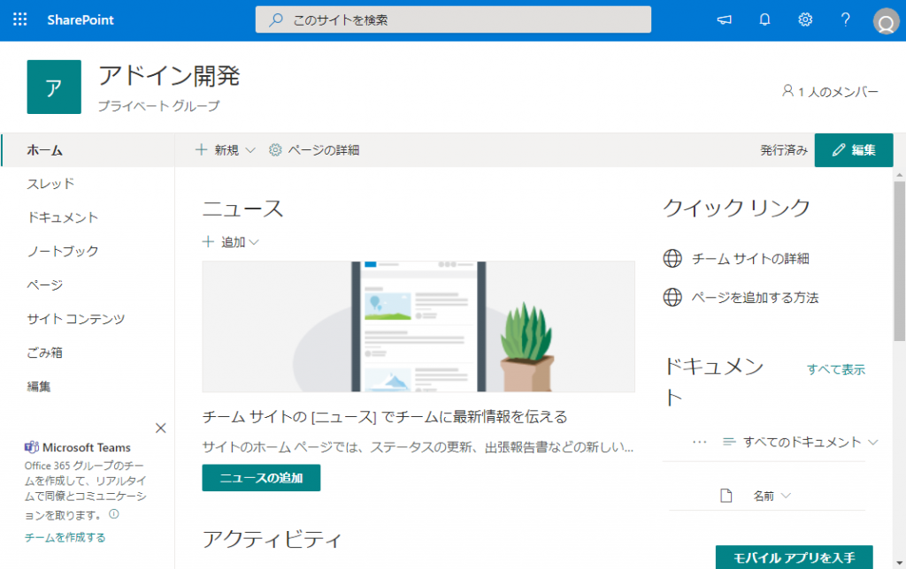

### アプリカタログサイト

SharePoint アドインのパッケージファイルを配置するためのアプリカタログサイトを作成します。
参考：
[アプリカタログを使用して、SharePoint 環境でカスタムビジネスアプリを使用できるようにする](https://docs.microsoft.com/ja-jp/powershell/exchange/exchange-online/connect-to-exchange-online-powershell/mfa-connect-to-exchange-online-powershell?view=exchange-ps&WT.mc_id=M365-MVP-4012897)

## SharePoint アドインの作成とデプロイ

### Visual Studio で新しい SharePoint アドインプロジェクトを作成

Visual Studio 2019 (他バージョンでも OK) で「SharePoint アドイン」テンプレートからプロジェクトを作成します。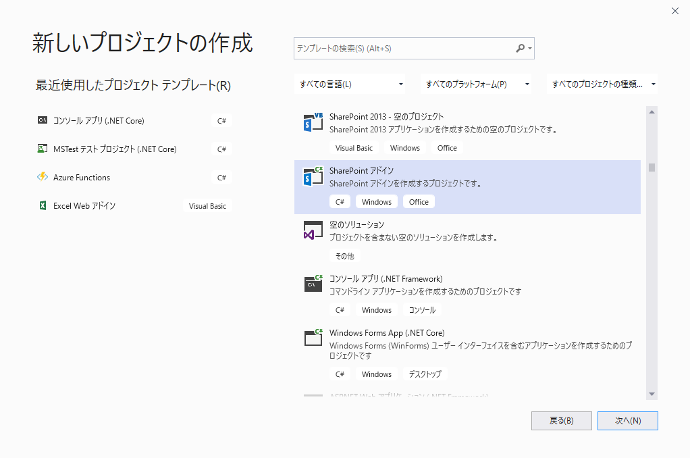
プロジェクト名、場所、ソリューション名、フレームワークを指定します。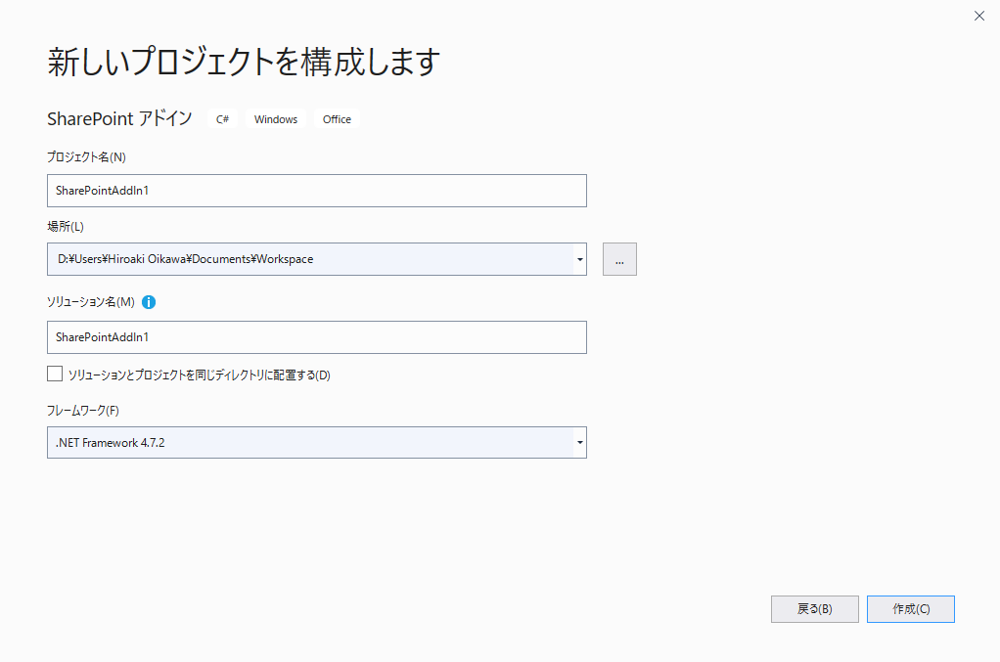
アドインのデバッグに使用する SharePoint サイトの URL として、最初に作成した SharePoint アドインを配置するサイトの URL を指定します。
[SharePoint アドインをホストする方法] は "プロバイダー向けのホスト型" を選択します。
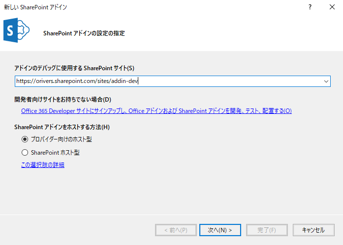
ターゲットとなる SharePoint のバージョンとして "SharePoint Online" を選択します。
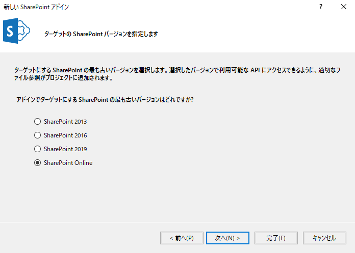
Web プロジェクトのタイプとして "ASP.NET MVC Web アプリケーション" を指定します。
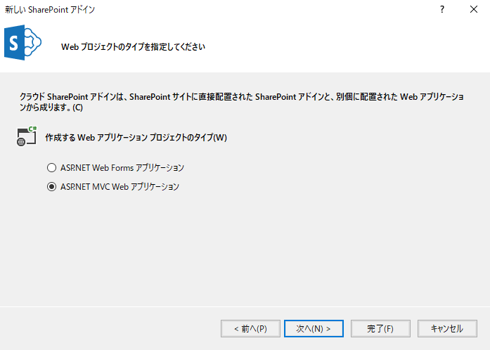
アドインの認証方法として "Windows Azure アクセス制御サービスを使用する (SharePoint クラウド アドインの場合)" を指定します。
[完了] ボタンをクリックしてプロジェクトを作成します。
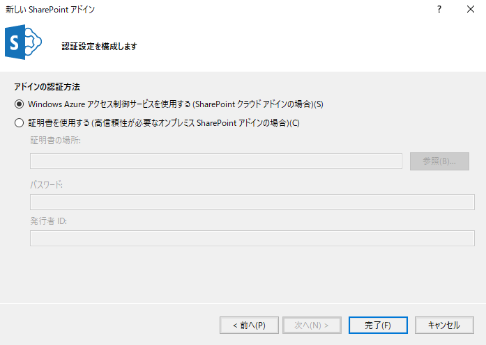

### Web プロジェクトの発行

Visual Studio のソリューションエクスプローラーでプロジェクト名を右クリックして、[発行] メニューをクリックし、プロジェクト発行のウィザードを起動します。
公開先を選択画面で、左メニューから [App Service] を選択し、右ペインにて [新規作成] を選択し、[プロファイルの作成] ボタンをクリックします。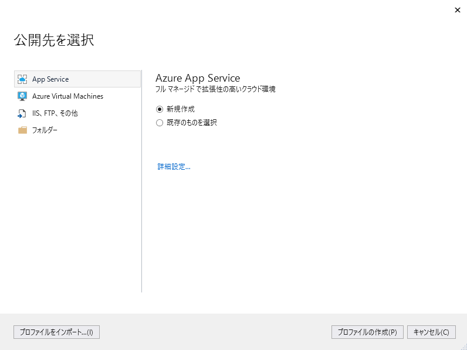
App Service 新規作成画面で、SharePoint アドインの Web プロジェクト部分をデプロイするにあたり App Service を作成するための Azure のサブスクリプション、リソースグループ、ホスティングプラン、Application Insights の組み込み有無を指定し、[作成] ボタンをクリックします。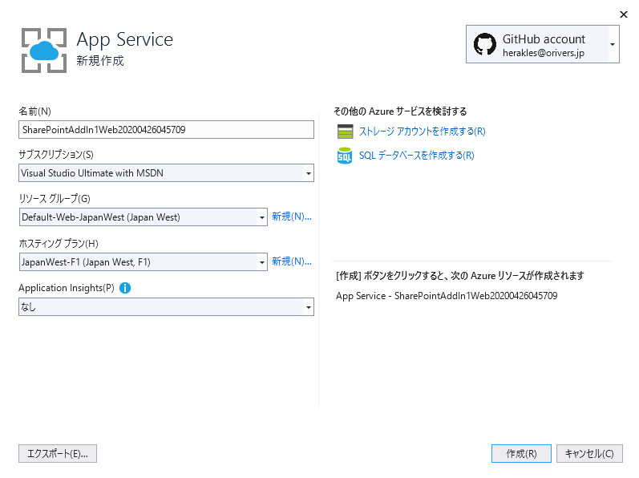
公開画面にて [発行] ボタンをクリックして Web プロジェクトを発行します。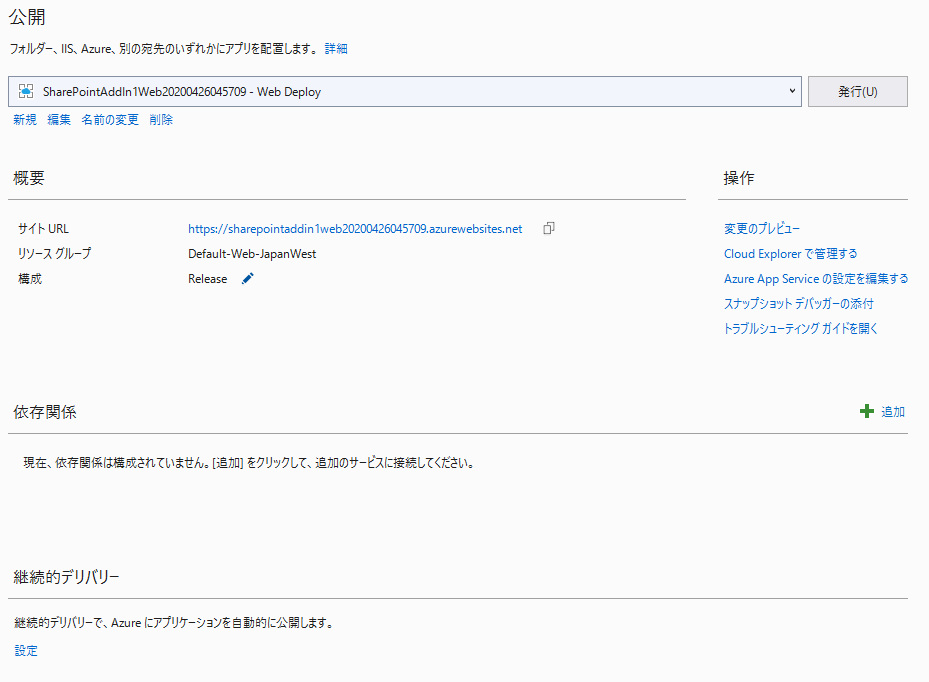
ブラウザが起動し、以下のようなエラーページが表示されるので、URL をコピーしておきます。
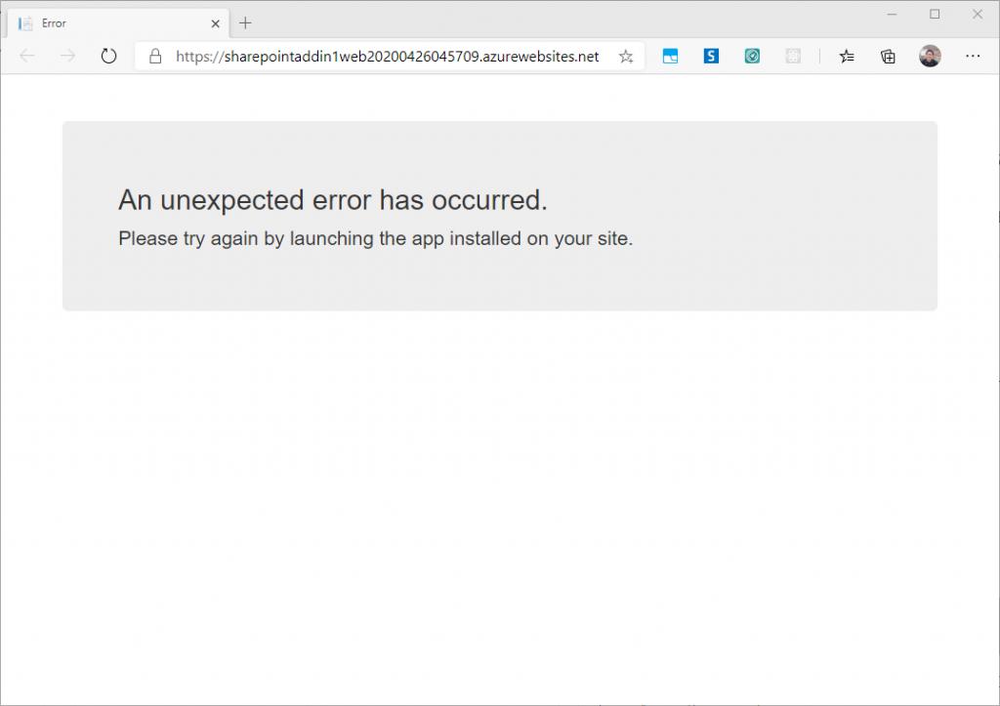
新たにブラウザを起動し、以下の URL にアクセスします。
*[サイト URL]*/\_layouts/appregnew.aspx
※サイト URL は、本手順の一番最初に作成したサイトの URL を指定します。
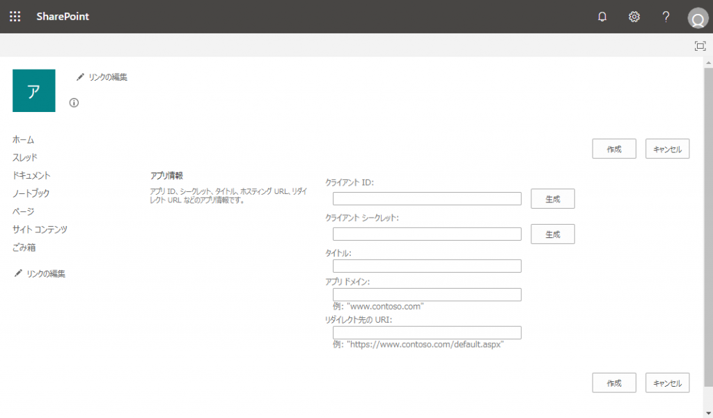
[クライアント ID]、[クライアントシークレット]の右側にある [生成] ボタンをクリックし、クライアント ID とクライアントシークレットの値を自動生成します。
[タイトル] には、UIに表示するアドインのタイトルを入力します。
[アプリドメイン] には先ほどコピーした Web アプリケーションの URL から、先頭の「https://」と最後の「/」を除いた値を入力します。
[リダイレクト先のURI] には先ほどコピーした Web アプリケーションの URL を入力し、[作成] ボタンをクリックします。
「アプリIDが正常に作成されました。」のページの、クライアントID、クライアントシークレットの値をコピーしてメモ帳等にペーストします。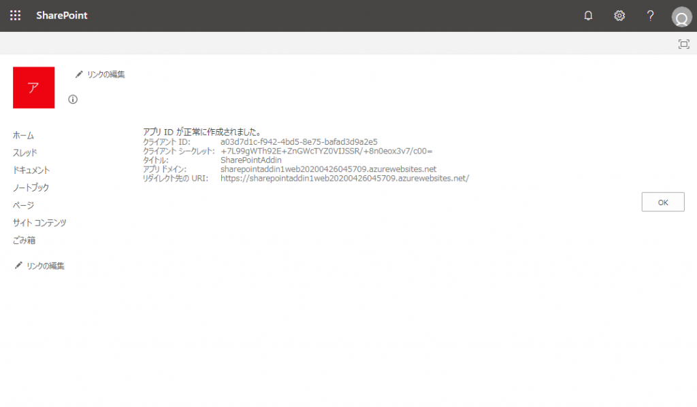
Visual Studio に戻り、Web アプリケーションのプロジェクトの web.config ファイルを開き、configuration/appSettings の ClientId と ClientSecret に、先ほどコピーしたクライアント ID、クライアントシークレットの値を貼り付けます。
変更前：
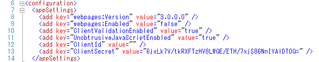
変更後：
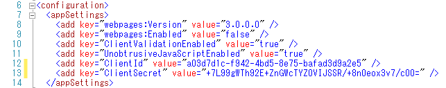
Visual Studio のソリューションエクスプローラーから SharePoint アドインプロジェクトを右クリックし、[公開] メニューをクリックします。
アドインを公開する画面の[現在のプロファイル] で、Web アプリの発行時に自動生成されたプロファイルを選択し、[編集] ボタンをクリックします。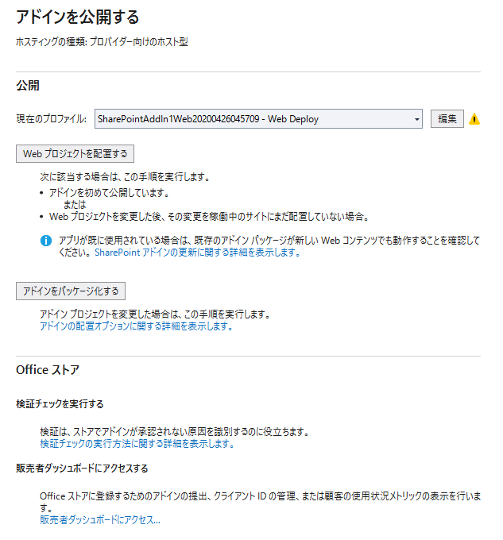
Office/SharePoint アドインの公開ダイアログにて、[クライアント ID]、[クライアントシークレット] のそれぞれのテキストボックスに、前にコピーしたクライアント ID とクライアントシークレットを貼り付け、[完了] ボタンをクリックします。
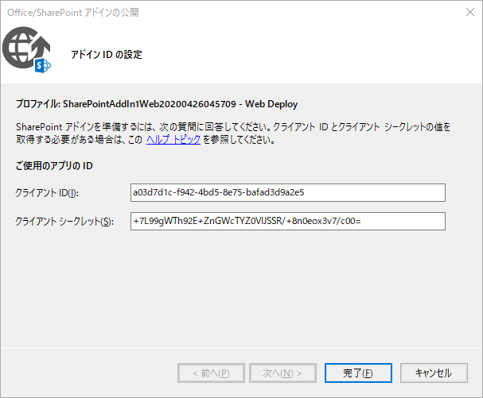
アドインを公開する画面に戻り、[Web プロジェクトを配置する] ボタンをクリックして、Web プロジェクトを再配置します。

### SharePoint アドインプロジェクトの公開

アドインを公開する画面にて、[アドインをパッケージ化する] ボタンをクリックします。
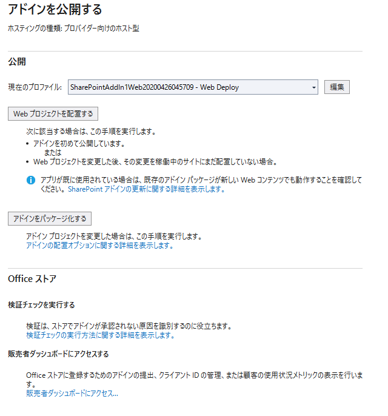
Office/SharePoint アドインの公開ダイアログにて、URL と アプリのクライアント ID が、先ほどデプロイした Web プロジェクトの内容と一致しているか確認し [完了] ボタンをクリックします。
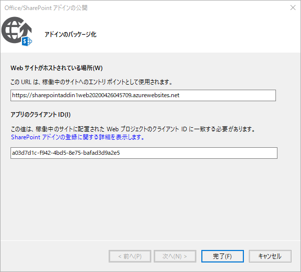
上記により作成された .app ファイルをアプリカタログサイトにアップロードします。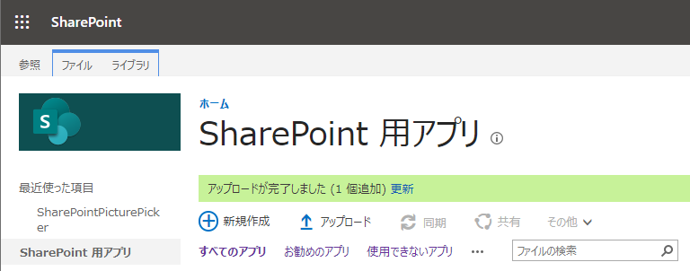
最初に作成したサイトにて、アプリカタログに登録したアプリを追加します。
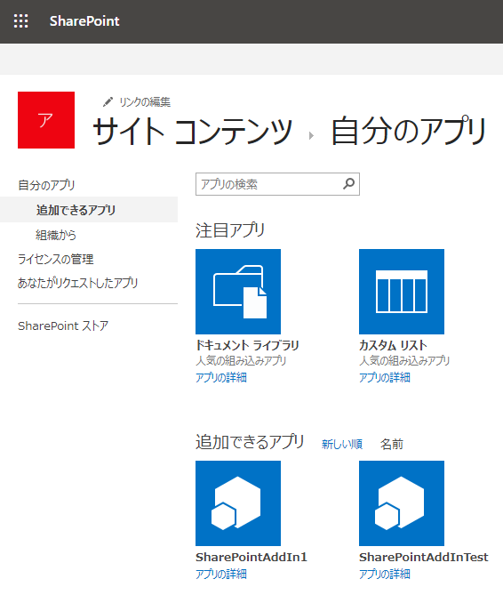
アプリを追加する際に以下のダイアログが表示されるので、[信頼する] ボタンをクリックします。
これで SharePoint アプリにサイトにアクセスする権限が割り当てられます。
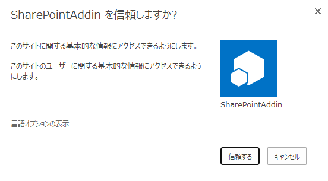
追加したアプリは、サイトコンテンツページに表示されます。
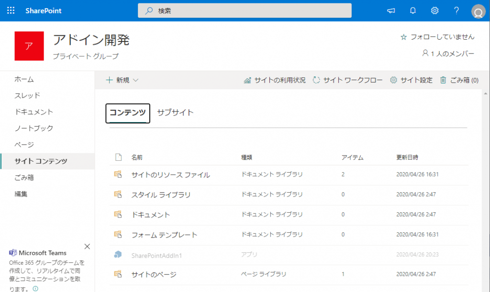
追加が完了するまではグレーアウトされていて、追加されると以下のようにグレーアウトが解除されます。

サイトコンテンツページに表示されるアプリ名をクリックすると、処理中画面の後、SharePoint アプリの本体である Web アプリケーションが表示されます。
Welcome の後に、ログインユーザーの表示名が表示されていれば成功です。
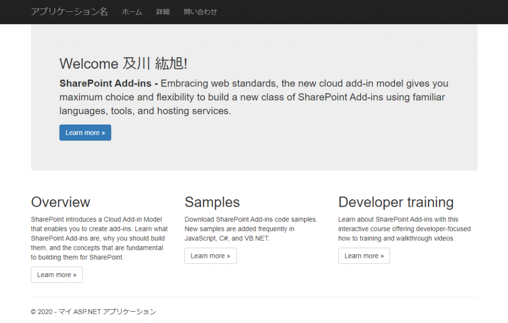
以上が、SharePoint Online 上への SharePoint アドインの作成、デプロイ手順になります。

# まとめ

SharePoint アドインが使えると、ASP.NET MVC を使った Web アプリケーションで SharePoint を拡張できるようになるので、これまでの開発手法に慣れた方は取り掛かりやすいかと思います。
SharePoint Framework がこれからの SharePoint 開発のトレンドであることは間違いありませんが、バックエンドの処理が複雑な業務システムの場合は、SharePoint アドインもソリューションの一つとして選択肢にあげても良いのではないかと思います。
SharePoint アドインをモダンページに配置するとどうなるかを確認しましたので、そちらもご覧ください。
[SharePoint アドインのクライアント Web パーツをモダンページに配置してみた](https://sharepoint.orivers.jp/article/10236)
[AdSense-B]
