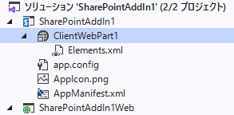
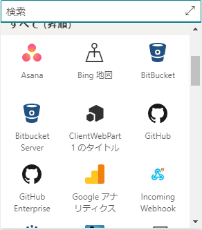
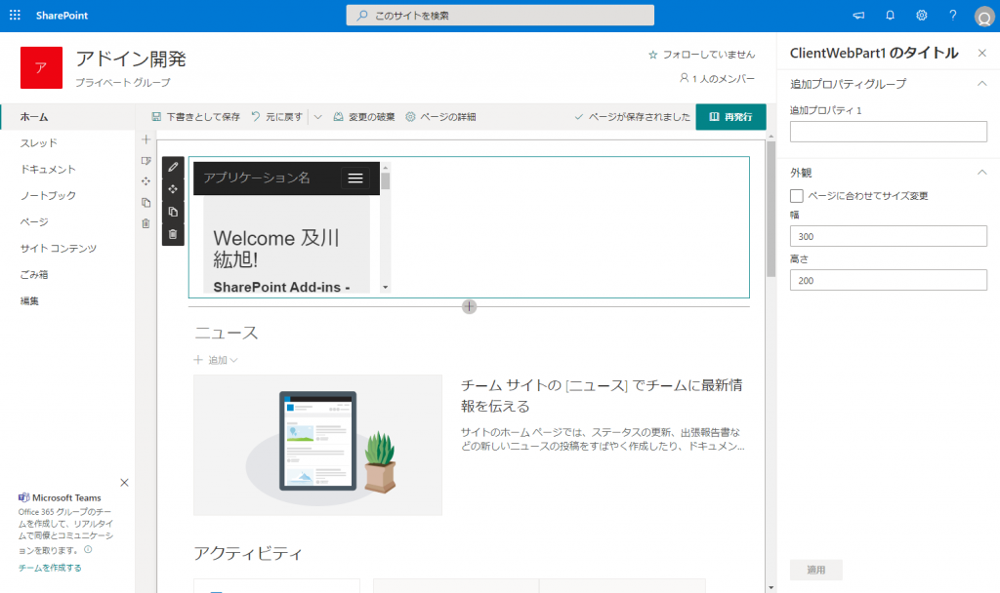
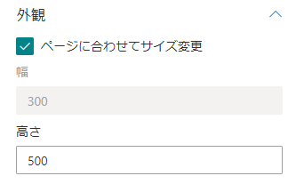
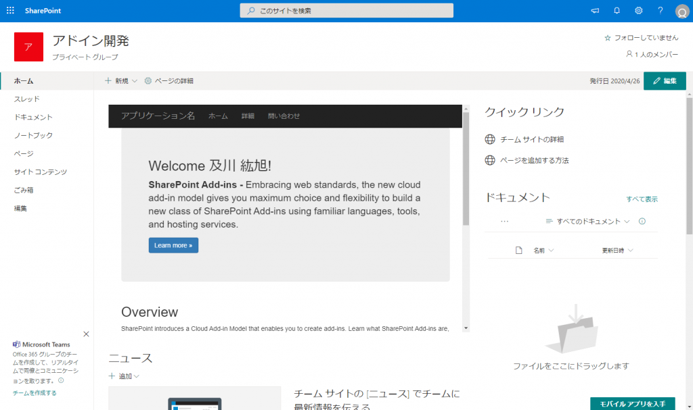
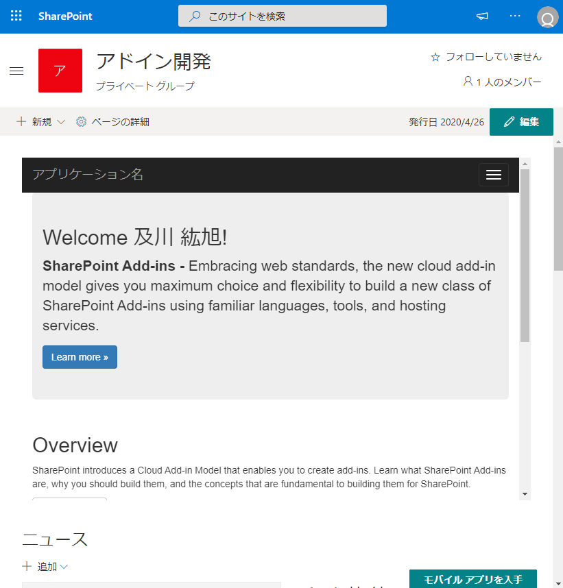
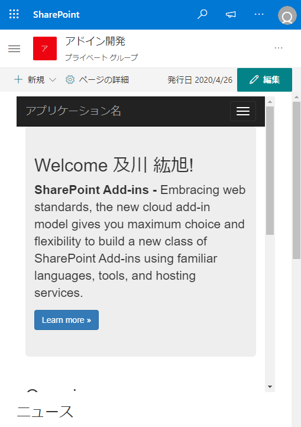
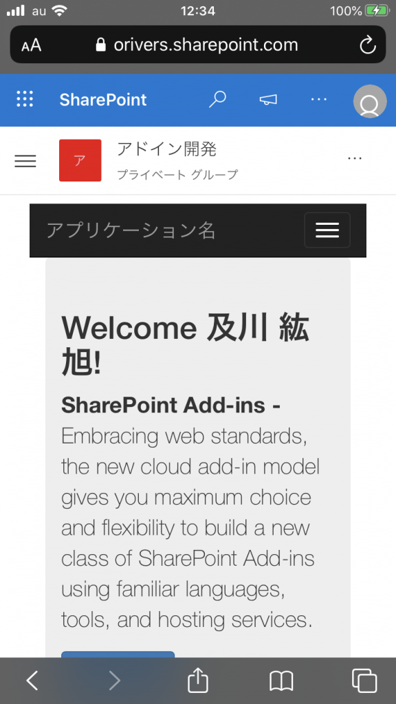

# はじめに

別記事で SharePoint アドインが SharePoint Online でも使えることを記載しましたが、そうやって開発したクライアント Web パーツをモダンページに配置するとどうなるのか確認してみました。
SharePoint アドインのクライアント Web パーツはモダンページが登場する前からあった技術なので、レスポンシブが前提のモダンページにうまくはまってくれるのか、そこが最も気になっていた部分です。
参考：
[SharePoint Online で SharePoint アドイン（プロバイダーホスト型）を使用する](https://sharepoint.orivers.jp/article/10200)

# クライアント Web パーツとは

クライアント Web パーツというのは、SharePoint アドインを開発する際に SharePoint アドイン本体の Web アプリケーション部分を SharePoint のページ上に表示するために使用する Web パーツで、SharePoint ページ上では HTML の iFrame としてレンダリングされます。
iFrame の中に、Web アプリケーション部分が表示されることになります。

# クライアント Web パーツをモダンページに配置する

SharePoint アドインプロジェクトの中には、下図の通りクライアント Web パーツ（下図「ClientWebPart1」）を含めることができます。
こうしてプロジェクトに含められたクライアント Web パーツは、\*.app ファイルに含まれているため、アプリカタログに \*.app ファイルをアップした時点で SharePoint アドインと一緒に展開されます。

展開されたクライアント Web パーツは SharePoint アドインと同様に、クライアント Web パーツを使用したいサイトコレクションにて、アプリの追加から追加する必要があります。
SharePoint アドインを追加すると、一緒にクラシック Web パーツもそのサイトコレクションに追加されます。

追加されたクラシック Web パーツは、モダンページの Web パーツの一覧の中に表示されます。
下図の「ClientWebPart1 のタイトル」というのが追加されたクライアント Web パーツです。
クライアント Web パーツの名前は、Visual Studio でクライアント Web パーツの定義情報を変更することで任意の文字にすることができます。

モダンページにクラシック Web パーツを配置すると初期状態は下図のようになります。
Web パーツの横幅がかなり小さくなっていて表示が崩れています。

この横幅の調整は、Web パーツのプロパティから幅を指定することで任意のサイズにすることができますが、[ページに合わせてサイズ変更] というチェックボックスにチェックを入れるとページの横幅に合わせてクライアント Web パーツの横幅を自動調整してくれるようになります。

[ページに合わせてサイズ変更] をチェックした状態が下図の通りです。
横幅がページ幅に合わせて調整されたため、崩れが無くなりました。

そして、ブラウザの幅を狭めていくと・・・・

きちんとレスポンシブ対応されていることが分かります。
縦については自動調整はされないですが・・・

さらに、iPhone でも表示してみましたが、正しく表示されています。

# まとめ

SharePoint アドインのクライアント Web パーツはモダンページでもきちんと動作することが確認できました。
高さの調整が自動で行えない部分が気がかりではありますが、そこは Web アプリケーション側で工夫するということで・・・
使いどころは十分にありそうな気がしますね。
[AdSense-B]
