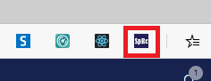
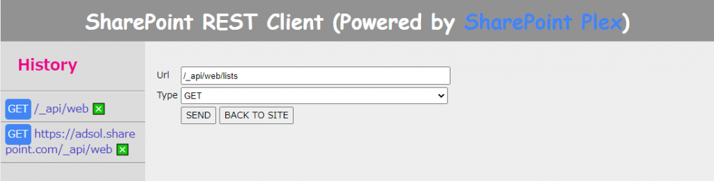
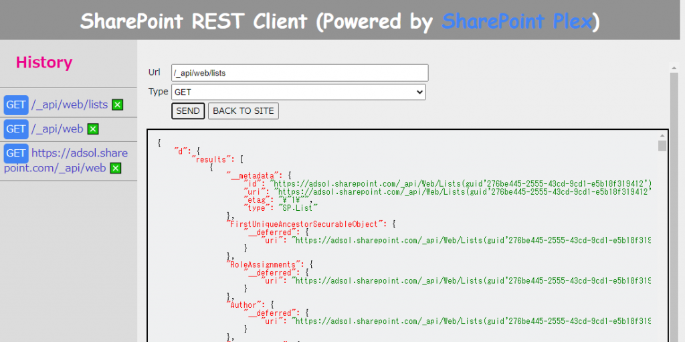

# はじめに

SharePoint の REST API をテストする時、みなさんはどんなツールを使っていますか？
私はこれまで Internet Explorer のフィードを表示する機能を使っていたのですが、IE の未来に光が見えないので他のツールに乗り換えようと色々探していました。
IE と同じように、ブラウザで SharePoint サイト認証をクリアしていればその認証情報を使いまわしてくれるものが使い勝手が良くていいなと。
そしてようやくニーズにあったツールに出会えたので紹介します。
その名も「[SP REST Client](https://chrome.google.com/webstore/detail/sp-rest-client/ojnaikgchcnginnmkmkonmdglhjikokd/related)」
Google の拡張機能として提供されています。
ひと目で SharePoint 用だと想像がつく分かりやすい名前ですね。

# インストール

Chrome ブラウザの拡張機能なので、他の拡張機能と同様にウェブストアからインストールします。
とはいえ、Edge のストア検索からは見つけられないので、以下の URL に Edge でアクセスしてインストールしてください。
ページ上に表示される [Chrome に追加] ボタンをクリックすると Edge にインストールすることができます。
<https://chrome.google.com/webstore/detail/sp-rest-client/ojnaikgchcnginnmkmkonmdglhjikokd/related>
インストールすると、ブラウザの右上に SpRc アイコンが表示されます。

# 使い方

Edge で SharePoint サイトを開いて、ブラウザ右上の SpRc アイコンをクリックします。
すると、以下の REST API をコールするための画面が表示されるので、[Url] のテキストボックスに REST API の URL を入力して [SEND] ボタンをクリックします。
なお、開くページはクラシックページである必要があるので該当サイトのサイトの設定ページ「\_layouts/15/settings.aspx」を開くのがお勧めです。

結果は JSON として画面下部に表示されます。
また、過去に実行した REST API の履歴が画面左側に表示されるので、再度同じリクエストを投げる際に活用できます。

使用上の注意が一点だけあります。
入力する URL ですが、「/\_api/」以降の URL を入力するようにしてください。
上図 History の３つ目にあるように「/\_api/」より前の部分の URL を入れると無反応となりますので。
これがあれば、REST API の確認が捗りますね！
[AdSense-B]
